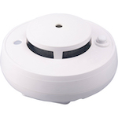

*To contribute to this page, edit the following
[file](https://github.com/Koenkk/zigbee2mqtt.io/blob/master/docs/devices/AV2010_24A.md)*

# Bitron AV2010/24A

| Model | AV2010/24A  |
| Vendor  | Bitron  |
| Description | Optical smoke detector (hardware version v2) |
| Exposes | smoke, battery_low, tamper, warning, linkquality |
| Picture |  |

## Notes

None


## Exposes

### Smoke (binary)
Indicates whether the device detected smoke.
Value can be found in the published state on the `smoke` property.
It's not possible to read (`/get`) or write (`/set`) this value.
If value equals `true` smoke is ON, if `false` OFF.

### Battery_low (binary)
Indicates if the battery of this device is almost empty.
Value can be found in the published state on the `battery_low` property.
It's not possible to read (`/get`) or write (`/set`) this value.
If value equals `true` battery_low is ON, if `false` OFF.

### Tamper (binary)
Indicates whether the device is tampered.
Value can be found in the published state on the `tamper` property.
It's not possible to read (`/get`) or write (`/set`) this value.
If value equals `true` tamper is ON, if `false` OFF.

### Warning (composite)
Can be set by publishing to `zigbee2mqtt/FRIENDLY_NAME/set` with payload `{"warning": {"mode": VALUE, "level": VALUE, "strobe_level": VALUE, "strobe": VALUE, "strobe_duty_cycle": VALUE, "duration": VALUE}}`
- `mode` (enum): Mode of the warning (sound effect). Allowed values: `stop`, `burglar`, `fire`, `emergency`, `police_panic`, `fire_panic`, `emergency_panic`
- `level` (enum): Sound level. Allowed values: `low`, `medium`, `high`, `very_high`
- `strobe_level` (enum): Intensity of the strobe. Allowed values: `low`, `medium`, `high`, `very_high`
- `strobe` (binary): Turn on/off the strobe (light) during warning. Allowed values: `true` or `false`
- `strobe_duty_cycle` (numeric): Length of the flash cycle. 
- `duration` (numeric): Duration in seconds of the alarm. 

### Linkquality (numeric)
Link quality (signal strength).
Value can be found in the published state on the `linkquality` property.
It's not possible to read (`/get`) or write (`/set`) this value.
The minimal value is `0` and the maximum value is `255`.
The unit of this value is `lqi`.

## Manual Home Assistant configuration
Although Home Assistant integration through [MQTT discovery](../integration/home_assistant) is preferred,
manual integration is possible with the following configuration:



```yaml
binary_sensor:
  - platform: "mqtt"
    state_topic: "zigbee2mqtt/<FRIENDLY_NAME>"
    availability_topic: "zigbee2mqtt/bridge/state"
    value_template: "{{ value_json.smoke }}"
    payload_on: true
    payload_off: false
    device_class: "smoke"

binary_sensor:
  - platform: "mqtt"
    state_topic: "zigbee2mqtt/<FRIENDLY_NAME>"
    availability_topic: "zigbee2mqtt/bridge/state"
    value_template: "{{ value_json.battery_low }}"
    payload_on: true
    payload_off: false
    device_class: "battery"

binary_sensor:
  - platform: "mqtt"
    state_topic: "zigbee2mqtt/<FRIENDLY_NAME>"
    availability_topic: "zigbee2mqtt/bridge/state"
    value_template: "{{ value_json.tamper }}"
    payload_on: true
    payload_off: false

sensor:
  - platform: "mqtt"
    state_topic: "zigbee2mqtt/<FRIENDLY_NAME>"
    availability_topic: "zigbee2mqtt/bridge/state"
    value_template: "{{ value_json.linkquality }}"
    unit_of_measurement: "lqi"
    enabled_by_default: false
    icon: "mdi:signal"
    state_class: "measurement"
```



