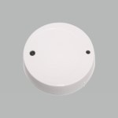

*To contribute to this page, edit the following
[file](https://github.com/Koenkk/zigbee2mqtt.io/blob/master/docs/devices/AV2010_33.md)*

# SMaBiT (Bitron Video) AV2010/33

| Model | AV2010/33  |
| Vendor  | SMaBiT (Bitron Video)  |
| Description | Vibration sensor |
| Exposes | occupancy, battery_low, linkquality |
| Picture |  |

## Notes

## Pairing
Press and hold the function button on the side of the sensor with a pointed object for about 10 seconds until the red LED on the front lights up once briefly.
During the search, the LED lights up red once every 10 seconds. When the LED flashes 2 times, the device has successfully registered.

## Exposes

### Occupancy (binary)
Indicates whether the device detected occupancy.
Value can be found in the published state on the `occupancy` property.
It's not possible to read (`/get`) or write (`/set`) this value.
If value equals `true` occupancy is ON, if `false` OFF.

### Battery_low (binary)
Indicates if the battery of this device is almost empty.
Value can be found in the published state on the `battery_low` property.
It's not possible to read (`/get`) or write (`/set`) this value.
If value equals `true` battery_low is ON, if `false` OFF.

### Linkquality (numeric)
Link quality (signal strength).
Value can be found in the published state on the `linkquality` property.
It's not possible to read (`/get`) or write (`/set`) this value.
The minimal value is `0` and the maximum value is `255`.
The unit of this value is `lqi`.

