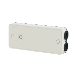

*To contribute to this page, edit the following
[file](https://github.com/Koenkk/zigbee2mqtt.io/blob/master/docs/devices/CCTFR6700.md)*

# Schneider Electric CCTFR6700

| Model | CCTFR6700  |
| Vendor  | Schneider Electric  |
| Description | Heating thermostat |
| Exposes | power, energy, schneider_pilot_mode, climate (occupied_heating_setpoint, local_temperature, system_mode, pi_heating_demand), linkquality |
| Picture |  |

## Notes


### Device info
This device is a thermostat to drive an electric heater.
It supports two modes:
- Contactor mode, that switches the heater power supply on and off
- Pilot mode, for compatible heaters

### Pairing and configuring
After pairing the device requires:
- the pilot mode to be configured (Contactor/Pilot)
- an external temperature measurment, either through a bind from a sensor, or report from the coordinator trhough automation. The temperature must be refreshed at least every 10mn
- the target thermostat set point


## Exposes

### Power (numeric)
Instantaneous measured power.
Value can be found in the published state on the `power` property.
It's not possible to read (`/get`) or write (`/set`) this value.
The unit of this value is `W`.

### Energy (numeric)
Sum of consumed energy.
Value can be found in the published state on the `energy` property.
It's not possible to read (`/get`) or write (`/set`) this value.
The unit of this value is `kWh`.

### Schneider_pilot_mode (enum)
Controls piloting mode.
Value can be found in the published state on the `schneider_pilot_mode` property.
To read (`/get`) the value publish a message to topic `zigbee2mqtt/FRIENDLY_NAME/get` with payload `{"schneider_pilot_mode": ""}`.
To write (`/set`) a value publish a message to topic `zigbee2mqtt/FRIENDLY_NAME/set` with payload `{"schneider_pilot_mode": NEW_VALUE}`.
The possible values are: `contactor`, `pilot`.

### Climate 
This climate device supports the following features: `occupied_heating_setpoint`, `local_temperature`, `system_mode`, `pi_heating_demand`.
- `occupied_heating_setpoint`: Temperature setpoint. To control publish a message to topic `zigbee2mqtt/FRIENDLY_NAME/set` with payload `{"occupied_heating_setpoint": VALUE}` where `VALUE` is the °C between `4` and `30`. To read send a message to `zigbee2mqtt/FRIENDLY_NAME/get` with payload `{"occupied_heating_setpoint": ""}`.
- `local_temperature`: Current temperature measured on the device (in °C). To read send a message to `zigbee2mqtt/FRIENDLY_NAME/get` with payload `{"local_temperature": ""}`.
- `system_mode`: Mode of this device. To control publish a message to topic `zigbee2mqtt/FRIENDLY_NAME/set` with payload `{"system_mode": VALUE}` where `VALUE` is one of: `off`, `auto`, `heat`. To read send a message to `zigbee2mqtt/FRIENDLY_NAME/get` with payload `{"system_mode": ""}`.

### Linkquality (numeric)
Link quality (signal strength).
Value can be found in the published state on the `linkquality` property.
It's not possible to read (`/get`) or write (`/set`) this value.
The minimal value is `0` and the maximum value is `255`.
The unit of this value is `lqi`.

## Manual Home Assistant configuration
Although Home Assistant integration through [MQTT discovery](../integration/home_assistant) is preferred,
manual integration is possible with the following configuration:



```yaml
sensor:
  - platform: "mqtt"
    state_topic: "zigbee2mqtt/<FRIENDLY_NAME>"
    availability_topic: "zigbee2mqtt/bridge/state"
    value_template: "{{ value_json.power }}"
    unit_of_measurement: "W"
    device_class: "power"
    state_class: "measurement"

sensor:
  - platform: "mqtt"
    state_topic: "zigbee2mqtt/<FRIENDLY_NAME>"
    availability_topic: "zigbee2mqtt/bridge/state"
    value_template: "{{ value_json.energy }}"
    unit_of_measurement: "kWh"
    device_class: "energy"
    state_class: "measurement"
    last_reset_topic: true
    last_reset_value_template: "1970-01-01T00:00:00+00:00"

sensor:
  - platform: "mqtt"
    state_topic: "zigbee2mqtt/<FRIENDLY_NAME>"
    availability_topic: "zigbee2mqtt/bridge/state"
    value_template: "{{ value_json.schneider_pilot_mode }}"
    enabled_by_default: false

select:
  - platform: "mqtt"
    state_topic: true
    availability_topic: "zigbee2mqtt/bridge/state"
    value_template: "{{ value_json.schneider_pilot_mode }}"
    command_topic: "zigbee2mqtt/<FRIENDLY_NAME>/set"
    command_topic_postfix: "schneider_pilot_mode"
    options: 
      - "contactor"
      - "pilot"

climate:
  - platform: "mqtt"
    availability_topic: "zigbee2mqtt/bridge/state"
    temperature_unit: "C"
    temp_step: 0.5
    min_temp: "4"
    max_temp: "30"
    current_temperature_topic: true
    current_temperature_template: "{{ value_json.local_temperature }}"
    mode_state_topic: true
    mode_state_template: "{{ value_json.system_mode }}"
    modes: 
      - "off"
      - "auto"
      - "heat"
    mode_command_topic: true
    temperature_command_topic: "occupied_heating_setpoint"
    temperature_state_template: "{{ value_json.occupied_heating_setpoint }}"
    temperature_state_topic: true

sensor:
  - platform: "mqtt"
    state_topic: "zigbee2mqtt/<FRIENDLY_NAME>"
    availability_topic: "zigbee2mqtt/bridge/state"
    value_template: "{{ value_json.linkquality }}"
    unit_of_measurement: "lqi"
    enabled_by_default: false
    icon: "mdi:signal"
    state_class: "measurement"
```



