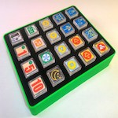

*To contribute to this page, edit the following
[file](https://github.com/Koenkk/zigbee2mqtt.io/blob/master/docs/devices/DIYRuZ_KEYPAD20.md)*

# Custom devices (DiY) DIYRuZ_KEYPAD20

| Model | DIYRuZ_KEYPAD20  |
| Vendor  | Custom devices (DiY)  |
| Description | [DiY 20 button keypad](http://modkam.ru/?p=1114) |
| Supports | click |
| Picture |  |

## Notes

None

## Manual Home Assistant configuration
Although Home Assistant integration through [MQTT discovery](../integration/home_assistant) is preferred,
manual integration is possbile with the following configuration:



```yaml
sensor:
  - platform: "mqtt"
    state_topic: "zigbee2mqtt/<FRIENDLY_NAME>"
    availability_topic: "zigbee2mqtt/bridge/state"
    unit_of_measurement: "-"
    value_template: "{{ value_json.linkquality }}"
```



