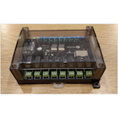

*To contribute to this page, edit the following
[file](https://github.com/Koenkk/zigbee2mqtt.io/blob/master/docs/devices/DIYRuZ_R8_8.md)*

# DIYRuZ DIYRuZ_R8_8

| Model | DIYRuZ_R8_8  |
| Vendor  | DIYRuZ  |
| Description | [DiY 8 Relays + 8 switches](https://modkam.ru/?p=1638) |
| Supports | on/off |
| Picture |  |

## Notes


### Deprecated click event
By default this device exposes a deprecated `click` event. It's recommended to use the `action` event instead.

To disable the `click` event, set `legacy: false` for this device in `configuration.yaml`. Example:

```yaml
devices:
  '0x12345678':
    friendly_name: my_device
    legacy: false
```

### Device type specific configuration
*[How to use device type specific configuration](../information/configuration.md)*

* `legacy`: Set to `true` to disable the legacy integration (highly recommended!)


## Manual Home Assistant configuration
Although Home Assistant integration through [MQTT discovery](../integration/home_assistant) is preferred,
manual integration is possible with the following configuration:



```yaml
switch:
  - platform: "mqtt"
    state_topic: "zigbee2mqtt/<FRIENDLY_NAME>"
    availability_topic: "zigbee2mqtt/bridge/state"
    payload_off: "OFF"
    payload_on: "ON"
    value_template: "{{ value_json.state_l1 }}"
    command_topic: "zigbee2mqtt/<FRIENDLY_NAME>/l1/set"

switch:
  - platform: "mqtt"
    state_topic: "zigbee2mqtt/<FRIENDLY_NAME>"
    availability_topic: "zigbee2mqtt/bridge/state"
    payload_off: "OFF"
    payload_on: "ON"
    value_template: "{{ value_json.state_l2 }}"
    command_topic: "zigbee2mqtt/<FRIENDLY_NAME>/l2/set"

switch:
  - platform: "mqtt"
    state_topic: "zigbee2mqtt/<FRIENDLY_NAME>"
    availability_topic: "zigbee2mqtt/bridge/state"
    payload_off: "OFF"
    payload_on: "ON"
    value_template: "{{ value_json.state_l3 }}"
    command_topic: "zigbee2mqtt/<FRIENDLY_NAME>/l3/set"

switch:
  - platform: "mqtt"
    state_topic: "zigbee2mqtt/<FRIENDLY_NAME>"
    availability_topic: "zigbee2mqtt/bridge/state"
    payload_off: "OFF"
    payload_on: "ON"
    value_template: "{{ value_json.state_l4 }}"
    command_topic: "zigbee2mqtt/<FRIENDLY_NAME>/l4/set"

switch:
  - platform: "mqtt"
    state_topic: "zigbee2mqtt/<FRIENDLY_NAME>"
    availability_topic: "zigbee2mqtt/bridge/state"
    payload_off: "OFF"
    payload_on: "ON"
    value_template: "{{ value_json.state_l5 }}"
    command_topic: "zigbee2mqtt/<FRIENDLY_NAME>/l5/set"

switch:
  - platform: "mqtt"
    state_topic: "zigbee2mqtt/<FRIENDLY_NAME>"
    availability_topic: "zigbee2mqtt/bridge/state"
    payload_off: "OFF"
    payload_on: "ON"
    value_template: "{{ value_json.state_l6 }}"
    command_topic: "zigbee2mqtt/<FRIENDLY_NAME>/l6/set"

switch:
  - platform: "mqtt"
    state_topic: "zigbee2mqtt/<FRIENDLY_NAME>"
    availability_topic: "zigbee2mqtt/bridge/state"
    payload_off: "OFF"
    payload_on: "ON"
    value_template: "{{ value_json.state_l7 }}"
    command_topic: "zigbee2mqtt/<FRIENDLY_NAME>/l7/set"

switch:
  - platform: "mqtt"
    state_topic: "zigbee2mqtt/<FRIENDLY_NAME>"
    availability_topic: "zigbee2mqtt/bridge/state"
    payload_off: "OFF"
    payload_on: "ON"
    value_template: "{{ value_json.state_l8 }}"
    command_topic: "zigbee2mqtt/<FRIENDLY_NAME>/l8/set"

sensor:
  - platform: "mqtt"
    state_topic: "zigbee2mqtt/<FRIENDLY_NAME>"
    availability_topic: "zigbee2mqtt/bridge/state"
    icon: "mdi:signal"
    unit_of_measurement: "lqi"
    value_template: "{{ value_json.linkquality }}"
```



