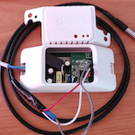

*To contribute to this page, edit the following
[file](https://github.com/Koenkk/zigbee2mqtt.io/blob/master/docs/devices/DIYRuZ_RT.md)*

# DIYRuZ DIYRuZ_RT

| Model | DIYRuZ_RT  |
| Vendor  | DIYRuZ  |
| Description | [DiY CC2530 Zigbee 3.0 firmware](https://habr.com/ru/company/iobroker/blog/495926/) |
| Supports | on/off, temperature |
| Picture |  |

## Notes


# Firmware
This firmware can be used to flash any CC2530 device to support zigbee 3.0
For example the Sonoff BasicZBR3
Firmware download: https://github.com/diyruz/diyruz_rt
Blog about supporting Zigbee 3.0 to CC2530: https://habr.com/ru/company/iobroker/blog/495926/

### Device type specific configuration
*[How to use device type specific configuration](../information/configuration.md)*

* `temperature_precision`: Controls the precision of `temperature` values,
e.g. `0`, `1` or `2`; default `2`.
To control the precision based on the temperature value set it to e.g. `{30: 0, 10: 1}`,
when temperature >= 30 precision will be 0, when temperature >= 10 precision will be 1.
* `temperature_calibration`: Allows to manually calibrate temperature values,
e.g. `1` would add 1 degree to the temperature reported by the device; default `0`.


## Manual Home Assistant configuration
Although Home Assistant integration through [MQTT discovery](../integration/home_assistant) is preferred,
manual integration is possible with the following configuration:



```yaml
switch:
  - platform: "mqtt"
    state_topic: "zigbee2mqtt/<FRIENDLY_NAME>"
    availability_topic: "zigbee2mqtt/bridge/state"
    payload_off: "OFF"
    payload_on: "ON"
    value_template: "{{ value_json.state }}"
    command_topic: "zigbee2mqtt/<FRIENDLY_NAME>/set"

sensor:
  - platform: "mqtt"
    state_topic: "zigbee2mqtt/<FRIENDLY_NAME>"
    availability_topic: "zigbee2mqtt/bridge/state"
    unit_of_measurement: "°C"
    device_class: "temperature"
    value_template: "{{ value_json.temperature }}"

sensor:
  - platform: "mqtt"
    state_topic: "zigbee2mqtt/<FRIENDLY_NAME>"
    availability_topic: "zigbee2mqtt/bridge/state"
    icon: "mdi:signal"
    unit_of_measurement: "lqi"
    value_template: "{{ value_json.linkquality }}"
```



