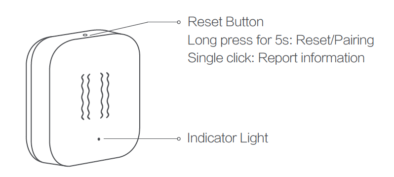

<!-- !!!! -->
<!-- ATTENTION: This file is auto-generated through docgen! -->
<!-- You can only edit the "Notes"-Section between the two comment lines "Notes BEGIN" and "Notes END". -->
<!-- Do not use h1 or h2 heading within "## Notes"-Section. -->
<!-- !!!! -->

# Aqara DJT12LM

|     |     |
|-----|-----|
| Model | DJT12LM  |
| Vendor  | [Aqara](/supported-devices/#v=Aqara)  |
| Description | Vibration sensor T1 |
| Exposes | report_interval, sensitivity_adjustment, battery, voltage, action |
| Picture |  |

<!-- Notes BEGIN: You can edit here. Add "## Notes" headline if not already present. -->
## Notes

### Pairing

Long press the reset button for more than 5 seconds, until the blue light blinks 3 times.

<!-- Notes END: Do not edit below this line -->

## OTA updates
This device supports OTA updates, for more information see [OTA updates](../guide/usage/ota_updates.md).

## Exposes

### Report interval (enum)
Reporting interval for the device.
Value will **not** be published in the state.
It's not possible to read (`/get`) this value.
To write (`/set`) a value publish a message to topic `zigbee2mqtt/FRIENDLY_NAME/set` with payload `{"report_interval": NEW_VALUE}`.
The possible values are: `1s`, `5s`, `10s`.

### Sensitivity adjustment (enum)
Sensitivity adjustment for the device.
Value will **not** be published in the state.
It's not possible to read (`/get`) this value.
To write (`/set`) a value publish a message to topic `zigbee2mqtt/FRIENDLY_NAME/set` with payload `{"sensitivity_adjustment": NEW_VALUE}`.
The possible values are: `high`, `medium`, `low`.

### Battery (numeric)
Remaining battery in %, can take up to 24 hours before reported.
Value can be found in the published state on the `battery` property.
It's not possible to read (`/get`) or write (`/set`) this value.
The minimal value is `0` and the maximum value is `100`.
The unit of this value is `%`.

### Voltage (numeric)
Voltage of the battery in millivolts.
Value can be found in the published state on the `voltage` property.
It's not possible to read (`/get`) or write (`/set`) this value.
The unit of this value is `mV`.

### Action (enum)
Triggered action (e.g. a button click).
Value can be found in the published state on the `action` property.
It's not possible to read (`/get`) or write (`/set`) this value.
The possible values are: `shake`, `triple_strike`, `movement`.

