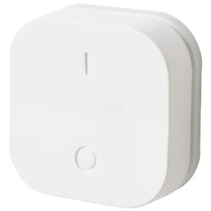

*To contribute to this page, edit the following
[file](https://github.com/Koenkk/zigbee2mqtt.io/blob/master/docs/devices/E1743.md)*

# IKEA E1743

| Model | E1743  |
| Vendor  | IKEA  |
| Description | TRADFRI ON/OFF switch |
| Supports | on, off, brightness up/down/stop |
| Picture |  |

## Notes


### Binding
The E1743 can be bound to groups using [binding](../information/binding).
It can only be bound to 1 group at a time.

Note that < zigbee2mqtt 1.4 automatically bound this device to group 99.
If you want to bind it to a different group you first have to unbind it from group 99.


### Pairing
Pair the switch to Zigbee2mqtt by pressing the pair button (found under the back cover next to the battery) 4 times in a row. The red light on the front side should flash a few times and the turn off (it's more visible to see the light from the back). After a few seconds it turns back on and pulsate. When connected, the light turns off.


### Device type specific configuration
*[How to use device type specific configuration](../configuration/device_specific_configuration.md)*


* `transition`: Controls the transition time (in seconds) of brightness,
color temperature (if applicable) and color (if applicable) changes. Defaults to `0` (no transition).
Note that this value is overridden if a `transition` value is present in the MQTT command payload.


## Manual Home Assistant configuration
Although Home Assistant integration through [MQTT discovery](../integration/home_assistant) is preferred,
manual integration is possbile with the following configuration:



```yaml
sensor:
  - platform: "mqtt"
    state_topic: "zigbee2mqtt/<FRIENDLY_NAME>"
    availability_topic: "zigbee2mqtt/bridge/state"
    icon: "mdi:toggle-switch"
    value_template: "{{ value_json.click }}"

sensor:
  - platform: "mqtt"
    state_topic: "zigbee2mqtt/<FRIENDLY_NAME>"
    availability_topic: "zigbee2mqtt/bridge/state"
    unit_of_measurement: "%"
    device_class: "battery"
    value_template: "{{ value_json.battery }}"

sensor:
  - platform: "mqtt"
    state_topic: "zigbee2mqtt/<FRIENDLY_NAME>"
    availability_topic: "zigbee2mqtt/bridge/state"
    unit_of_measurement: "-"
    value_template: "{{ value_json.linkquality }}"
```



