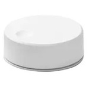

*To contribute to this page, edit the following
[file](https://github.com/Koenkk/zigbee2mqtt.io/blob/master/docs/devices/E1744.md)*

# IKEA E1744

| Model | E1744  |
| Vendor  | IKEA  |
| Description | SYMFONISK sound controller |
| Supports | volume up/down, play/pause, skip forward/backward |
| Picture |  |

## Notes


### Pairing
Press the button on the device 4 times (until the red light turns on).


### Legacy integration
By default (for backwards compatibility purposes) the legacy integration is enabled.
For new users it is recommended to **disable** this as it has several fundamental problems.
To disable the legacy integration add the following to your `configuration.yaml`:


```yaml
'0xabc457fffe679xyz':
    friendly_name: my_remote
    legacy: false
```



The information below only applies to the legacy integration.

### Recommendation
This device sends multiple messages in short time period with the same payload. It's worth setting `debounce` option with `debounce_ignore: - action` to throttle them without losing unique action payloads.

E.g. (devices.yaml)


```yaml
'0xabc457fffe679xyz':
    friendly_name: my_remote
    debounce: 0.5
    debounce_ignore:
    - action
```


To find optimal "smoothness" play with debounce time or if you need all unique rotation steps consider adding `brightness` to `debounce_ignore` option


```yaml
'0xabc457fffe679xyz':
    friendly_name: my_remote
    debounce: 0.1
    debounce_ignore:
    - action
    - brightness
```


### Device type specific configuration
*[How to use device type specific configuration](../information/configuration.md)*

* `legacy`: Set to `true` to disable the legacy integration (highly recommended!)


## OTA updates
This device supports OTA updates, for more information see [OTA updates](../information/ota_updates.md).

## Manual Home Assistant configuration
Although Home Assistant integration through [MQTT discovery](../integration/home_assistant) is preferred,
manual integration is possible with the following configuration:



```yaml
sensor:
  - platform: "mqtt"
    state_topic: "zigbee2mqtt/<FRIENDLY_NAME>"
    availability_topic: "zigbee2mqtt/bridge/state"
    icon: "mdi:gesture-double-tap"
    value_template: "{{ value_json.action }}"

sensor:
  - platform: "mqtt"
    state_topic: "zigbee2mqtt/<FRIENDLY_NAME>"
    availability_topic: "zigbee2mqtt/bridge/state"
    unit_of_measurement: "%"
    device_class: "battery"
    value_template: "{{ value_json.battery }}"

sensor:
  - platform: "mqtt"
    state_topic: "zigbee2mqtt/<FRIENDLY_NAME>"
    availability_topic: "zigbee2mqtt/bridge/state"
    icon: "mdi:signal"
    unit_of_measurement: "lqi"
    value_template: "{{ value_json.linkquality }}"

binary_sensor:
  - platform: "mqtt"
    state_topic: "zigbee2mqtt/<FRIENDLY_NAME>"
    availability_topic: "zigbee2mqtt/bridge/state"
    payload_on: true
    payload_off: false
    value_template: "{{ value_json.update_available}}"
```



