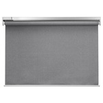

*To contribute to this page, edit the following
[file](https://github.com/Koenkk/zigbee2mqtt.io/blob/master/docs/devices/E1757_E1926.md)*

# IKEA E1757/E1926

| Model | E1757/E1926  |
| Vendor  | IKEA  |
| Description | FYRTUR block-out roller blind / IKEA KADRILJ roller blind |
| Supports | open, close, stop, position |
| Picture |  |

## Notes
The FYTRUR and KADRILJ blinds are the same, only the fabric differs.

It is recommended to pair this device close to your coordinator or a router-device such as the [TRADFRI signal repeater](../devices/E1746.html). One comes supplied with the FYRTUR / KADRILJ in the box.


### Pairing
To factory reset the blinds and enable pairing mode, press and hold both buttons
on the blind for 5 seconds and wait for the LED to turn on.


### Device specific configuration
This devices does not have any device specific configuration.


## Manual Home Assistant configuration
Although Home Assistant integration through [MQTT discovery](../integration/home_assistant) is preferred,
manual integration is possbile with the following configuration:



```yaml
cover:
  - platform: "mqtt"
    state_topic: false
    availability_topic: "zigbee2mqtt/bridge/state"
    command_topic: "zigbee2mqtt/<FRIENDLY_NAME>/set"
    position_topic: true
    set_position_topic: true
    set_position_template: "{ \"position\": {{ position }} }"
    value_template: "{{ value_json.position }}"

sensor:
  - platform: "mqtt"
    state_topic: "zigbee2mqtt/<FRIENDLY_NAME>"
    availability_topic: "zigbee2mqtt/bridge/state"
    value_template: "{{ value_json.position }}"
    icon: "mdi:view-array"

sensor:
  - platform: "mqtt"
    state_topic: "zigbee2mqtt/<FRIENDLY_NAME>"
    availability_topic: "zigbee2mqtt/bridge/state"
    unit_of_measurement: "-"
    value_template: "{{ value_json.linkquality }}"
```

