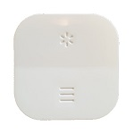

*To contribute to this page, edit the following
[file](https://github.com/Koenkk/zigbee2mqtt.io/blob/master/docs/devices/E1766.md)*

# IKEA E1766

| Model | E1766  |
| Vendor  | IKEA  |
| Description | TRADFRI open/close remote |
| Supports | click, action |
| Picture |  |

## Notes


### Deprecated click event
By default this device exposes a deprecated `click` event. It's recommended to use the `action` event instead.

To disable the `click` event, set `legacy: false` for this device in `configuration.yaml`. Example:

```yaml
devices:
  '0x12345678':
    friendly_name: my_device
    legacy: false
```


### Pairing
Open the back cover of the remote and find the pairing button.
Reset the remote with 4 short pushes on the pairing button on the back (within 5 seconds) and a red light will shine steadily on the remote.

Now keep the CC2531 USB sniffer very close to the remote for pairing (red light will stop shinning when done).

### Device type specific configuration
*[How to use device type specific configuration](../information/configuration.md)*

* `legacy`: Set to `true` to disable the legacy integration (highly recommended!)


## OTA updates
This device supports OTA updates, for more information see [OTA updates](../information/ota_updates.md).

## Manual Home Assistant configuration
Although Home Assistant integration through [MQTT discovery](../integration/home_assistant) is preferred,
manual integration is possible with the following configuration:



```yaml
sensor:
  - platform: "mqtt"
    state_topic: "zigbee2mqtt/<FRIENDLY_NAME>"
    availability_topic: "zigbee2mqtt/bridge/state"
    icon: "mdi:toggle-switch"
    value_template: "{{ value_json.click }}"

sensor:
  - platform: "mqtt"
    state_topic: "zigbee2mqtt/<FRIENDLY_NAME>"
    availability_topic: "zigbee2mqtt/bridge/state"
    unit_of_measurement: "%"
    device_class: "battery"
    value_template: "{{ value_json.battery }}"

sensor:
  - platform: "mqtt"
    state_topic: "zigbee2mqtt/<FRIENDLY_NAME>"
    availability_topic: "zigbee2mqtt/bridge/state"
    icon: "mdi:gesture-double-tap"
    value_template: "{{ value_json.action }}"

sensor:
  - platform: "mqtt"
    state_topic: "zigbee2mqtt/<FRIENDLY_NAME>"
    availability_topic: "zigbee2mqtt/bridge/state"
    icon: "mdi:signal"
    unit_of_measurement: "lqi"
    value_template: "{{ value_json.linkquality }}"

binary_sensor:
  - platform: "mqtt"
    state_topic: "zigbee2mqtt/<FRIENDLY_NAME>"
    availability_topic: "zigbee2mqtt/bridge/state"
    payload_on: true
    payload_off: false
    value_template: "{{ value_json.update_available}}"
```



