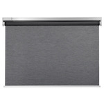

*To contribute to this page, edit the following
[file](https://github.com/Koenkk/zigbee2mqtt.io/blob/master/docs/devices/E1926.md)*

# IKEA E1926

| Model | E1926  |
| Vendor  | IKEA  |
| Description | KADRILJ roller blind |
| Supports | open, close, stop, position |
| Picture |  |

## Notes


### Pairing
It's recommend to first pair the included TRADFRI signal repeater in the room where you want to put the blinds.
Now press both buttons on the blind (next to battery lid) for 5 seconds until a white light between both buttons is turned on.
The device is now awake and ready to pair for 2 minutes.
After that pair the blind by holding the blind battery lid very close to the TRADFRI signal repeater until the white light is turned off (this should mean the pairing is successful).

### End Position
The roller blind maximum extension can be set by moving the blind to the desired position and then double pressing the up or down button.

### Device type specific configuration
*[How to use device type specific configuration](../information/configuration.md)*

* `invert_cover`: By default the position/tilt values mean: open = 100, closed = 0. This can be inverted by setting this option to true (so open = 0, close = 100).


## OTA updates
This device supports OTA updates, for more information see [OTA updates](../information/ota_updates.md).

## Manual Home Assistant configuration
Although Home Assistant integration through [MQTT discovery](../integration/home_assistant) is preferred,
manual integration is possible with the following configuration:



```yaml
cover:
  - platform: "mqtt"
    availability_topic: "zigbee2mqtt/bridge/state"
    command_topic: "zigbee2mqtt/<FRIENDLY_NAME>/set"
    position_topic: "zigbee2mqtt/<FRIENDLY_NAME>"
    set_position_topic: "zigbee2mqtt/<FRIENDLY_NAME>/set"
    set_position_template: "{ \"position\": {{ position }} }"
    value_template: "{{ value_json.position }}"

sensor:
  - platform: "mqtt"
    state_topic: "zigbee2mqtt/<FRIENDLY_NAME>"
    availability_topic: "zigbee2mqtt/bridge/state"
    unit_of_measurement: "%"
    device_class: "battery"
    value_template: "{{ value_json.battery }}"

sensor:
  - platform: "mqtt"
    state_topic: "zigbee2mqtt/<FRIENDLY_NAME>"
    availability_topic: "zigbee2mqtt/bridge/state"
    icon: "mdi:signal"
    unit_of_measurement: "lqi"
    value_template: "{{ value_json.linkquality }}"

binary_sensor:
  - platform: "mqtt"
    state_topic: "zigbee2mqtt/<FRIENDLY_NAME>"
    availability_topic: "zigbee2mqtt/bridge/state"
    payload_on: true
    payload_off: false
    value_template: "{{ value_json.update_available}}"
```



