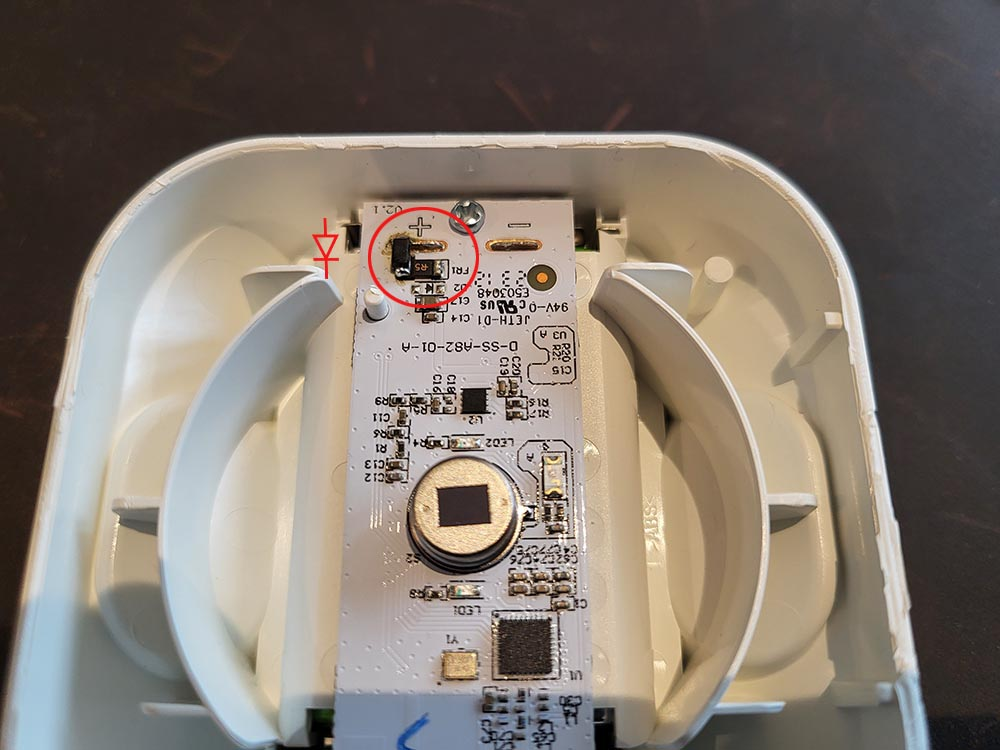
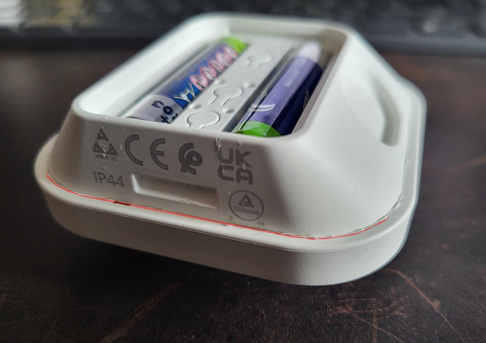

<!-- !!!! -->
<!-- ATTENTION: This file is auto-generated through docgen! -->
<!-- You can only edit the "Notes"-Section between the two comment lines "Notes BEGIN" and "Notes END". -->
<!-- Do not use h1 or h2 heading within "## Notes"-Section. -->
<!-- !!!! -->

# IKEA E2134

|     |     |
|-----|-----|
| Model | E2134  |
| Vendor  | [IKEA](/supported-devices/#v=IKEA)  |
| Description | VALLHORN wireless motion sensor |
| Exposes | occupancy, illuminance, identify, battery |
| Picture |  |

<!-- Notes BEGIN: You can edit here. Add "## Notes" headline if not already present. -->
## Notes

### Pairing
Pair the sensor to Zigbee2MQTT by pressing the pair button 4 short times.
The red light on the front side should flash a few times and then turn off.
After a few seconds it turns back on and pulsate. When connected, the light turns off.

### Common problems
Many has experienced using 1.2v AAA batteries (instead of the common 1.5v) makes the device behave correctly. Using 1.5v might result in unexpected behavior like unable to connect and false-positive motion detection.

### Mods
As an alternative to the use of 1.2V batteries as mentioned above, the battery voltage of normal batteries can also be reduced by using a diode. Experienced user can insert a diode in series in the battery circuit at the point marked in red. An MBR0520, for example, with a Vf of 0.45V worked well here. Other types will probably work well too. At the point shown in the photo, the conductor track must be scratched/split open and the diode inserted as a bridge between the battery plate and the soldering point of the polyfuse (FR1). Please note the direction! Alternatively, the polyfuse (FR1) can be removed and the diode inserted instead, then you don't have to sratch the conductor. 

Unfortunately, the casing is quite difficult to open, because both halves are glued together. With a sharp flat-head screwdriver or knife and a lot of patience, you can poke around the red line shown and pry. Then simply glue it back together afterwards.

<!-- Notes END: Do not edit below this line -->

## OTA updates
This device supports OTA updates, for more information see [OTA updates](../guide/usage/ota_updates.md).

## Options
*[How to use device type specific configuration](../guide/configuration/devices-groups.md#specific-device-options)*

* `illuminance_calibration`: Calibrates the illuminance value (percentual offset), takes into effect on next report of device. The value must be a number.

* `identify_timeout`: Sets the duration of the identification procedure in seconds (i.e., how long the device would flash).The value ranges from 1 to 30 seconds (default: 3). The value must be a number with a minimum value of `1` and with a with a maximum value of `30`

* `no_occupancy_since`: Sends a message after the last time no occupancy (occupancy: false) was detected. When setting this for example to [10, 60] a `{"no_occupancy_since": 10}` will be send after 10 seconds and a `{"no_occupancy_since": 60}` after 60 seconds. The value must be a list of [object Object].

* `illuminance_raw`: Expose the raw illuminance value. The value must be `true` or `false`

## Exposes

### Occupancy (binary)
Indicates whether the device detected occupancy.
Value can be found in the published state on the `occupancy` property.
To read (`/get`) the value publish a message to topic `zigbee2mqtt/FRIENDLY_NAME/get` with payload `{"occupancy": ""}`.
It's not possible to write (`/set`) this value.
If value equals `true` occupancy is ON, if `false` OFF.

### Illuminance (numeric)
Measured illuminance.
Value can be found in the published state on the `illuminance` property.
To read (`/get`) the value publish a message to topic `zigbee2mqtt/FRIENDLY_NAME/get` with payload `{"illuminance": ""}`.
It's not possible to write (`/set`) this value.
The unit of this value is `lx`.

### Identify (enum)
Initiate device identification. This device is asleep by default.You may need to wake it up first before sending the identify command..
Value will **not** be published in the state.
It's not possible to read (`/get`) this value.
To write (`/set`) a value publish a message to topic `zigbee2mqtt/FRIENDLY_NAME/set` with payload `{"identify": NEW_VALUE}`.
The possible values are: `identify`.

### Battery (numeric)
Remaining battery in %.
Value can be found in the published state on the `battery` property.
To read (`/get`) the value publish a message to topic `zigbee2mqtt/FRIENDLY_NAME/get` with payload `{"battery": ""}`.
It's not possible to write (`/set`) this value.
The minimal value is `0` and the maximum value is `100`.
The unit of this value is `%`.

