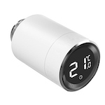

*To contribute to this page, edit the following
[file](https://github.com/Koenkk/zigbee2mqtt.io/blob/master/docs/devices/GS361A-H04.md)*

# Siterwell GS361A-H04

| Model | GS361A-H04  |
| Vendor  | Siterwell  |
| Description | Radiator valve with thermostat |
| Exposes | lock (state), switch (state), battery, position, climate (current_heating_setpoint, local_temperature, system_mode, running_state), linkquality |
| Picture |  |
| White-label | Essentials 120112, TuYa GTZ02, Revolt NX-4911, Unitec 30946 |

## Notes


### Installing the TRV
- open battery cover (twist and slide)
- insert batteries (a orange wrench should appear)
- close battery cover (slide and twist)
- press front button until `F1₁` is displayed
- install TRV
- press front button until `F1₂` is displayed (after 10-30 seconds the TRV should be able to pair)

### Pairing
- press front button 3x to enter pairing mode (LED will flash green)

If you get a warning that the model is undefined, which might happen after removing the device. Try removing it from the network again while in pairing mode.


## Exposes

### Lock 
The current state of this lock is in the published state under the `child_lock` property (value is `LOCK` or `UNLOCK`).
To control this lock publish a message to topic `zigbee2mqtt/FRIENDLY_NAME/set` with payload `{"child_lock": "LOCK"}` or `{"child_lock": "UNLOCK"}`.
It's not possible to read (`/get`) this value.

### Switch 
The current state of this switch is in the published state under the `window_detection` property (value is `ON` or `OFF`).
To control this switch publish a message to topic `zigbee2mqtt/FRIENDLY_NAME/set` with payload `{"window_detection": "ON"}`, `{"window_detection": "OFF"}` or `{"window_detection": "TOGGLE"}`.
It's not possible to read (`/get`) this value.

### Battery (numeric)
Remaining battery in %.
Value can be found in the published state on the `battery` property.
It's not possible to read (`/get`) or write (`/set`) this value.
The minimal value is `0` and the maximum value is `100`.
The unit of this value is `%`.

### Switch 
The current state of this switch is in the published state under the `valve_detection` property (value is `ON` or `OFF`).
To control this switch publish a message to topic `zigbee2mqtt/FRIENDLY_NAME/set` with payload `{"valve_detection": "ON"}`, `{"valve_detection": "OFF"}` or `{"valve_detection": "TOGGLE"}`.
It's not possible to read (`/get`) this value.

### Position (numeric)
Position.
Value can be found in the published state on the `position` property.
It's not possible to read (`/get`) or write (`/set`) this value.
The unit of this value is `%`.

### Climate 
This climate device supports the following features: `current_heating_setpoint`, `local_temperature`, `system_mode`, `running_state`.
- `current_heating_setpoint`: Temperature setpoint. To control publish a message to topic `zigbee2mqtt/FRIENDLY_NAME/set` with payload `{"current_heating_setpoint": VALUE}` where `VALUE` is the °C between `5` and `30`. To read send a message to `zigbee2mqtt/FRIENDLY_NAME/get` with payload `{"current_heating_setpoint": ""}`.
- `local_temperature`: Current temperature measured on the device (in °C). Reading (`/get`) this attribute is not possible.
- `system_mode`: Mode of this device. To control publish a message to topic `zigbee2mqtt/FRIENDLY_NAME/set` with payload `{"system_mode": VALUE}` where `VALUE` is one of: `off`, `auto`, `heat`. To read send a message to `zigbee2mqtt/FRIENDLY_NAME/get` with payload `{"system_mode": ""}`.
- `running_state`: The current running state. Possible values are: `idle`, `heat`. To read send a message to `zigbee2mqtt/FRIENDLY_NAME/get` with payload `{"running_state": ""}`.

### Linkquality (numeric)
Link quality (signal strength).
Value can be found in the published state on the `linkquality` property.
It's not possible to read (`/get`) or write (`/set`) this value.
The minimal value is `0` and the maximum value is `255`.
The unit of this value is `lqi`.

## Manual Home Assistant configuration
Although Home Assistant integration through [MQTT discovery](../integration/home_assistant) is preferred,
manual integration is possible with the following configuration:



```yaml
lock:
  - platform: "mqtt"
    state_topic: true
    availability_topic: "zigbee2mqtt/bridge/state"
    command_topic: "zigbee2mqtt/<FRIENDLY_NAME>/set"
    value_template: "{{ value_json.child_lock }}"
    payload_lock: "LOCK"
    payload_unlock: "UNLOCK"
    state_locked: "LOCK"
    state_unlocked: "UNLOCK"
    command_topic_postfix: "child_lock"

switch:
  - platform: "mqtt"
    state_topic: "zigbee2mqtt/<FRIENDLY_NAME>"
    availability_topic: "zigbee2mqtt/bridge/state"
    payload_off: "OFF"
    payload_on: "ON"
    value_template: "{{ value_json.window_detection }}"
    command_topic: "zigbee2mqtt/<FRIENDLY_NAME>/set"
    command_topic_postfix: "window_detection"
    state_off: "OFF"
    state_on: "ON"
    icon: "mdi:window-open-variant"

sensor:
  - platform: "mqtt"
    state_topic: "zigbee2mqtt/<FRIENDLY_NAME>"
    availability_topic: "zigbee2mqtt/bridge/state"
    value_template: "{{ value_json.battery }}"
    unit_of_measurement: "%"
    device_class: "battery"
    state_class: "measurement"

switch:
  - platform: "mqtt"
    state_topic: "zigbee2mqtt/<FRIENDLY_NAME>"
    availability_topic: "zigbee2mqtt/bridge/state"
    payload_off: "OFF"
    payload_on: "ON"
    value_template: "{{ value_json.valve_detection }}"
    command_topic: "zigbee2mqtt/<FRIENDLY_NAME>/set"
    command_topic_postfix: "valve_detection"
    state_off: "OFF"
    state_on: "ON"

sensor:
  - platform: "mqtt"
    state_topic: "zigbee2mqtt/<FRIENDLY_NAME>"
    availability_topic: "zigbee2mqtt/bridge/state"
    value_template: "{{ value_json.position }}"
    unit_of_measurement: "%"
    icon: "mdi:valve"
    state_class: "measurement"

climate:
  - platform: "mqtt"
    availability_topic: "zigbee2mqtt/bridge/state"
    temperature_unit: "C"
    temp_step: 0.5
    min_temp: "5"
    max_temp: "30"
    current_temperature_topic: true
    current_temperature_template: "{{ value_json.local_temperature }}"
    mode_state_topic: true
    mode_state_template: "{{ value_json.system_mode }}"
    modes: 
      - "off"
      - "auto"
      - "heat"
    mode_command_topic: true
    action_topic: true
    action_template: "{{ values[value_json.running_state] }}"
    temperature_command_topic: "current_heating_setpoint"
    temperature_state_template: "{{ value_json.current_heating_setpoint }}"
    temperature_state_topic: true

sensor:
  - platform: "mqtt"
    state_topic: "zigbee2mqtt/<FRIENDLY_NAME>"
    availability_topic: "zigbee2mqtt/bridge/state"
    value_template: "{{ value_json.linkquality }}"
    unit_of_measurement: "lqi"
    enabled_by_default: false
    icon: "mdi:signal"
    state_class: "measurement"
```



