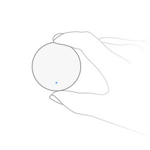

<!-- !!!! -->
<!-- ATTENTION: This file is auto-generated through docgen! -->
<!-- You can only edit the "Notes"-Section between the two comment lines "Notes BEGIN" and "Notes END". -->
<!-- Do not use h1 or h2 heading within "## Notes"-Section. -->
<!-- !!!! -->

# Xiaomi GZCGQ01LM

|     |     |
|-----|-----|
| Model | GZCGQ01LM  |
| Vendor  | [Xiaomi](/supported-devices/#v=Xiaomi)  |
| Description | Mi light sensor |
| Exposes | battery, voltage, illuminance, illuminance_lux, linkquality |
| Picture |  |
| White-label | Xiaomi YTC4043GL |

<!-- Notes BEGIN: You can edit here. Add "## Notes" headline if not already present. -->
## Notes

### Adapter firmware
In order for this device to work (fully), at least the following firmware is required on your adapter:
- CC2530/CC2531: [`20211115`](https://github.com/Koenkk/Z-Stack-firmware/tree/Z-Stack_Home_1.2_20211115/20211116/coordinator/Z-Stack_Home_1.2/bin)
- CC1352/CC2652: [`20211114`](https://github.com/Koenkk/Z-Stack-firmware/tree/7c5a6da0c41855d42b5e6506e5e3b496be097ba3/coordinator/Z-Stack_3.x.0/bin)
- CC2538: [`20211222`](https://github.com/jethome-ru/zigbee-firmware/tree/master/ti/coordinator/cc2538_cc2592)
- Conbee II: [`0x26720700`]( http://deconz.dresden-elektronik.de/deconz-firmware/deCONZ_ConBeeII_0x26720700.bin.GCF)

*Note that if you have already paired the device you will need to repair it after upgrading your adapter firmware.*

### Pairing
Press and hold the reset button on the device for +- 5 seconds (until the blue light starts blinking).
After this the device will automatically join. If this doesn't work, try with a single short button press.

### Battery
This device uses a CR2450 battery.
<!-- Notes END: Do not edit below this line -->

## Options
*[How to use device type specific configuration](../guide/configuration/devices-groups.md#specific-device-options)*

* `illuminance_calibration`: Calibrates the illuminance value (percentual offset), takes into effect on next report of device. The value must be a number.

* `illuminance_lux_calibration`: Calibrates the illuminance_lux value (percentual offset), takes into effect on next report of device. The value must be a number.

## Exposes

### Battery (numeric)
Remaining battery in %, can take up to 24 hours before reported.
Value can be found in the published state on the `battery` property.
It's not possible to read (`/get`) or write (`/set`) this value.
The minimal value is `0` and the maximum value is `100`.
The unit of this value is `%`.

### Voltage (numeric)
Voltage of the battery in millivolts.
Value can be found in the published state on the `voltage` property.
It's not possible to read (`/get`) or write (`/set`) this value.
The unit of this value is `mV`.

### Illuminance (numeric)
Raw measured illuminance.
Value can be found in the published state on the `illuminance` property.
To read (`/get`) the value publish a message to topic `zigbee2mqtt/FRIENDLY_NAME/get` with payload `{"illuminance": ""}`.
It's not possible to write (`/set`) this value.

### Illuminance (lux) (numeric)
Measured illuminance in lux.
Value can be found in the published state on the `illuminance_lux` property.
To read (`/get`) the value publish a message to topic `zigbee2mqtt/FRIENDLY_NAME/get` with payload `{"illuminance_lux": ""}`.
It's not possible to write (`/set`) this value.
The unit of this value is `lx`.

### Linkquality (numeric)
Link quality (signal strength).
Value can be found in the published state on the `linkquality` property.
It's not possible to read (`/get`) or write (`/set`) this value.
The minimal value is `0` and the maximum value is `255`.
The unit of this value is `lqi`.

