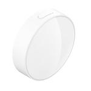

*To contribute to this page, edit the following
[file](https://github.com/Koenkk/zigbee2mqtt.io/blob/master/docs/devices/GZCGQ11LM.md)*

# Xiaomi GZCGQ11LM

| Model | GZCGQ11LM  |
| Vendor  | Xiaomi  |
| Description | Aqara T1 light intensity sensor |
| Exposes | battery, voltage, illuminance, illuminance_lux, detection_period, linkquality |
| Picture |  |

## Notes

### Device type specific configuration
*[How to use device type specific configuration](../information/configuration.md)*

* `illuminance_lux_precision`: Controls the precision of `illuminance_lux` values, e.g. `0` or `1`; default `1`.
To control the precision based on the illuminance_lux value set it to e.g. `{1000: 0, 100: 1}`,
when illuminance_lux >= 1000 precision will be 0, when illuminance_lux >= 100 precision will be 1. Precision will take into affect with next report of device.


* `illuminance_lux_calibration`: Allows to manually calibrate illuminance values,
e.g. `95` would take 95% to the illuminance reported by the device; default `100`. Calibration will take into affect with next report of device.


## Exposes

### Battery (numeric)
Remaining battery in %.
Value can be found in the published state on the `battery` property.
It's not possible to read (`/get`) or write (`/set`) this value.
The minimal value is `0` and the maximum value is `100`.
The unit of this value is `%`.

### Voltage (numeric)
Voltage of the battery in millivolts.
Value can be found in the published state on the `voltage` property.
It's not possible to read (`/get`) or write (`/set`) this value.
The unit of this value is `mV`.

### Illuminance (numeric)
Raw measured illuminance.
Value can be found in the published state on the `illuminance` property.
It's not possible to read (`/get`) or write (`/set`) this value.

### Illuminance_lux (numeric)
Measured illuminance in lux.
Value can be found in the published state on the `illuminance_lux` property.
It's not possible to read (`/get`) or write (`/set`) this value.
The unit of this value is `lx`.

### Detection_period (numeric)
Time interval in seconds to report after light changes.
Value can be found in the published state on the `detection_period` property.
To read (`/get`) the value publish a message to topic `zigbee2mqtt/FRIENDLY_NAME/get` with payload `{"detection_period": ""}`.
To write (`/set`) a value publish a message to topic `zigbee2mqtt/FRIENDLY_NAME/set` with payload `{"detection_period": NEW_VALUE}`.
The minimal value is `1` and the maximum value is `59`.
The unit of this value is `s`.

### Linkquality (numeric)
Link quality (signal strength).
Value can be found in the published state on the `linkquality` property.
It's not possible to read (`/get`) or write (`/set`) this value.
The minimal value is `0` and the maximum value is `255`.
The unit of this value is `lqi`.

## Manual Home Assistant configuration
Although Home Assistant integration through [MQTT discovery](../integration/home_assistant) is preferred,
manual integration is possible with the following configuration:



```yaml
sensor:
  - platform: "mqtt"
    state_topic: "zigbee2mqtt/<FRIENDLY_NAME>"
    availability_topic: "zigbee2mqtt/bridge/state"
    value_template: "{{ value_json.battery }}"
    unit_of_measurement: "%"
    device_class: "battery"
    state_class: "measurement"

sensor:
  - platform: "mqtt"
    state_topic: "zigbee2mqtt/<FRIENDLY_NAME>"
    availability_topic: "zigbee2mqtt/bridge/state"
    value_template: "{{ value_json.voltage }}"
    unit_of_measurement: "mV"
    device_class: "voltage"
    enabled_by_default: false
    state_class: "measurement"

sensor:
  - platform: "mqtt"
    state_topic: "zigbee2mqtt/<FRIENDLY_NAME>"
    availability_topic: "zigbee2mqtt/bridge/state"
    value_template: "{{ value_json.illuminance }}"
    device_class: "illuminance"
    enabled_by_default: false
    state_class: "measurement"

sensor:
  - platform: "mqtt"
    state_topic: "zigbee2mqtt/<FRIENDLY_NAME>"
    availability_topic: "zigbee2mqtt/bridge/state"
    value_template: "{{ value_json.illuminance_lux }}"
    unit_of_measurement: "lx"
    device_class: "illuminance"
    state_class: "measurement"

sensor:
  - platform: "mqtt"
    state_topic: "zigbee2mqtt/<FRIENDLY_NAME>"
    availability_topic: "zigbee2mqtt/bridge/state"
    value_template: "{{ value_json.detection_period }}"
    unit_of_measurement: "s"

sensor:
  - platform: "mqtt"
    state_topic: "zigbee2mqtt/<FRIENDLY_NAME>"
    availability_topic: "zigbee2mqtt/bridge/state"
    value_template: "{{ value_json.linkquality }}"
    unit_of_measurement: "lqi"
    enabled_by_default: false
    icon: "mdi:signal"
    state_class: "measurement"
```



