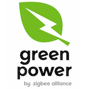

*To contribute to this page, edit the following
[file](https://github.com/Koenkk/zigbee2mqtt.io/blob/master/docs/devices/GreenPower_On_Off_Switch.md)*

# GreenPower GreenPower_On_Off_Switch

| Model | GreenPower_On_Off_Switch  |
| Vendor  | GreenPower  |
| Description | On/off switch |
| Exposes | action, linkquality |
| Picture |  |
| White-label | Philips 8718696743133, Niko 91004, Vimar 03906 |

## Notes


### Green Power
This is a Zigbee Green Power device which allows it to be very energy efficient.
Messages from Green Power devices cannot be "understood" by normal Zigbee devices, therefore they need to be "translated" first.
Not all Zigbee devices can do this translation, currently the only devices known to do this are Philips Hue devices. This means that the Green Power device has to be in range of a Philips Hue device in order to use it.

Green Power devices don't support binding and are not included in network scans.

### Pairing Philips Hue Tap
This device requires your Zigbee network to run on channel 11, 15, 20 or 25. In order to pair it hold the corresponding button for that channel 10 seconds.

| Button (dots) | Channel |
|-|-|
| 1 | 11 |
| 2 | 15 |
| 3 | 20 |
| 4 | 25 |

### Pairing Friends of Hue switches (EnOcean PTM 216Z module based)
This device has 4 buttons: A0 (left-top), A1 (left-bottom), B0 (right-top), B1 (right-bottom). In case the module is integrated in a single rocker switch, you need to remove the caps to expose all buttons. A button can be pressed by holding the contact of that button and then push the energy bar.

To pair it hold the corresponding button for that channel for 7 seconds or more.

| Button | Channel |
|-|-|
| A0 | 15 |
| A1 | 20 |
| B0 | 11 |
| B1 | 25 |

Once the device is paired you need to confirm the channel. To do this press A1 and B0 together. Important: don't press any other buttons between this and the pairing.

In case you want to pair it to a different channel you have to factory reset the device. This can be done by pressing all buttons (A0, A1, B0 and B1) simultaneously for at least 7 seconds.

This device can work on any channel, not only 15, 20, 11 or 25. For this refer to the [EnOcean PTM 216Z manual chapter 5.3](https://www.enocean.com/en/products/enocean_modules_24ghz/ptm-216z/user-manual-pdf/)


## Exposes

### Action (enum)
Triggered action (e.g. a button click).
Value can be found in the published state on the `action` property.
It's not possible to read (`/get`) or write (`/set`) this value.
The possible values are: `identify`, `recall_scene_0`, `recall_scene_1`, `recall_scene_2`, `recall_scene_3`, `recall_scene_4`, `recall_scene_5`, `recall_scene_6`, `recall_scene_7`, `store_scene_0`, `store_scene_1`, `store_scene_2`, `store_scene_3`, `store_scene_4`, `store_scene_5`, `store_scene_6`, `store_scene_7`, `off`, `on`, `toggle`, `release`, `press_1_of_1`, `release_1_of_1`, `press_1_of_2`, `release_1_of_2`, `press_2_of_2`, `release_2_of_2`, `short_press_1_of_1`, `short_press_1_of_2`, `short_press_2_of_1`.

### Linkquality (numeric)
Link quality (signal strength).
Value can be found in the published state on the `linkquality` property.
It's not possible to read (`/get`) or write (`/set`) this value.
The minimal value is `0` and the maximum value is `255`.
The unit of this value is `lqi`.

## Manual Home Assistant configuration
Although Home Assistant integration through [MQTT discovery](../integration/home_assistant) is preferred,
manual integration is possible with the following configuration:



```yaml
sensor:
  - platform: "mqtt"
    state_topic: "zigbee2mqtt/<FRIENDLY_NAME>"
    availability_topic: "zigbee2mqtt/bridge/state"
    value_template: "{{ value_json.action }}"
    enabled_by_default: true
    icon: "mdi:gesture-double-tap"

sensor:
  - platform: "mqtt"
    state_topic: "zigbee2mqtt/<FRIENDLY_NAME>"
    availability_topic: "zigbee2mqtt/bridge/state"
    value_template: "{{ value_json.linkquality }}"
    unit_of_measurement: "lqi"
    enabled_by_default: false
    icon: "mdi:signal"
    state_class: "measurement"
```



