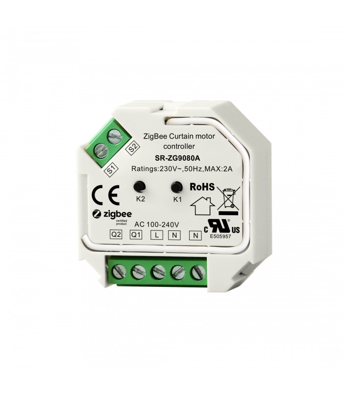

*To contribute to this page, edit the following
[file](https://github.com/Koenkk/zigbee2mqtt.io/blob/master/docs/devices/HK-ZCC-A.md)*

# Salus Controls SR600

| Model | HK-ZCC-A  |
| Vendor  | Sunricher  |
| Description | Sunricher Zigbee Curtain Motor Controller |
| Exposes | position and state |
| Picture |  |

## Notes

None

## OTA updates
This device supports OTA updates, for more information see [OTA updates](../information/ota_updates.md).

## Exposes

### Switch 
To control this switch publish a message to topic `zigbee2mqtt/FRIENDLY_NAME/set` with payload `{"state": "value"}` where value can be  open, close, stop, on, off.

### Position
To control this switch publish a message to topic `zigbee2mqtt/FRIENDLY_NAME/set` with payload `{"position": "value"}` where value can be  0 to 100.

### Linkquality (numeric)
Link quality (signal strength).
Value can be found in the published state on the `linkquality` property.
It's not possible to read (`/get`) or write (`/set`) this value.
The minimal value is `0` and the maximum value is `255`.
The unit of this value is `lqi`.

