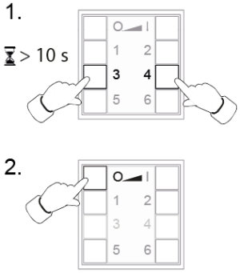
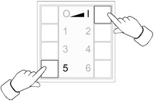

<!-- !!!! -->
<!-- ATTENTION: This file is auto-generated through docgen! -->
<!-- You can only edit the "Notes"-Section between the two comment lines "Notes BEGIN" and "Notes END". -->
<!-- Do not use h1 or h2 heading within "## Notes"-Section. -->
<!-- !!!! -->

# Insta InstaRemote

|     |     |
|-----|-----|
| Model | InstaRemote  |
| Vendor  | [Insta](/supported-devices/#v=Insta)  |
| Description | ZigBee Light Link wall/handheld transmitter |
| Exposes | action, linkquality |
| Picture |  |
| White-label | Gira 2430-100, Gira 2435-10, Jung ZLLCD5004M, Jung ZLLLS5004M, Jung ZLLA5004M, Jung ZLLHS4 |

<!-- Notes BEGIN: You can edit here. Add "## Notes" headline if not already present. -->
## Notes

### Transmitters Loosing Connection in ZigBee 3 Networks
With their factory firmware, the transmitters loose network connection after a few hours when ZigBee 3 devices are present in the network (which is a pretty much standard nowadays). For the Jung wall and handheld transmitters there is a firmware update available that fixes this problem (see [OTA updates](#ota-updates) below), but in turn decreases battery lifetime down to a few months.

Unfortunately Gira seems to have dropped support for their ZigBee transmitters completely and does not offer any firmware updates at all. For the Gira handheld transmitter the Jung update seems to work (and to fix the problem), but for the Gira wall transmitter this is not the case (it only has 6 buttons instead of 8 on the Jung wall transmitter and would therefore need a different firmware). There does not seem to be real solution for this problem rendering the Gira wall transmitters pretty much useless nowadays.

### Factory Reset (8-Button Devices)
* Press and hold buttons `3` and `4` simultaneously for about 10 seconds until the green LEDs start to flash.
* Release buttons `3` and `4` and then briefly press button `O` within 10 seconds.
* The LEDs should light up green for 3 seconds and the transmitter has been reset.

### Join Network (8-Button Devices)
* Press and hold buttons `5` and `I` simultaneously until the green LEDs start to flash. Then release the buttons again.
* After 10 more seconds the transmitter will start to search for an open network in order to join it.
* If the transmitter was able to join a network, the LEDs will light up green for 3 seconds (otherwise the LEDs will flash red quickly for 3 seconds).

### OTA
For the device to ask for/accept OTA updates, it needs to be in "programming mode" (same mode as for joining a network, see above).
In case the device does still not accept updates or seems to be stuck somehow, it may help to do a factory reset, join the network again and then again enter programming mode before starting the OTA update again.
<!-- Notes END: Do not edit below this line -->

## OTA updates
This device supports OTA updates, for more information see [OTA updates](../guide/usage/ota_updates.md).

## Options
*[How to use device type specific configuration](../guide/configuration/devices-groups.md#specific-device-options)*

* `legacy`: Set to false to disable the legacy integration (highly recommended), will change structure of the published payload (default true). The value must be `true` or `false`

## Exposes

### Action (enum)
Triggered action (e.g. a button click).
Value can be found in the published state on the `action` property.
It's not possible to read (`/get`) or write (`/set`) this value.
The possible values are: `select_0`, `select_1`, `select_2`, `select_3`, `select_4`, `select_5`, `on`, `off`, `down`, `up`, `stop`.

### Linkquality (numeric)
Link quality (signal strength).
Value can be found in the published state on the `linkquality` property.
It's not possible to read (`/get`) or write (`/set`) this value.
The minimal value is `0` and the maximum value is `255`.
The unit of this value is `lqi`.

