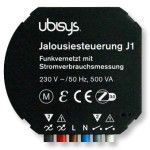

*To contribute to this page, edit the following
[file](https://github.com/Koenkk/zigbee2mqtt.io/blob/master/docs/devices/J1.md)*

# Ubisys J1

| Model | J1  |
| Vendor  | Ubisys  |
| Description | Shutter control J1 |
| Supports | open, close, stop, position, tilt |
| Picture |  |

## Notes

None

## Manual Home Assistant configuration
Although Home Assistant integration through [MQTT discovery](../integration/home_assistant) is preferred,
manual integration is possbile with the following configuration:



```yaml
cover:
  - platform: "mqtt"
    state_topic: false
    availability_topic: "zigbee2mqtt/bridge/state"
    command_topic: "zigbee2mqtt/<FRIENDLY_NAME>/set"
    set_position_topic: true
    set_position_template: "{ \"position\": {{ position }} }"
    tilt_command_topic: true
    position_topic: true
    value_template: "{{ value_json.position }}"
    tilt_status_topic: true
    tilt_status_template: "{{ value_json.tilt }}"

sensor:
  - platform: "mqtt"
    state_topic: "zigbee2mqtt/<FRIENDLY_NAME>"
    availability_topic: "zigbee2mqtt/bridge/state"
    unit_of_measurement: "-"
    value_template: "{{ value_json.linkquality }}"
```



