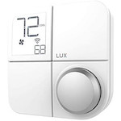

*To contribute to this page, edit the following
[file](https://github.com/Koenkk/zigbee2mqtt.io/blob/master/docs/devices/KN-Z-WH1-B04.md)*

# LUX KN-Z-WH1-B04

| Model | KN-Z-WH1-B04  |
| Vendor  | LUX  |
| Description | KONOz thermostat |
| Exposes | climate (occupied_heating_setpoint, occupied_cooling_setpoint, local_temperature, system_mode, running_state, fan_mode), linkquality |
| Picture |  |

## Notes

None


## Exposes

### Climate 
This climate device supports the following features: `occupied_heating_setpoint`, `occupied_cooling_setpoint`, `local_temperature`, `system_mode`, `running_state`, `fan_mode`.
- `occupied_heating_setpoint`: Temperature setpoint. To control publish a message to topic `zigbee2mqtt/FRIENDLY_NAME/set` with payload `{"occupied_heating_setpoint": VALUE}` where `VALUE` is the °C between `10` and `30`. To read send a message to `zigbee2mqtt/FRIENDLY_NAME/get` with payload `{"occupied_heating_setpoint": ""}`.
- `occupied_cooling_setpoint`: Temperature setpoint. To control publish a message to topic `zigbee2mqtt/FRIENDLY_NAME/set` with payload `{"occupied_cooling_setpoint": VALUE}` where `VALUE` is the °C between `10` and `30`. To read send a message to `zigbee2mqtt/FRIENDLY_NAME/get` with payload `{"occupied_cooling_setpoint": ""}`.
- `local_temperature`: Current temperature measured on the device (in °C). To read send a message to `zigbee2mqtt/FRIENDLY_NAME/get` with payload `{"local_temperature": ""}`.
- `system_mode`: Mode of this device. To control publish a message to topic `zigbee2mqtt/FRIENDLY_NAME/set` with payload `{"system_mode": VALUE}` where `VALUE` is one of: `off`, `heat`, `cool`. To read send a message to `zigbee2mqtt/FRIENDLY_NAME/get` with payload `{"system_mode": ""}`.
- `running_state`: The current running state. Possible values are: `idle`, `heat`, `cool`. To read send a message to `zigbee2mqtt/FRIENDLY_NAME/get` with payload `{"running_state": ""}`.

### Linkquality (numeric)
Link quality (signal strength).
Value can be found in the published state on the `linkquality` property.
It's not possible to read (`/get`) or write (`/set`) this value.
The minimal value is `0` and the maximum value is `255`.
The unit of this value is `lqi`.

## Manual Home Assistant configuration
Although Home Assistant integration through [MQTT discovery](../integration/home_assistant) is preferred,
manual integration is possible with the following configuration:



```yaml
climate:
  - platform: "mqtt"
    availability_topic: "zigbee2mqtt/bridge/state"
    temperature_unit: "C"
    temp_step: 0.05
    min_temp: "10"
    max_temp: "30"
    current_temperature_topic: true
    current_temperature_template: "{{ value_json.local_temperature }}"
    mode_state_topic: true
    mode_state_template: "{{ value_json.system_mode }}"
    modes: 
      - "off"
      - "heat"
      - "cool"
    mode_command_topic: true
    action_topic: true
    action_template: "{{ values[value_json.running_state] }}"
    temperature_low_command_topic: "occupied_heating_setpoint"
    temperature_low_state_template: "{{ value_json.occupied_heating_setpoint }}"
    temperature_low_state_topic: true
    temperature_high_command_topic: "occupied_cooling_setpoint"
    temperature_high_state_template: "{{ value_json.occupied_cooling_setpoint }}"
    temperature_high_state_topic: true
    fan_modes: 
      - "on"
      - "auto"
    fan_mode_command_topic: true
    fan_mode_state_template: "{{ value_json.fan_mode }}"
    fan_mode_state_topic: true

sensor:
  - platform: "mqtt"
    state_topic: "zigbee2mqtt/<FRIENDLY_NAME>"
    availability_topic: "zigbee2mqtt/bridge/state"
    value_template: "{{ value_json.linkquality }}"
    unit_of_measurement: "lqi"
    enabled_by_default: false
    icon: "mdi:signal"
    state_class: "measurement"
```



