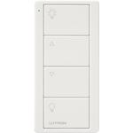

*To contribute to this page, edit the following
[file](https://github.com/Koenkk/zigbee2mqtt.io/blob/master/docs/devices/LZL4BWHL01.md)*

# Lutron LZL4BWHL01

| Model | LZL4BWHL01  |
| Vendor  | Lutron  |
| Description | Connected bulb remote control |
| Supports | on/off, brightness |
| Picture |  |

## Notes

### Device type specific configuration
*[How to use device type specific configuration](../information/configuration.md)*

* `transition`: Controls the transition time (in seconds) of on/off, brightness,
color temperature (if applicable) and color (if applicable) changes. Defaults to `0` (no transition).
Note that this value is overridden if a `transition` value is present in the MQTT command payload.


### Pairing
Factory reset the Lutron Connected Bulb Remote by pressing and holding the remote's top and bottom buttons for approximately 15 seconds. The light on the remote will blink rapidly to indicate that the remote has been reset.

After resetting the remote can be paired to a network by pressing and holding the top button for approximately 2 seconds.

#### Using the Connected Bulb Remote to reset a connected light bulb (Hue, Cree, GE Link)
Connected light bulbs can be reset with the Lutron Connected Bulb Remote by bringing the remote close (~3 inches) to the light bulb and pressing and holding the remote's 2nd and bottom buttons. The light bulb will flash and the remote's LED will turn on. Continue to hold both buttons until the remote's LED turns off.

After resetting the bulb will automatically attempt to join a network.

This method should work for Philips Hue bulbs, IKEA TRADFRI bulbs, GE Link bulbs, Connected Cree bulbs, and EcoSmart SMART bulbs.


## Manual Home Assistant configuration
Although Home Assistant integration through [MQTT discovery](../integration/home_assistant) is preferred,
manual integration is possible with the following configuration:



```yaml
sensor:
  - platform: "mqtt"
    state_topic: "zigbee2mqtt/<FRIENDLY_NAME>"
    availability_topic: "zigbee2mqtt/bridge/state"
    icon: "mdi:gesture-double-tap"
    value_template: "{{ value_json.action }}"

sensor:
  - platform: "mqtt"
    state_topic: "zigbee2mqtt/<FRIENDLY_NAME>"
    availability_topic: "zigbee2mqtt/bridge/state"
    icon: "mdi:signal"
    unit_of_measurement: "lqi"
    value_template: "{{ value_json.linkquality }}"
```



