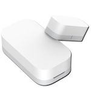

*To contribute to this page, edit the following
[file](https://github.com/Koenkk/zigbee2mqtt.io/blob/master/docs/devices/MCCGQ11LM.md)*

# Xiaomi MCCGQ11LM

| Model | MCCGQ11LM  |
| Vendor  | Xiaomi  |
| Description | Aqara door & window contact sensor |
| Supports | contact |
| Picture |  |

## Notes


### Pairing
Press and hold reset button on the device for +- 5 seconds until the
blue light blinks three times, release the reset button (the blue light will blink once more) and wait.

*NOTE: When you fail to pair a device, try replacing the battery, this could solve the problem.*


## Manual Home Assistant configuration
Although Home Assistant integration through [MQTT discovery](../integration/home_assistant) is preferred,
manual integration is possbile with the following configuration:



```yaml
binary_sensor:
  - platform: "mqtt"
    state_topic: "zigbee2mqtt/<FRIENDLY_NAME>"
    availability_topic: "zigbee2mqtt/bridge/state"
    payload_on: false
    payload_off: true
    value_template: "{{ value_json.contact }}"
    device_class: "door"

sensor:
  - platform: "mqtt"
    state_topic: "zigbee2mqtt/<FRIENDLY_NAME>"
    availability_topic: "zigbee2mqtt/bridge/state"
    unit_of_measurement: "%"
    device_class: "battery"
    value_template: "{{ value_json.battery }}"

sensor:
  - platform: "mqtt"
    state_topic: "zigbee2mqtt/<FRIENDLY_NAME>"
    availability_topic: "zigbee2mqtt/bridge/state"
    unit_of_measurement: "-"
    value_template: "{{ value_json.linkquality }}"
```



