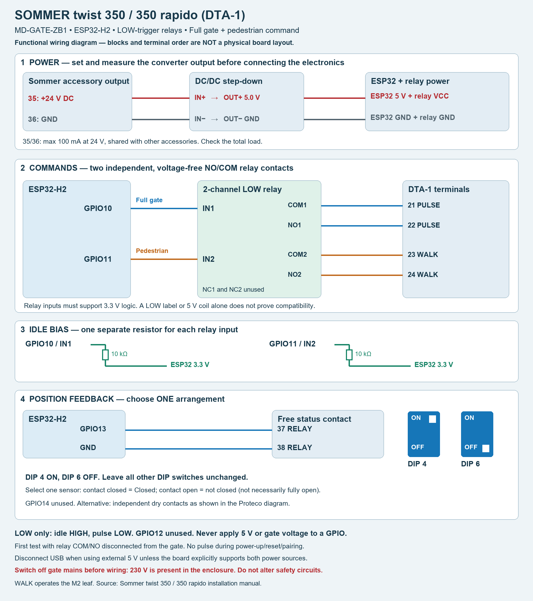
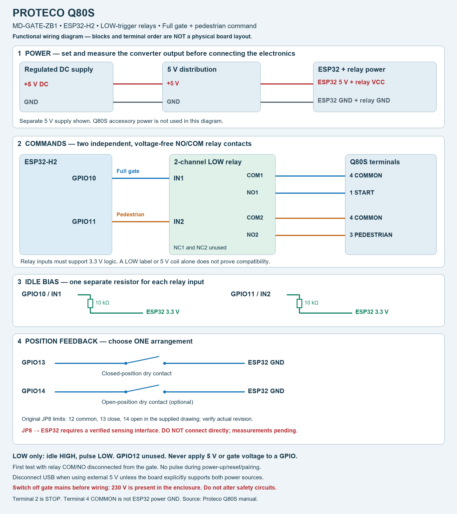

# MakeDIY MD-GATE-ZB1

<!-- Notes BEGIN -->
## Notes

### Hardware and firmware

DIY ESP32-H2 gate controller with voltage-free relay outputs and position inputs. One controller operates one gate automation. The same hardware interface can be wired to Sommer twist 350 / 350 rapido (DTA-1) or Proteco Q80S. This package is LOW-trigger only for both gate brands. Both relay channels must be LOW-trigger modules compatible with 3.3 V control. The flasher selects LOW automatically; no HIGH build is included.

The original firmware provides the main pulse on GPIO10. Firmware 1.7.0-rc1 adds an independent pedestrian pulse on GPIO11 (Zigbee endpoint 5). Firmware 1.7.0-rc1 LOW has been compiled and flashed to an ESP32-H2. The owner confirmed on a test bench that both main and pedestrian relay commands and open/closed position reporting work. An initially unresponsive pedestrian relay was traced to a cold solder joint; it worked after the hardware connection was corrected. This is a bench functional check, not completed validation on both gate installations. The pedestrian command also requires a matching converter; it is not a claim that released Zigbee2MQTT versions already support it.

### Firmware download and flashing

[Download the LOW firmware ZIP and complete illustrated instructions](https://github.com/ShifuEst/zigbee2mqtt.io/releases/tag/md-gate-zb1-v1.7.0-rc1). Select `MD-GATE-ZB1-1.7.0-rc1-LOW.zip` under Assets, not the automatically generated source archives. This is a MakeDIY pre-release, not an official Zigbee2MQTT release.

The ZIP includes the precompiled firmware, portable Windows flasher, matching external converter, exact firmware sources, SHA256 checksums and an English README with both wiring diagrams. No Arduino compilation is required.

1. Extract the entire ZIP into a writable folder. Install Python 3.11 or newer with the Python launcher from python.org.
2. Disconnect the gate COM/NO wires and relay inputs. Connect the ESP32-H2 by USB data cable, using USB power only, and close serial monitors.
3. Run `FLASH.cmd`. Internet access is needed to install esptool 5.4.0 into a local virtual environment. Select the correct port and type `FLASH` to confirm. This replaces the firmware, pairing and settings. The flasher checks the image hash, ESP32-H2 chip and 4 MB flash size before writing.
4. Wait for successful writing and verification. Press RESET if necessary. Follow the included README to install `md-gate-zb1.mjs` through Zigbee2MQTT Settings > Dev console > External converters, save and restart Zigbee2MQTT.
5. Enable Permit join, hold BOOT for 3 seconds and release; wait 10 seconds, then bench-test both relay channels and the position contacts before connecting the gate.

If no serial port appears, hold BOOT while connecting USB, release and retry. A failed flash must be rewritten completely before use. The included converter retains the tested Estonian state labels, explained in the English README.

### ESP32 wiring

| ESP32 pin | Connection |
|---|---|
| 5 V | Regulated 5 V supply and 5 V relay-module VCC |
| GND | Supply negative and relay-module GND |
| GPIO10 | Relay channel 1 IN: main pulse |
| GPIO11 | Relay channel 2 IN: pedestrian pulse, firmware 1.7.0-rc1 |
| GPIO13 | Closed-position contact to GND |
| GPIO14 | Optional open-position contact to GND |
| GPIO12 | Unused |

Relay inputs must explicitly support 3.3 V logic. A 5 V coil or a LOW-trigger label alone does not establish compatibility. Never apply 5 V or gate-controller voltage to an ESP32 GPIO. Both channels are active LOW: idle HIGH, pulse LOW. Each relay GPIO uses its own 10 kOhm pull-up to 3.3 V. These resistors are not voltage converters and do not guarantee safe behavior for every relay module. Verify that neither relay operates during power-up, reset or pairing before connecting the gate.

Use NO and COM relay contacts; leave NC unused. Do not power the ESP32 simultaneously from external 5 V and USB unless the development board explicitly supports it.

### Sommer twist 350 / 350 rapido, DTA-1



The diagram shows electrical connections, not the physical positions of terminals. Match the printed terminal numbers on your controller.

```text
ESP32 GPIO10 -> relay IN1     COM1 -> 21 PULSE
                              NO1 -> 22 PULSE
ESP32 GPIO11 -> relay IN2     COM2 -> 23 WALK
                              NO2 -> 24 WALK
ESP32 GPIO13 --------------------> 37 RELAY
ESP32 GND -----------------------> 38 RELAY
```

WALK operates the M2 pedestrian leaf. The controller determines the command sequence. For a free, voltage-free 37/38 status contact, set DIP 4 ON and DIP 6 OFF; leave the other DIP switches unchanged. Select one-sensor mode. Contact closed means closed; contact open means not closed, not necessarily fully open. GPIO14 remains unused in this arrangement.

For power from the controller, terminal 35 (+24 V) and 36 (GND) feed a suitable 24-to-5 V DC/DC converter. Set and measure 5.0 V at its output before connecting the ESP32 and relay. The 35/36 accessory output is limited to 100 mA at 24 V, shared with existing loads; verify available power or use a separate regulated supply.

### Proteco Q80S



The diagram shows electrical connections, not the physical positions of terminals. The two relay COM contacts connect to the same Q80S terminal 4. Existing JP8 limit-switch monitoring is not yet validated; use the separate dry contacts shown until the interface has been verified.

```text
ESP32 GPIO10 -> relay IN1     COM1 -> 4 COMMON
                              NO1 -> 1 START
ESP32 GPIO11 -> relay IN2     COM2 -> 4 COMMON
                              NO2 -> 3 PEDESTRIAN
```

Both COM contacts connect to terminal 4. Terminal 2 is STOP: do not use it for the pedestrian command or alter the safety circuit. PEDESTRIAN requests a partial sliding-gate opening as configured in the Q80S. Terminal 4 is the control-contact common, not an instruction to join ESP32 power GND to it. This example uses a separate regulated 5 V supply. Sommer terminal numbers and DIP settings do not apply.

#### Existing Proteco limit switches

JP8 is the limit-switch terminal block. In the supplied Q80S wiring diagram, 12 is common, 13 is the closing limit input and 14 is the opening limit input. Some manual revisions differ, and left/right motor installation can change the wiring. Confirm the actual signals in both end positions.

Proteco documents parallel reading of existing limit switches with its PQSB02 Smart Box. This establishes that the existing switches can be reused with a suitable interface; it does not establish compatibility with bare ESP32 GPIO. The JP8 signal voltages, loading and active polarity have not yet been verified for this DIY interface. Do not connect JP8 directly to GPIO13/14 or ESP32 GND. A properly specified sensing interface is required; no JP8-to-ESP32 circuit is claimed as validated here. Keep the original limit-switch wiring intact.

### Separate position contacts (either automation)

```text
GPIO13 ---- closed-position dry contact ---- GND
GPIO14 ---- open-position dry contact ------ GND (optional)
```

Use independent voltage-free contacts that close at the corresponding end position. With one sensor, closed contact means closed and released contact means not closed. With two sensors, neither active means intermediate; both active means sensor error. These are position indicators, not safety devices.

### Pairing and controls

Enable joining in Zigbee2MQTT, hold BOOT for 3 seconds, then release. Allow 10 seconds after joining before testing relay commands. A short BOOT press is not a gate command. After upgrading to firmware that adds endpoint 5, perform a fresh interview; re-pair if necessary.

Both pulse commands share the pulse duration (0–1000 ms, default 300 ms) and a one-second cooldown. Zero disables pulses. Commands received during an active pulse or cooldown are discarded, not queued. Sensor-mode changes must not activate a relay.

Until compatible built-in support is merged, released and installed, use the matching external converter once per Zigbee2MQTT server. Pairing alone does not install an external converter. This guide does not establish ZHA support.

### Troubleshooting a relay that does not respond

If position reporting works but one relay does not, check that the matching converter exposes both commands and that IN1 is connected to GPIO10 and IN2 to GPIO11, with a common relay/ESP32 GND. Disconnect power before inspecting wiring, connector seating and solder joints. On the bench with the gate disconnected, use the same known-working relay channel and lead to isolate a channel or wiring fault. A pulse-start/pulse-end firmware log confirms command processing, not electrical switching at the relay. Do not assume that reflashing will repair a bad connection.

### Commissioning

Disconnect mains before wiring inside the gate enclosure. First test the controller with relay COM/NO wires disconnected from the gate: verify each command pulses only its own channel, both return to idle, and power-up/reset/pairing produce no pulse. Then test position reporting and connect the gate only after these checks succeed. Do not bypass existing STOP, photocell or obstruction protection.

### Manufacturer references

- [Sommer twist 350 / 350 rapido manual](https://www.sommer.eu/SOMMER/Downloads/Montageanleitung/Drehtorantriebe/twist%20350%20-%20350%20rapido/twist-350-rapido_46800V001_EN.pdf)
- [Proteco Q80S manual](https://www.proteco.net/sites/default/files/products-attached-manual/q80s_gb.pdf)
- [Proteco PQSB02: parallel limit-switch reading, section 2.5](https://www.proteco.net/sites/default/files/products-attached-manual/pqsb02_03_06_2025_gb.pdf)

<!-- Notes END -->
