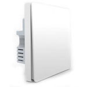

*To contribute to this page, edit the following
[file](https://github.com/Koenkk/zigbee2mqtt.io/blob/master/docs/devices/QBKG04LM.md)*

# Xiaomi QBKG04LM

| Model | QBKG04LM  |
| Vendor  | Xiaomi  |
| Description | Aqara single key wired wall switch without neutral wire. Doesn't work as a router and doesn't support power meter |
| Supports | release/hold, on/off |
| Picture |  |

## Notes


### Deprecated click event
By default this device exposes a deprecated `click` event. It's recommended to use the `action` event instead.

To disable the `click` event, set `legacy: false` for this device in `configuration.yaml`. Example:

```yaml
devices:
  '0x12345678':
    friendly_name: my_device
    legacy: false
```


### Pairing
Press and hold the button on the device for +- 10 seconds
(until the blue light starts blinking and stops blinking), release and wait.

You may have to unpair the switch from an existing coordinator before the pairing process will start.

### Device type specific configuration
*[How to use device type specific configuration](../information/configuration.md)*

* `legacy`: Set to `true` to disable the legacy integration (highly recommended!)


### Decoupled mode
Decoupled mode allows to turn wired switch into wireless button with separately controlled relay.
This might be useful to assign some custom actions to buttons and control relay remotely.
This command also allows to redefine which button controls which relay for the double switch (not supported for QBKG25LM).

Topic `zigbee2mqtt/[FRIENDLY_NAME]/system/set` should be used to modify operation mode.

**NOTE:** For QBKG25LM instead of `system` use `left`, `center` or `right` and leave out the `button` property in the payload.

Payload:
```js
{
  "operation_mode": {
    "button": "single"|"left"|"right", // Always use single for a single switch
    "state": "VALUE"
  }
}
```

Values                | Description
----------------------|---------------------------------------------------------
`control_relay`       | Button directly controls relay (for single switch and QBKG25LM)
`control_left_relay`  | Button directly controls left relay (for double switch, not supported for QBKG25LM)
`control_right_relay` | Button directly controls right relay (for double switch, not supported for QBKG25LM)
`decoupled`           | Button doesn't control any relay

`zigbee2mqtt/[FRIENDLY_NAME]/system/get` to read current mode.

Payload:
```js
{
  "operation_mode": {
    "button": "single"|"left"|"right" // Always use single for a single switch
  }
}
```

Response will be sent to `zigbee2mqtt/[FRIENDLY_NAME]`, example: `{"operation_mode_right":"control_right_relay"}`


## Manual Home Assistant configuration
Although Home Assistant integration through [MQTT discovery](../integration/home_assistant) is preferred,
manual integration is possible with the following configuration:



```yaml
switch:
  - platform: "mqtt"
    state_topic: "zigbee2mqtt/<FRIENDLY_NAME>"
    availability_topic: "zigbee2mqtt/bridge/state"
    payload_off: "OFF"
    payload_on: "ON"
    value_template: "{{ value_json.state }}"
    command_topic: "zigbee2mqtt/<FRIENDLY_NAME>/set"

sensor:
  - platform: "mqtt"
    state_topic: "zigbee2mqtt/<FRIENDLY_NAME>"
    availability_topic: "zigbee2mqtt/bridge/state"
    icon: "mdi:toggle-switch"
    value_template: "{{ value_json.click }}"

sensor:
  - platform: "mqtt"
    state_topic: "zigbee2mqtt/<FRIENDLY_NAME>"
    availability_topic: "zigbee2mqtt/bridge/state"
    icon: "mdi:gesture-double-tap"
    value_template: "{{ value_json.action }}"

sensor:
  - platform: "mqtt"
    state_topic: "zigbee2mqtt/<FRIENDLY_NAME>"
    availability_topic: "zigbee2mqtt/bridge/state"
    icon: "mdi:signal"
    unit_of_measurement: "lqi"
    value_template: "{{ value_json.linkquality }}"
```



