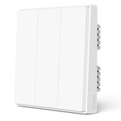

*To contribute to this page, edit the following
[file](https://github.com/Koenkk/zigbee2mqtt.io/blob/master/docs/devices/QBKG25LM.md)*

# Xiaomi QBKG25LM

| Model | QBKG25LM  |
| Vendor  | Xiaomi  |
| Description | Aqara D1 3 gang smart wall switch (no neutral wire) |
| Exposes | switch (state), power_outage_memory, operation_mode, action, linkquality |
| Picture |  |

## Notes


### Pairing
Press and hold the button on the device for +- 10 seconds
(until the blue light starts blinking and stops blinking), release and wait.

You may have to unpair the switch from an existing coordinator before the pairing process will start.
If you can't do this, try to remove battery (if it has one), push the button (to completely discharge device), place the battery back and try pairing again.

### Device type specific configuration
*[How to use device type specific configuration](../information/configuration.md)*

* `legacy`: Set to `false` to disable the legacy integration (highly recommended!) (default: true)


### Power outage memory
This option allows the device to restore the last on/off state when it's reconnected to power.
To set this option publish to `zigbee2mqtt/FRIENDLY_NAME/set` payload `{"power_outage_memory": true}` (or `false`).
Now toggle the plug/switch once with the button on it, from now on it will restore its state when reconnecting to power.


### Do not disturb mode
This option allows to turn off the indicator lights between 21:00 and 09:00.
To set this option publish to `zigbee2mqtt/FRIENDLY_NAME/set` payload `{"do_not_disturb": true}` (or `false`).


## OTA updates
This device supports OTA updates, for more information see [OTA updates](../information/ota_updates.md).


## Exposes

### Switch (left endpoint)
The current state of this switch is in the published state under the `state_left` property (value is `ON` or `OFF`).
To control this switch publish a message to topic `zigbee2mqtt/FRIENDLY_NAME/set` with payload `{"state_left": "ON"}`, `{"state_left": "OFF"}` or `{"state_left": "TOGGLE"}`.
To read the current state of this switch publish a message to topic `zigbee2mqtt/FRIENDLY_NAME/get` with payload `{"state_left": ""}`.

### Power_outage_memory (binary)
Enable/disable the power outage memory, this recovers the on/off mode after power failure.
Value can be found in the published state on the `power_outage_memory` property.
To read (`/get`) the value publish a message to topic `zigbee2mqtt/FRIENDLY_NAME/get` with payload `{"power_outage_memory": ""}`.
To write (`/set`) a value publish a message to topic `zigbee2mqtt/FRIENDLY_NAME/set` with payload `{"power_outage_memory": NEW_VALUE}`.
If value equals `true` power_outage_memory is ON, if `false` OFF.

### Switch (center endpoint)
The current state of this switch is in the published state under the `state_center` property (value is `ON` or `OFF`).
To control this switch publish a message to topic `zigbee2mqtt/FRIENDLY_NAME/set` with payload `{"state_center": "ON"}`, `{"state_center": "OFF"}` or `{"state_center": "TOGGLE"}`.
To read the current state of this switch publish a message to topic `zigbee2mqtt/FRIENDLY_NAME/get` with payload `{"state_center": ""}`.

### Operation_mode (enum, left endpoint)
Decoupled mode for left button.
Value can be found in the published state on the `operation_mode_left` property.
To read (`/get`) the value publish a message to topic `zigbee2mqtt/FRIENDLY_NAME/get` with payload `{"operation_mode_left": ""}`.
To write (`/set`) a value publish a message to topic `zigbee2mqtt/FRIENDLY_NAME/set` with payload `{"operation_mode_left": NEW_VALUE}`.
The possible values are: `control_relay`, `decoupled`.

### Operation_mode (enum, center endpoint)
Decoupled mode for center button.
Value can be found in the published state on the `operation_mode_center` property.
To read (`/get`) the value publish a message to topic `zigbee2mqtt/FRIENDLY_NAME/get` with payload `{"operation_mode_center": ""}`.
To write (`/set`) a value publish a message to topic `zigbee2mqtt/FRIENDLY_NAME/set` with payload `{"operation_mode_center": NEW_VALUE}`.
The possible values are: `control_relay`, `decoupled`.

### Operation_mode (enum, right endpoint)
Decoupled mode for right button.
Value can be found in the published state on the `operation_mode_right` property.
To read (`/get`) the value publish a message to topic `zigbee2mqtt/FRIENDLY_NAME/get` with payload `{"operation_mode_right": ""}`.
To write (`/set`) a value publish a message to topic `zigbee2mqtt/FRIENDLY_NAME/set` with payload `{"operation_mode_right": NEW_VALUE}`.
The possible values are: `control_relay`, `decoupled`.

### Switch (right endpoint)
The current state of this switch is in the published state under the `state_right` property (value is `ON` or `OFF`).
To control this switch publish a message to topic `zigbee2mqtt/FRIENDLY_NAME/set` with payload `{"state_right": "ON"}`, `{"state_right": "OFF"}` or `{"state_right": "TOGGLE"}`.
To read the current state of this switch publish a message to topic `zigbee2mqtt/FRIENDLY_NAME/get` with payload `{"state_right": ""}`.

### Action (enum)
Triggered action (e.g. a button click).
Value can be found in the published state on the `action` property.
It's not possible to read (`/get`) or write (`/set`) this value.
The possible values are: `left_single`, `left_double`, `left_triple`, `left_hold`, `left_release`, `center_single`, `center_double`, `center_triple`, `center_hold`, `center_release`, `right_single`, `right_double`, `right_triple`, `right_hold`, `right_release`.

### Linkquality (numeric)
Link quality (signal strength).
Value can be found in the published state on the `linkquality` property.
It's not possible to read (`/get`) or write (`/set`) this value.
The minimal value is `0` and the maximum value is `255`.
The unit of this value is `lqi`.

## Manual Home Assistant configuration
Although Home Assistant integration through [MQTT discovery](../integration/home_assistant) is preferred,
manual integration is possible with the following configuration:



```yaml
switch:
  - platform: "mqtt"
    state_topic: "zigbee2mqtt/<FRIENDLY_NAME>"
    availability_topic: "zigbee2mqtt/bridge/state"
    payload_off: "OFF"
    payload_on: "ON"
    value_template: "{{ value_json.state_left }}"
    command_topic: "zigbee2mqtt/<FRIENDLY_NAME>/left/set"

switch:
  - platform: "mqtt"
    state_topic: "zigbee2mqtt/<FRIENDLY_NAME>"
    availability_topic: "zigbee2mqtt/bridge/state"
    value_template: " true  false "
    payload_on: "true"
    payload_off: "false"
    command_topic: "zigbee2mqtt/<FRIENDLY_NAME>/set"
    command_topic_postfix: "power_outage_memory"

switch:
  - platform: "mqtt"
    state_topic: "zigbee2mqtt/<FRIENDLY_NAME>"
    availability_topic: "zigbee2mqtt/bridge/state"
    payload_off: "OFF"
    payload_on: "ON"
    value_template: "{{ value_json.state_center }}"
    command_topic: "zigbee2mqtt/<FRIENDLY_NAME>/center/set"

sensor:
  - platform: "mqtt"
    state_topic: "zigbee2mqtt/<FRIENDLY_NAME>"
    availability_topic: "zigbee2mqtt/bridge/state"
    value_template: "{{ value_json.operation_mode_left }}"
    enabled_by_default: false
    icon: "mdi:tune"

select:
  - platform: "mqtt"
    state_topic: true
    availability_topic: "zigbee2mqtt/bridge/state"
    value_template: "{{ value_json.operation_mode_left }}"
    command_topic: "zigbee2mqtt/<FRIENDLY_NAME>/left/set"
    command_topic_postfix: "operation_mode_left"
    options: 
      - "control_relay"
      - "decoupled"
    enabled_by_default: false
    icon: "mdi:tune"

sensor:
  - platform: "mqtt"
    state_topic: "zigbee2mqtt/<FRIENDLY_NAME>"
    availability_topic: "zigbee2mqtt/bridge/state"
    value_template: "{{ value_json.operation_mode_center }}"
    enabled_by_default: false
    icon: "mdi:tune"

select:
  - platform: "mqtt"
    state_topic: true
    availability_topic: "zigbee2mqtt/bridge/state"
    value_template: "{{ value_json.operation_mode_center }}"
    command_topic: "zigbee2mqtt/<FRIENDLY_NAME>/center/set"
    command_topic_postfix: "operation_mode_center"
    options: 
      - "control_relay"
      - "decoupled"
    enabled_by_default: false
    icon: "mdi:tune"

sensor:
  - platform: "mqtt"
    state_topic: "zigbee2mqtt/<FRIENDLY_NAME>"
    availability_topic: "zigbee2mqtt/bridge/state"
    value_template: "{{ value_json.operation_mode_right }}"
    enabled_by_default: false
    icon: "mdi:tune"

select:
  - platform: "mqtt"
    state_topic: true
    availability_topic: "zigbee2mqtt/bridge/state"
    value_template: "{{ value_json.operation_mode_right }}"
    command_topic: "zigbee2mqtt/<FRIENDLY_NAME>/right/set"
    command_topic_postfix: "operation_mode_right"
    options: 
      - "control_relay"
      - "decoupled"
    enabled_by_default: false
    icon: "mdi:tune"

switch:
  - platform: "mqtt"
    state_topic: "zigbee2mqtt/<FRIENDLY_NAME>"
    availability_topic: "zigbee2mqtt/bridge/state"
    payload_off: "OFF"
    payload_on: "ON"
    value_template: "{{ value_json.state_right }}"
    command_topic: "zigbee2mqtt/<FRIENDLY_NAME>/right/set"

sensor:
  - platform: "mqtt"
    state_topic: "zigbee2mqtt/<FRIENDLY_NAME>"
    availability_topic: "zigbee2mqtt/bridge/state"
    value_template: "{{ value_json.action }}"
    enabled_by_default: true
    icon: "mdi:gesture-double-tap"

sensor:
  - platform: "mqtt"
    state_topic: "zigbee2mqtt/<FRIENDLY_NAME>"
    availability_topic: "zigbee2mqtt/bridge/state"
    value_template: "{{ value_json.linkquality }}"
    unit_of_measurement: "lqi"
    enabled_by_default: false
    icon: "mdi:signal"
    state_class: "measurement"

sensor:
  - platform: "mqtt"
    state_topic: "zigbee2mqtt/<FRIENDLY_NAME>"
    availability_topic: "zigbee2mqtt/bridge/state"
    icon: "mdi:update"
    value_template: "{{ value_json['update']['state'] }}"
    enabled_by_default: false

binary_sensor:
  - platform: "mqtt"
    state_topic: "zigbee2mqtt/<FRIENDLY_NAME>"
    availability_topic: "zigbee2mqtt/bridge/state"
    payload_on: true
    payload_off: false
    value_template: "{{ value_json.update_available}}"
    enabled_by_default: false
```



