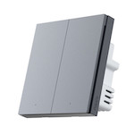

*To contribute to this page, edit the following
[file](https://github.com/Koenkk/zigbee2mqtt.io/blob/master/docs/devices/QBKG31LM.md)*

# Xiaomi QBKG31LM

| Model | QBKG31LM  |
| Vendor  | Xiaomi  |
| Description | Aqara smart wall switch H1 Pro (with neutral, double rocker) |
| Exposes | power_outage_memory, action, switch (state), power, operation_mode, linkquality |
| Picture |  |

## Notes

None

## OTA updates
This device supports OTA updates, for more information see [OTA updates](../information/ota_updates.md).


## Exposes

### Power_outage_memory (binary)
Enable/disable the power outage memory, this recovers the on/off mode after power failure.
Value can be found in the published state on the `power_outage_memory` property.
To read (`/get`) the value publish a message to topic `zigbee2mqtt/FRIENDLY_NAME/get` with payload `{"power_outage_memory": ""}`.
To write (`/set`) a value publish a message to topic `zigbee2mqtt/FRIENDLY_NAME/set` with payload `{"power_outage_memory": NEW_VALUE}`.
If value equals `true` power_outage_memory is ON, if `false` OFF.

### Action (enum)
Triggered action (e.g. a button click).
Value can be found in the published state on the `action` property.
It's not possible to read (`/get`) or write (`/set`) this value.
The possible values are: `single_left`, `double_left`, `single_right`, `double_right`.

### Switch (left endpoint)
The current state of this switch is in the published state under the `state_left` property (value is `ON` or `OFF`).
To control this switch publish a message to topic `zigbee2mqtt/FRIENDLY_NAME/set` with payload `{"state_left": "ON"}`, `{"state_left": "OFF"}` or `{"state_left": "TOGGLE"}`.
To read the current state of this switch publish a message to topic `zigbee2mqtt/FRIENDLY_NAME/get` with payload `{"state_left": ""}`.

### Switch (right endpoint)
The current state of this switch is in the published state under the `state_right` property (value is `ON` or `OFF`).
To control this switch publish a message to topic `zigbee2mqtt/FRIENDLY_NAME/set` with payload `{"state_right": "ON"}`, `{"state_right": "OFF"}` or `{"state_right": "TOGGLE"}`.
To read the current state of this switch publish a message to topic `zigbee2mqtt/FRIENDLY_NAME/get` with payload `{"state_right": ""}`.

### Power (numeric)
Instantaneous measured power.
Value can be found in the published state on the `power` property.
To read (`/get`) the value publish a message to topic `zigbee2mqtt/FRIENDLY_NAME/get` with payload `{"power": ""}`.
It's not possible to write (`/set`) this value.
The unit of this value is `W`.

### Operation_mode (enum, left endpoint)
Decoupled mode for left button.
Value can be found in the published state on the `operation_mode_left` property.
To read (`/get`) the value publish a message to topic `zigbee2mqtt/FRIENDLY_NAME/get` with payload `{"operation_mode_left": ""}`.
To write (`/set`) a value publish a message to topic `zigbee2mqtt/FRIENDLY_NAME/set` with payload `{"operation_mode_left": NEW_VALUE}`.
The possible values are: `control_relay`, `decoupled`.

### Operation_mode (enum, right endpoint)
Decoupled mode for right button.
Value can be found in the published state on the `operation_mode_right` property.
To read (`/get`) the value publish a message to topic `zigbee2mqtt/FRIENDLY_NAME/get` with payload `{"operation_mode_right": ""}`.
To write (`/set`) a value publish a message to topic `zigbee2mqtt/FRIENDLY_NAME/set` with payload `{"operation_mode_right": NEW_VALUE}`.
The possible values are: `control_relay`, `decoupled`.

### Linkquality (numeric)
Link quality (signal strength).
Value can be found in the published state on the `linkquality` property.
It's not possible to read (`/get`) or write (`/set`) this value.
The minimal value is `0` and the maximum value is `255`.
The unit of this value is `lqi`.

## Manual Home Assistant configuration
Although Home Assistant integration through [MQTT discovery](../integration/home_assistant) is preferred,
manual integration is possible with the following configuration:



```yaml
switch:
  - platform: "mqtt"
    state_topic: "zigbee2mqtt/<FRIENDLY_NAME>"
    availability_topic: "zigbee2mqtt/bridge/state"
    value_template: " true  false "
    payload_on: "true"
    payload_off: "false"
    command_topic: "zigbee2mqtt/<FRIENDLY_NAME>/set"
    command_topic_postfix: "power_outage_memory"

sensor:
  - platform: "mqtt"
    state_topic: "zigbee2mqtt/<FRIENDLY_NAME>"
    availability_topic: "zigbee2mqtt/bridge/state"
    value_template: "{{ value_json.action }}"
    enabled_by_default: true
    icon: "mdi:gesture-double-tap"

switch:
  - platform: "mqtt"
    state_topic: "zigbee2mqtt/<FRIENDLY_NAME>"
    availability_topic: "zigbee2mqtt/bridge/state"
    payload_off: "OFF"
    payload_on: "ON"
    value_template: "{{ value_json.state_left }}"
    command_topic: "zigbee2mqtt/<FRIENDLY_NAME>/left/set"

switch:
  - platform: "mqtt"
    state_topic: "zigbee2mqtt/<FRIENDLY_NAME>"
    availability_topic: "zigbee2mqtt/bridge/state"
    payload_off: "OFF"
    payload_on: "ON"
    value_template: "{{ value_json.state_right }}"
    command_topic: "zigbee2mqtt/<FRIENDLY_NAME>/right/set"

sensor:
  - platform: "mqtt"
    state_topic: "zigbee2mqtt/<FRIENDLY_NAME>"
    availability_topic: "zigbee2mqtt/bridge/state"
    value_template: "{{ value_json.power }}"
    unit_of_measurement: "W"
    device_class: "power"
    state_class: "measurement"

sensor:
  - platform: "mqtt"
    state_topic: "zigbee2mqtt/<FRIENDLY_NAME>"
    availability_topic: "zigbee2mqtt/bridge/state"
    value_template: "{{ value_json.operation_mode_left }}"
    enabled_by_default: false
    icon: "mdi:tune"

select:
  - platform: "mqtt"
    state_topic: true
    availability_topic: "zigbee2mqtt/bridge/state"
    value_template: "{{ value_json.operation_mode_left }}"
    command_topic: "zigbee2mqtt/<FRIENDLY_NAME>/left/set"
    command_topic_postfix: "operation_mode_left"
    options: 
      - "control_relay"
      - "decoupled"
    enabled_by_default: false
    icon: "mdi:tune"

sensor:
  - platform: "mqtt"
    state_topic: "zigbee2mqtt/<FRIENDLY_NAME>"
    availability_topic: "zigbee2mqtt/bridge/state"
    value_template: "{{ value_json.operation_mode_right }}"
    enabled_by_default: false
    icon: "mdi:tune"

select:
  - platform: "mqtt"
    state_topic: true
    availability_topic: "zigbee2mqtt/bridge/state"
    value_template: "{{ value_json.operation_mode_right }}"
    command_topic: "zigbee2mqtt/<FRIENDLY_NAME>/right/set"
    command_topic_postfix: "operation_mode_right"
    options: 
      - "control_relay"
      - "decoupled"
    enabled_by_default: false
    icon: "mdi:tune"

sensor:
  - platform: "mqtt"
    state_topic: "zigbee2mqtt/<FRIENDLY_NAME>"
    availability_topic: "zigbee2mqtt/bridge/state"
    value_template: "{{ value_json.linkquality }}"
    unit_of_measurement: "lqi"
    enabled_by_default: false
    icon: "mdi:signal"
    state_class: "measurement"

sensor:
  - platform: "mqtt"
    state_topic: "zigbee2mqtt/<FRIENDLY_NAME>"
    availability_topic: "zigbee2mqtt/bridge/state"
    icon: "mdi:update"
    value_template: "{{ value_json['update']['state'] }}"
    enabled_by_default: false

binary_sensor:
  - platform: "mqtt"
    state_topic: "zigbee2mqtt/<FRIENDLY_NAME>"
    availability_topic: "zigbee2mqtt/bridge/state"
    payload_on: true
    payload_off: false
    value_template: "{{ value_json.update_available}}"
    enabled_by_default: false
```



