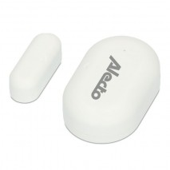

*To contribute to this page, edit the following
[file](https://github.com/Koenkk/zigbee2mqtt.io/blob/master/docs/devices/RH3052.md)*

# Alecto RH3001

| Model | RH3001  |
| Vendor  | Alecto  |
| Description | Smart-DOOR10 Door and Window Sensor |
| Supports | temperature and humidity |
| Picture | |

## Notes

None

## Manual Home Assistant configuration
Although Home Assistant integration through [MQTT discovery](../integration/home_assistant) is preferred,
manual integration is possible with the following configuration:



```yaml
todo: Manual configuration information here
```



