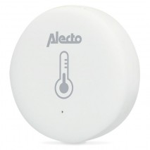

*To contribute to this page, edit the following
[file](https://github.com/Koenkk/zigbee2mqtt.io/blob/master/docs/devices/RH3052.md)*

# Alecto RH3052

| Model | RH3052  |
| Vendor  | Alecto  |
| Description | Temperature and Humidity Sensor |
| Supports | temperature and humidity |
| Picture | |

## Notes

    Alecto Smart Home branded Smart sensor temp and humidity
    Appears to be a re-branded TUYATEC - TT001ZAV20 temp and humidity sensor

## Manual Home Assistant configuration
Although Home Assistant integration through [MQTT discovery](../integration/home_assistant) is preferred,
manual integration is possible with the following configuration:



```yaml
todo: Manual configuration information here
```



