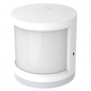

*To contribute to this page, edit the following
[file](https://github.com/Koenkk/zigbee2mqtt.io/blob/master/docs/devices/RTCGQ01LM.md)*

# Xiaomi RTCGQ01LM

| Model | RTCGQ01LM  |
| Vendor  | Xiaomi  |
| Description | MiJia human body movement sensor |
| Supports | occupancy |
| Picture |  |

## Notes


### Pairing
Press and hold the reset button on the device for +- 5 seconds (until the blue light starts blinking).

**IMPORTANT**: Release and start pressing the reset button every second.
This keeps the device awake, otherwise pairing will **fail!**.

*NOTE: When you fail to pair a device, try replacing the battery, this could solve the problem.*


### Device type specific configuration
*[How to use device type specific configuration](../configuration/device_specific_configuration.md)*

* `no_occupancy_since`: Timeout (in seconds) after `no_occupancy_since` is send.
This indicates the time since last occupancy was detected.
For example `no_occupancy_since: [10, 60]` will send a `{"no_occupancy_since": 10}` after 10 seconds
and a `{"no_occupancy_since": 60}` after 60 seconds.
* `occupancy_timeout`: Timeout (in seconds) after the `occupancy: false` message is sent.
If not set, the timeout is `90` seconds.
When set to `0` no `occupancy: false` is send.

**IMPORTANT**: `occupancy_timeout` should not be set to lower than 60 seconds.
The reason is this: after detecting a motion the sensor ignores any movements for
exactly 60 seconds. In case there are movements after this, a new message
(`occupancy: true`) will be sent and the sensor will go for one more minute sleep, and so on.
This is expected behaviour (see [#270](https://github.com/Koenkk/zigbee2mqtt/issues/270#issuecomment-414999973)).
To work around this, a
[hardware modification](https://community.smartthings.com/t/making-xiaomi-motion-sensor-a-super-motion-sensor/139806)
is needed.


## Manual Home Assistant configuration
Although Home Assistant integration through [MQTT discovery](../integration/home_assistant) is preferred,
manual integration is possbile with the following configuration:



```yaml
binary_sensor:
  - platform: "mqtt"
    state_topic: "zigbee2mqtt/<FRIENDLY_NAME>"
    availability_topic: "zigbee2mqtt/bridge/state"
    payload_on: true
    payload_off: false
    value_template: "{{ value_json.occupancy }}"
    device_class: "motion"

sensor:
  - platform: "mqtt"
    state_topic: "zigbee2mqtt/<FRIENDLY_NAME>"
    availability_topic: "zigbee2mqtt/bridge/state"
    unit_of_measurement: "%"
    device_class: "battery"
    value_template: "{{ value_json.battery }}"

sensor:
  - platform: "mqtt"
    state_topic: "zigbee2mqtt/<FRIENDLY_NAME>"
    availability_topic: "zigbee2mqtt/bridge/state"
    unit_of_measurement: "-"
    value_template: "{{ value_json.linkquality }}"
```



