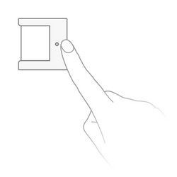

<!-- !!!! -->
<!-- ATTENTION: This file is auto-generated through docgen! -->
<!-- You can only edit the "Notes"-Section between the two comment lines "Notes BEGIN" and "Notes END". -->
<!-- Do not use h1 or h2 heading within "## Notes"-Section. -->
<!-- !!!! -->

# Xiaomi RTCGQ12LM

|     |     |
|-----|-----|
| Model | RTCGQ12LM  |
| Vendor  | Xiaomi  |
| Description | Aqara T1 human body movement and illuminance sensor |
| Exposes | occupancy, illuminance, detection_interval, battery, linkquality |
| Picture |  |

<!-- Notes BEGIN: You can edit here. Add "## Notes" headline if not already present. -->
## Notes

### Adapter firmware
In order for this device to work, at least the following firmware is required on your adapter:
- CC2530/CC2531: [`20211115`](https://github.com/Koenkk/Z-Stack-firmware/tree/Z-Stack_Home_1.2_20211115/20211116/coordinator/Z-Stack_Home_1.2/bin)
- CC1352/CC2652: [`20211114`](https://github.com/Koenkk/Z-Stack-firmware/tree/7c5a6da0c41855d42b5e6506e5e3b496be097ba3/coordinator/Z-Stack_3.x.0/bin)
- Conbee II: [`0x26720700`]( http://deconz.dresden-elektronik.de/deconz-firmware/deCONZ_ConBeeII_0x26720700.bin.GCF)

*Note that if you have already paired the device you will need to repair it after upgrading your adapter firmware.*

### Pairing
Press and hold the reset button on the device for +- 5 seconds (until the blue light starts blinking).
After this the device will automatically join. If this doesn't work, try with a single short button press.

*Note: When you fail to pair a device, try replacing the battery, this could solve the problem.*
<!-- Notes END: Do not edit below this line -->

## OTA updates
This device supports OTA updates, for more information see [OTA updates](../guide/usage/ota_updates.md).

## Options
*[How to use device type specific configuration](../guide/configuration/devices-groups.md#specific-device-options)*

* `illuminance_precision`: Number of digits after decimal point for illuminance, takes into effect on next report of device. The value must be a number with a minimum value of `0` and with a with a maximum value of `3`

* `illuminance_calibration`: Calibrates the illuminance value (percentual offset), takes into effect on next report of device. The value must be a number.

* `temperature_precision`: Number of digits after decimal point for temperature, takes into effect on next report of device. The value must be a number with a minimum value of `0` and with a with a maximum value of `3`

* `temperature_calibration`: Calibrates the temperature value (absolute offset), takes into effect on next report of device. The value must be a number.

## Exposes

### Occupancy (binary)
Indicates whether the device detected occupancy.
Value can be found in the published state on the `occupancy` property.
It's not possible to read (`/get`) or write (`/set`) this value.
If value equals `true` occupancy is ON, if `false` OFF.

### Illuminance (numeric)
Measured illuminance in lux.
Value can be found in the published state on the `illuminance` property.
It's not possible to read (`/get`) or write (`/set`) this value.
The unit of this value is `lx`.

### Detection_interval (numeric)
Time interval for detecting actions.
Value can be found in the published state on the `detection_interval` property.
To read (`/get`) the value publish a message to topic `zigbee2mqtt/FRIENDLY_NAME/get` with payload `{"detection_interval": ""}`.
To write (`/set`) a value publish a message to topic `zigbee2mqtt/FRIENDLY_NAME/set` with payload `{"detection_interval": NEW_VALUE}`.
The minimal value is `2` and the maximum value is `65535`.
The unit of this value is `s`.

### Battery (numeric)
Remaining battery in %.
Value can be found in the published state on the `battery` property.
It's not possible to read (`/get`) or write (`/set`) this value.
The minimal value is `0` and the maximum value is `100`.
The unit of this value is `%`.

### Linkquality (numeric)
Link quality (signal strength).
Value can be found in the published state on the `linkquality` property.
It's not possible to read (`/get`) or write (`/set`) this value.
The minimal value is `0` and the maximum value is `255`.
The unit of this value is `lqi`.

