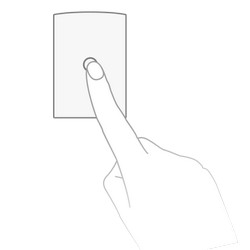

<!-- !!!! -->
<!-- ATTENTION: This file is auto-generated through docgen! -->
<!-- You can only edit the "Notes"-Section between the two comment lines "Notes BEGIN" and "Notes END". -->
<!-- Do not use h1 or h2 heading within "## Notes"-Section. -->
<!-- !!!! -->

# Aqara RTCGQ14LM

|     |     |
|-----|-----|
| Model | RTCGQ14LM  |
| Vendor  | [Aqara](/supported-devices/#v=Aqara)  |
| Description | Motion sensor P1 |
| Exposes | occupancy, illuminance_lux, illuminance, motion_sensitivity, detection_interval, trigger_indicator, device_temperature, battery, voltage, linkquality |
| Picture |  |
| White-label | Aqara MS-S02 |

<!-- Notes BEGIN: You can edit here. Add "## Notes" headline if not already present. -->
## Notes

### Adapter firmware
In order for this device to work, at least the following firmware is required on your adapter:
- CC2530/CC2531: [`20211115`](https://github.com/Koenkk/Z-Stack-firmware/tree/Z-Stack_Home_1.2_20211115/20211116/coordinator/Z-Stack_Home_1.2/bin)
- CC1352/CC2652: [`20211114`](https://github.com/Koenkk/Z-Stack-firmware/tree/7c5a6da0c41855d42b5e6506e5e3b496be097ba3/coordinator/Z-Stack_3.x.0/bin)
- CC2538: [`20211222`](https://github.com/jethome-ru/zigbee-firmware/tree/master/ti/coordinator/cc2538_cc2592)
- Conbee II: [`0x26720700`]( http://deconz.dresden-elektronik.de/deconz-firmware/deCONZ_ConBeeII_0x26720700.bin.GCF)

*Note that if you have already paired the device you will need to repair it after upgrading your adapter firmware.*

### Pairing
Press and hold the reset button on the device for +- 5 seconds (until the blue light starts blinking).
After this the device will automatically join. If this doesn't work, try with a single short button press.

*Note: When you fail to pair a device, try replacing the battery, this could solve the problem.*
<!-- Notes END: Do not edit below this line -->

## OTA updates
This device supports OTA updates, for more information see [OTA updates](../guide/usage/ota_updates.md).

## Options
*[How to use device type specific configuration](../guide/configuration/devices-groups.md#specific-device-options)*

* `illuminance_lux_calibration`: Calibrates the illuminance_lux value (percentual offset), takes into effect on next report of device. The value must be a number.

* `illuminance_calibration`: Calibrates the illuminance value (percentual offset), takes into effect on next report of device. The value must be a number.

* `device_temperature_calibration`: Calibrates the device_temperature value (absolute offset), takes into effect on next report of device. The value must be a number.

* `occupancy_timeout`: Time in seconds after which occupancy is cleared after detecting it (default is "detection_interval" + 2 seconds). The value must be equal to or greater than "detection_interval", and it can also be a fraction. The value must be a number with a minimum value of `0`

* `no_occupancy_since`: Sends a message the last time occupancy (occupancy: true) was detected. When setting this for example to [10, 60] a `{"no_occupancy_since": 10}` will be send after 10 seconds and a `{"no_occupancy_since": 60}` after 60 seconds. The value must be a list of [object Object].

## Exposes

### Occupancy (binary)
Indicates whether the device detected occupancy.
Value can be found in the published state on the `occupancy` property.
It's not possible to read (`/get`) or write (`/set`) this value.
If value equals `true` occupancy is ON, if `false` OFF.

### Illuminance (lux) (numeric)
Measured illuminance in lux.
Value can be found in the published state on the `illuminance` property.
It's not possible to read (`/get`) or write (`/set`) this value.
The unit of this value is `lx`.

### Illuminance (numeric)
Measured illuminance in lux.
Value can be found in the published state on the `illuminance` property.
It's not possible to read (`/get`) or write (`/set`) this value.
The unit of this value is `lx`.

### Motion sensitivity (enum)
Select motion sensitivity to use. Press pairing button right before changing this otherwise it will fail..
Value can be found in the published state on the `motion_sensitivity` property.
To read (`/get`) the value publish a message to topic `zigbee2mqtt/FRIENDLY_NAME/get` with payload `{"motion_sensitivity": ""}`.
To write (`/set`) a value publish a message to topic `zigbee2mqtt/FRIENDLY_NAME/set` with payload `{"motion_sensitivity": NEW_VALUE}`.
The possible values are: `low`, `medium`, `high`.

### Detection interval (numeric)
Time interval between action detection. Press pairing button right before changing this otherwise it will fail..
Value can be found in the published state on the `detection_interval` property.
To read (`/get`) the value publish a message to topic `zigbee2mqtt/FRIENDLY_NAME/get` with payload `{"detection_interval": ""}`.
To write (`/set`) a value publish a message to topic `zigbee2mqtt/FRIENDLY_NAME/set` with payload `{"detection_interval": NEW_VALUE}`.
The minimal value is `2` and the maximum value is `65535`.
The unit of this value is `s`.

### Trigger indicator (binary)
When this option is enabled then blue LED will blink once when motion is detected. Press pairing button right before changing this otherwise it will fail..
Value can be found in the published state on the `trigger_indicator` property.
To read (`/get`) the value publish a message to topic `zigbee2mqtt/FRIENDLY_NAME/get` with payload `{"trigger_indicator": ""}`.
To write (`/set`) a value publish a message to topic `zigbee2mqtt/FRIENDLY_NAME/set` with payload `{"trigger_indicator": NEW_VALUE}`.
If value equals `true` trigger indicator is ON, if `false` OFF.

### Device temperature (numeric)
Temperature of the device.
Value can be found in the published state on the `device_temperature` property.
It's not possible to read (`/get`) or write (`/set`) this value.
The unit of this value is `°C`.

### Battery (numeric)
Remaining battery in %, can take up to 24 hours before reported.
Value can be found in the published state on the `battery` property.
It's not possible to read (`/get`) or write (`/set`) this value.
The minimal value is `0` and the maximum value is `100`.
The unit of this value is `%`.

### Voltage (numeric)
Voltage of the battery in millivolts.
Value can be found in the published state on the `voltage` property.
It's not possible to read (`/get`) or write (`/set`) this value.
The unit of this value is `mV`.

### Linkquality (numeric)
Link quality (signal strength).
Value can be found in the published state on the `linkquality` property.
It's not possible to read (`/get`) or write (`/set`) this value.
The minimal value is `0` and the maximum value is `255`.
The unit of this value is `lqi`.

