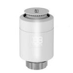

*To contribute to this page, edit the following
[file](https://github.com/Koenkk/zigbee2mqtt.io/blob/master/docs/devices/SEA802-Zigbee.md)*

# Saswell SEA802-Zigbee

| Model | SEA802-Zigbee  |
| Vendor  | Saswell  |
| Description | Thermostatic radiator valve |
| Supports | thermostat, temperature |
| Picture |  |
| White-label | HiHome WZB-TRVL |

## Notes

None

## Manual Home Assistant configuration
Although Home Assistant integration through [MQTT discovery](../integration/home_assistant) is preferred,
manual integration is possible with the following configuration:



```yaml
binary_sensor:
  - platform: "mqtt"
    state_topic: "zigbee2mqtt/<FRIENDLY_NAME>"
    availability_topic: "zigbee2mqtt/bridge/state"
    payload_on: true
    payload_off: false
    value_template: "{{ value_json.battery_low}}"
    device_class: "battery"

climate:
  - platform: "mqtt"
    availability_topic: "zigbee2mqtt/bridge/state"
    temperature_unit: "C"
    min_temp: "5"
    max_temp: "30"
    mode_state_topic: true
    mode_state_template: "{{ value_json.system_mode }}"
    mode_command_topic: true
    current_temperature_topic: true
    current_temperature_template: "{{ value_json.local_temperature }}"
    temp_step: 0.5
    action_topic: true
    action_template: "{{ values[value_json.running_state] }}"
    modes: 
      - "off"
      - "heat"
    hold_modes: 
      - "manual"
      - "auto"
    hold_command_topic: true
    hold_state_template: "{{ value_json.preset }}"
    hold_state_topic: true
    temperature_state_topic: true
    temperature_state_template: "{{ value_json.current_heating_setpoint }}"
    temperature_command_topic: "current_heating_setpoint"

sensor:
  - platform: "mqtt"
    state_topic: "zigbee2mqtt/<FRIENDLY_NAME>"
    availability_topic: "zigbee2mqtt/bridge/state"
    icon: "mdi:signal"
    unit_of_measurement: "lqi"
    value_template: "{{ value_json.linkquality }}"
```



