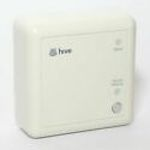

*To contribute to this page, edit the following
[file](https://github.com/Koenkk/zigbee2mqtt.io/blob/master/docs/devices/SLR1b.md)*

# Hive SLR1b

| Model | SLR1b  |
| Vendor  | Hive  |
| Description | Heating thermostat |
| Exposes | climate (occupied_heating_setpoint, local_temperature, system_mode, running_state), temperature_setpoint_hold, temperature_setpoint_hold_duration, linkquality |
| Picture |  |

## Notes


### How to start/edit native boost
The receiver has support for native Boost, which will allow to display the remaining time on a compatible remote.

To start one, or modify an already active one, send the following payload to the topic `zigbee2mqtt/FRIENDLY_NAME/set`:

```js
{
   "system_mode":"emergency_heating",
   "temperature_setpoint_hold_duration":"30",  // Replace with desired duration in minutes. Max 360. 0 to stop
   "temperature_setpoint_hold":"1",
   "occupied_heating_setpoint":"18"  // Replace with desired temperature. Between 5 and 32 C
}
```
Note: For device timing reasons, the payload needs to be sent as one single command. Sending individual commands or settings attributes manually using the Frontend will not work.

Also, the native boost can be used as a method to pause the heating too. To do so, set the temperature to a low value.

### Set heating mode to ON
Send the following payload to the topic `zigbee2mqtt/FRIENDLY_NAME/set`:
```js
{
   "system_mode":"heat",
   "temperature_setpoint_hold":"1",
   "occupied_heating_setpoint":"20" // Replace with desired temperature. Between 5 and 32 C
}
```
Note: You will also notice that `temperature_setpoint_hold_duration` automatically changes to `65535` which means `undefined` (indefinite).

This will also stop any native boosts that are currently active.


### Set heating mode to OFF
Send the following payload to the topic `zigbee2mqtt/FRIENDLY_NAME/set`:
```js
{
   "system_mode":"off",
   "temperature_setpoint_hold":"0"
}
```
Note: You will also notice that `temperature_setpoint_hold_duration` automatically changes to `0` which means `not set`. `occupied_heating_setpoint` automatically changes to `1` degree C.

This will also stop any native boosts that are currently active.


## Exposes

### Climate 
This climate device supports the following features: `occupied_heating_setpoint`, `local_temperature`, `system_mode`, `running_state`.
- `occupied_heating_setpoint`: Temperature setpoint. To control publish a message to topic `zigbee2mqtt/FRIENDLY_NAME/set` with payload `{"occupied_heating_setpoint": VALUE}` where `VALUE` is the °C between `5` and `32`. To read send a message to `zigbee2mqtt/FRIENDLY_NAME/get` with payload `{"occupied_heating_setpoint": ""}`.
- `local_temperature`: Current temperature measured on the device (in °C). To read send a message to `zigbee2mqtt/FRIENDLY_NAME/get` with payload `{"local_temperature": ""}`.
- `system_mode`: Mode of this device. To control publish a message to topic `zigbee2mqtt/FRIENDLY_NAME/set` with payload `{"system_mode": VALUE}` where `VALUE` is one of: `off`, `auto`, `heat`. To read send a message to `zigbee2mqtt/FRIENDLY_NAME/get` with payload `{"system_mode": ""}`.
- `running_state`: The current running state. Possible values are: `idle`, `heat`. To read send a message to `zigbee2mqtt/FRIENDLY_NAME/get` with payload `{"running_state": ""}`.

### Temperature_setpoint_hold (binary)
Prevent changes. `false` = run normally. `true` = prevent from making changes. Must be set to `false` when system_mode = off or `true` for heat.
Value can be found in the published state on the `temperature_setpoint_hold` property.
To read (`/get`) the value publish a message to topic `zigbee2mqtt/FRIENDLY_NAME/get` with payload `{"temperature_setpoint_hold": ""}`.
To write (`/set`) a value publish a message to topic `zigbee2mqtt/FRIENDLY_NAME/set` with payload `{"temperature_setpoint_hold": NEW_VALUE}`.
If value equals `true` temperature_setpoint_hold is ON, if `false` OFF.

### Temperature_setpoint_hold_duration (numeric)
Period in minutes for which the setpoint hold will be active. 65535 = attribute not used. 0 to 360 to match the remote display.
Value can be found in the published state on the `temperature_setpoint_hold_duration` property.
To read (`/get`) the value publish a message to topic `zigbee2mqtt/FRIENDLY_NAME/get` with payload `{"temperature_setpoint_hold_duration": ""}`.
To write (`/set`) a value publish a message to topic `zigbee2mqtt/FRIENDLY_NAME/set` with payload `{"temperature_setpoint_hold_duration": NEW_VALUE}`.
The minimal value is `0` and the maximum value is `65535`.

### Linkquality (numeric)
Link quality (signal strength).
Value can be found in the published state on the `linkquality` property.
It's not possible to read (`/get`) or write (`/set`) this value.
The minimal value is `0` and the maximum value is `255`.
The unit of this value is `lqi`.

## Manual Home Assistant configuration
Although Home Assistant integration through [MQTT discovery](../integration/home_assistant) is preferred,
manual integration is possible with the following configuration:



```yaml
climate:
  - platform: "mqtt"
    availability_topic: "zigbee2mqtt/bridge/state"
    temperature_unit: "C"
    temp_step: 0.5
    min_temp: "5"
    max_temp: "32"
    current_temperature_topic: true
    current_temperature_template: "{{ value_json.local_temperature }}"
    mode_state_topic: true
    mode_state_template: "{{ value_json.system_mode }}"
    modes: 
      - "off"
      - "auto"
      - "heat"
    mode_command_topic: true
    action_topic: true
    action_template: "{{ values[value_json.running_state] }}"
    temperature_command_topic: "occupied_heating_setpoint"
    temperature_state_template: "{{ value_json.occupied_heating_setpoint }}"
    temperature_state_topic: true

switch:
  - platform: "mqtt"
    state_topic: "zigbee2mqtt/<FRIENDLY_NAME>"
    availability_topic: "zigbee2mqtt/bridge/state"
    value_template: " true  false "
    payload_on: "true"
    payload_off: "false"
    command_topic: "zigbee2mqtt/<FRIENDLY_NAME>/set"
    command_topic_postfix: "temperature_setpoint_hold"

sensor:
  - platform: "mqtt"
    state_topic: "zigbee2mqtt/<FRIENDLY_NAME>"
    availability_topic: "zigbee2mqtt/bridge/state"
    value_template: "{{ value_json.temperature_setpoint_hold_duration }}"

sensor:
  - platform: "mqtt"
    state_topic: "zigbee2mqtt/<FRIENDLY_NAME>"
    availability_topic: "zigbee2mqtt/bridge/state"
    value_template: "{{ value_json.linkquality }}"
    unit_of_measurement: "lqi"
    enabled_by_default: false
    icon: "mdi:signal"
    state_class: "measurement"
```



