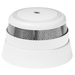

*To contribute to this page, edit the following
[file](https://github.com/Koenkk/zigbee2mqtt.io/blob/master/docs/devices/SMSZB-120.md)*

# Develco SMSZB-120

| Model | SMSZB-120  |
| Vendor  | Develco  |
| Description | Smoke detector with siren |
| Exposes | temperature, battery, smoke, battery_low, test, max_duration, alarm, linkquality |
| Picture |  |

## Notes


### Warning usage
Warning only support a single mode, `burglar`

Duration of using `warning` can be shorter than `max_duration` but not longer. If `max_duration` are set to 60 seconds, and you try to set `warning` with `duration` of 90 seconds, the warning will only apply for 60 seconds. Default value of `max_duration` are 240 seconds

This device do not support the `strobe` and `strobe_duty_cycle` functionality


### Triggering alarm (using old style `warning`)
This smoke alarm can be triggered manually by publishing to `zigbee2mqtt/FRIENDLY_NAME/set` with the payloads:

To start :
* `{"warning":{"duration":60,"level":"low","mode":"burglar","strobe":false,"strobe_duty_cycle":0}}`
Where:
- `duration`: the number of seconds the alarm will be on
- `level`: `low`, `medium`, `high`, `very_high`
- `mode`: `stop`, `burglar`
- `strobe`: not supported
- `strobe_duty_cycle`: not supported

To stop:
* `{"warning":{"duration":60,"level":"low","mode":"stop","strobe":false,"strobe_duty_cycle":0}}`

### Triggering alarm, Simple
Can be set by publishing to `zigbee2mqtt/FRIENDLY_NAME/set` with payload `{"alarm": "START"}` and `{"alarm": "OFF"}`
Set `max_duration` from the Zigbee2MQTT UI or by publishing `{"max_duration": NEW_VALUE}`
This alarm are preset to highest volume

### Device type specific configuration
*[How to use device type specific configuration](../information/configuration.md)*

* `temperature_precision`: Controls the precision of `temperature` values,
e.g. `0`, `1` or `2`; default `2`.
To control the precision based on the temperature value set it to e.g. `{30: 0, 10: 1}`,
when temperature >= 30 precision will be 0, when temperature >= 10 precision will be 1. Precision will take into affect with next report of device.
* `temperature_calibration`: Allows to manually calibrate temperature values,
e.g. `1` would add 1 degree to the temperature reported by the device; default `0`. Calibration will take into affect with next report of device.


## OTA updates
This device supports OTA updates, for more information see [OTA updates](../information/ota_updates.md).


## Exposes

### Temperature (numeric)
Measured temperature value.
Value can be found in the published state on the `temperature` property.
It's not possible to read (`/get`) or write (`/set`) this value.
The unit of this value is `°C`.

### Battery (numeric)
Remaining battery in %.
Value can be found in the published state on the `battery` property.
It's not possible to read (`/get`) or write (`/set`) this value.
The minimal value is `0` and the maximum value is `100`.
The unit of this value is `%`.

### Smoke (binary)
Indicates whether the device detected smoke.
Value can be found in the published state on the `smoke` property.
It's not possible to read (`/get`) or write (`/set`) this value.
If value equals `true` smoke is ON, if `false` OFF.

### Battery_low (binary)
Indicates if the battery of this device is almost empty.
Value can be found in the published state on the `battery_low` property.
It's not possible to read (`/get`) or write (`/set`) this value.
If value equals `true` battery_low is ON, if `false` OFF.

### Test (binary)
Indicates whether the device is being tested.
Value can be found in the published state on the `test` property.
It's not possible to read (`/get`) or write (`/set`) this value.
If value equals `true` test is ON, if `false` OFF.

### Max_duration (numeric)
Duration of Siren.
Value can be found in the published state on the `max_duration` property.
To read (`/get`) the value publish a message to topic `zigbee2mqtt/FRIENDLY_NAME/get` with payload `{"max_duration": ""}`.
To write (`/set`) a value publish a message to topic `zigbee2mqtt/FRIENDLY_NAME/set` with payload `{"max_duration": NEW_VALUE}`.
The minimal value is `0` and the maximum value is `600`.
The unit of this value is `s`.

### Alarm (binary)
Manual Start of Siren.
Value will **not** be published in the state.
It's not possible to read (`/get`) this value.
To write (`/set`) a value publish a message to topic `zigbee2mqtt/FRIENDLY_NAME/set` with payload `{"alarm": NEW_VALUE}`.
If value equals `START` alarm is ON, if `OFF` OFF.

### Linkquality (numeric)
Link quality (signal strength).
Value can be found in the published state on the `linkquality` property.
It's not possible to read (`/get`) or write (`/set`) this value.
The minimal value is `0` and the maximum value is `255`.
The unit of this value is `lqi`.

## Manual Home Assistant configuration
Although Home Assistant integration through [MQTT discovery](../integration/home_assistant) is preferred,
manual integration is possible with the following configuration:



```yaml
sensor:
  - platform: "mqtt"
    state_topic: "zigbee2mqtt/<FRIENDLY_NAME>"
    availability_topic: "zigbee2mqtt/bridge/state"
    value_template: "{{ value_json.temperature }}"
    unit_of_measurement: "°C"
    device_class: "temperature"
    state_class: "measurement"

sensor:
  - platform: "mqtt"
    state_topic: "zigbee2mqtt/<FRIENDLY_NAME>"
    availability_topic: "zigbee2mqtt/bridge/state"
    value_template: "{{ value_json.battery }}"
    unit_of_measurement: "%"
    device_class: "battery"
    state_class: "measurement"

binary_sensor:
  - platform: "mqtt"
    state_topic: "zigbee2mqtt/<FRIENDLY_NAME>"
    availability_topic: "zigbee2mqtt/bridge/state"
    value_template: "{{ value_json.smoke }}"
    payload_on: true
    payload_off: false
    device_class: "smoke"

binary_sensor:
  - platform: "mqtt"
    state_topic: "zigbee2mqtt/<FRIENDLY_NAME>"
    availability_topic: "zigbee2mqtt/bridge/state"
    value_template: "{{ value_json.battery_low }}"
    payload_on: true
    payload_off: false
    device_class: "battery"

binary_sensor:
  - platform: "mqtt"
    state_topic: "zigbee2mqtt/<FRIENDLY_NAME>"
    availability_topic: "zigbee2mqtt/bridge/state"
    value_template: "{{ value_json.test }}"
    payload_on: true
    payload_off: false

sensor:
  - platform: "mqtt"
    state_topic: "zigbee2mqtt/<FRIENDLY_NAME>"
    availability_topic: "zigbee2mqtt/bridge/state"
    value_template: "{{ value_json.max_duration }}"
    unit_of_measurement: "s"

switch:
  - platform: "mqtt"
    state_topic: "zigbee2mqtt/<FRIENDLY_NAME>"
    availability_topic: "zigbee2mqtt/bridge/state"
    value_template: "{{ value_json.alarm }}"
    payload_on: "START"
    payload_off: "OFF"
    command_topic: "zigbee2mqtt/<FRIENDLY_NAME>/set"
    command_topic_postfix: "alarm"

sensor:
  - platform: "mqtt"
    state_topic: "zigbee2mqtt/<FRIENDLY_NAME>"
    availability_topic: "zigbee2mqtt/bridge/state"
    value_template: "{{ value_json.linkquality }}"
    unit_of_measurement: "lqi"
    enabled_by_default: false
    icon: "mdi:signal"
    state_class: "measurement"

sensor:
  - platform: "mqtt"
    state_topic: "zigbee2mqtt/<FRIENDLY_NAME>"
    availability_topic: "zigbee2mqtt/bridge/state"
    icon: "mdi:update"
    value_template: "{{ value_json['update']['state'] }}"
    enabled_by_default: false

binary_sensor:
  - platform: "mqtt"
    state_topic: "zigbee2mqtt/<FRIENDLY_NAME>"
    availability_topic: "zigbee2mqtt/bridge/state"
    payload_on: true
    payload_off: false
    value_template: "{{ value_json.update_available}}"
    enabled_by_default: false
```



