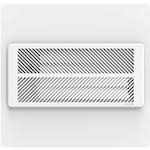

*To contribute to this page, edit the following
[file](https://github.com/Koenkk/zigbee2mqtt.io/blob/master/docs/devices/SV01.md)*

# Keen Home SV01

| Model | SV01  |
| Vendor  | Keen Home  |
| Description | Smart vent |
| Supports | open, close, position, temperature, pressure, battery |
| Picture |  |

## Notes


### Device type specific configuration
*[How to use device type specific configuration](../configuration/device_specific_configuration.md)*


* `temperature_precision`: Controls the precision of `temperature` values,
e.g. `0`, `1` or `2`; default `2`.
* `temperature_calibration`: Allows to manually calibrate temperature values,
e.g. `1` would add 1 degree to the temperature reported by the device; default `0`.


* `pressure_precision`: Controls the precision of `pressure` values, e.g. `0` or `1`; default `1`.
* `pressure_calibration`: Allows to manually calibrate pressure values,
e.g. `1` would add 1 to the pressure reported by the device; default `0`.


## Manual Home Assistant configuration
Although Home Assistant integration through [MQTT discovery](../integration/home_assistant) is preferred,
manual integration is possbile with the following configuration:



```yaml
cover:
  - platform: "mqtt"
    state_topic: false
    availability_topic: "zigbee2mqtt/bridge/state"
    command_topic: "zigbee2mqtt/<FRIENDLY_NAME>/set"
    position_topic: true
    set_position_topic: true
    set_position_template: "{ \"position\": {{ position }} }"
    value_template: "{{ value_json.position }}"

sensor:
  - platform: "mqtt"
    state_topic: "zigbee2mqtt/<FRIENDLY_NAME>"
    availability_topic: "zigbee2mqtt/bridge/state"
    unit_of_measurement: "°C"
    device_class: "temperature"
    value_template: "{{ value_json.temperature }}"

sensor:
  - platform: "mqtt"
    state_topic: "zigbee2mqtt/<FRIENDLY_NAME>"
    availability_topic: "zigbee2mqtt/bridge/state"
    unit_of_measurement: "hPa"
    device_class: "pressure"
    value_template: "{{ value_json.pressure }}"

sensor:
  - platform: "mqtt"
    state_topic: "zigbee2mqtt/<FRIENDLY_NAME>"
    availability_topic: "zigbee2mqtt/bridge/state"
    unit_of_measurement: "%"
    device_class: "battery"
    value_template: "{{ value_json.battery }}"

sensor:
  - platform: "mqtt"
    state_topic: "zigbee2mqtt/<FRIENDLY_NAME>"
    availability_topic: "zigbee2mqtt/bridge/state"
    unit_of_measurement: "-"
    value_template: "{{ value_json.linkquality }}"
```



