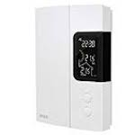

*To contribute to this page, edit the following
[file](https://github.com/Koenkk/zigbee2mqtt.io/blob/master/docs/devices/TH1123ZB.md)*

# Sinope TH1123ZB

| Model | TH1123ZB  |
| Vendor  | Sinope  |
| Description | Zigbee line volt thermostat |
| Supports | local temp, units, keypad lockout, mode, state, backlight, outdoor temp, time |
| Picture |  |

## Notes

None

## Manual Home Assistant configuration
Although Home Assistant integration through [MQTT discovery](../integration/home_assistant) is preferred,
manual integration is possbile with the following configuration:



```yaml
climate:
  - platform: "mqtt"
    state_topic: false
    availability_topic: "zigbee2mqtt/bridge/state"
    min_temp: 7
    max_temp: 30
    modes: 
      - "off"
      - "auto"
      - "heat"
    mode_state_topic: true
    mode_state_template: "{{ value_json.system_mode }}"
    mode_command_topic: true
    current_temperature_topic: true
    current_temperature_template: "{{ value_json.local_temperature }}"
    temperature_state_topic: true
    temperature_state_template: "{{ value_json.occupied_heating_setpoint }}"
    temperature_command_topic: true

sensor:
  - platform: "mqtt"
    state_topic: "zigbee2mqtt/<FRIENDLY_NAME>"
    availability_topic: "zigbee2mqtt/bridge/state"
    unit_of_measurement: "-"
    value_template: "{{ value_json.linkquality }}"
```



