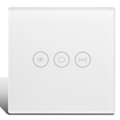

*To contribute to this page, edit the following
[file](https://github.com/Koenkk/zigbee2mqtt.io/blob/master/docs/devices/TS0601_curtain_switch.md)*

# TuYa TS0601_curtain_switch

| Model | TS0601_curtain_switch  |
| Vendor  | TuYa  |
| Description | Curtain switch |
| Supports | open, close, stop |
| Picture |  |
| White-label | Larkkey ZSTY-SM-1SRZG-EU |

## Notes

None

## Manual Home Assistant configuration
Although Home Assistant integration through [MQTT discovery](../integration/home_assistant) is preferred,
manual integration is possible with the following configuration:



```yaml
cover:
  - platform: "mqtt"
    availability_topic: "zigbee2mqtt/bridge/state"
    command_topic: "zigbee2mqtt/<FRIENDLY_NAME>/set"
    value_template: "{{ value_json.position }}"
    set_position_template: "{ \"position\": {{ position }} }"
    set_position_topic: "zigbee2mqtt/<FRIENDLY_NAME>/set"
    position_topic: "zigbee2mqtt/<FRIENDLY_NAME>"

sensor:
  - platform: "mqtt"
    state_topic: "zigbee2mqtt/<FRIENDLY_NAME>"
    availability_topic: "zigbee2mqtt/bridge/state"
    unit_of_measurement: "lqi"
    value_template: "{{ value_json.linkquality }}"
    icon: "mdi:signal"
```



