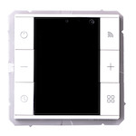

*To contribute to this page, edit the following
[file](https://github.com/Koenkk/zigbee2mqtt.io/blob/master/docs/devices/U86KWF-ZPSJ.md)*

# TuYa U86KWF-ZPSJ

| Model | U86KWF-ZPSJ  |
| Vendor  | TuYa  |
| Description | Environment controller |
| Supports | temperature, heating/cooling system control |
| Picture |  |

## Notes

### Device type specific configuration
*[How to use device type specific configuration](../information/configuration.md)*

* `temperature_precision`: Controls the precision of `temperature` values,
e.g. `0`, `1` or `2`; default `2`.
To control the precision based on the temperature value set it to e.g. `{30: 0, 10: 1}`,
when temperature >= 30 precision will be 0, when temperature >= 10 precision will be 1.
* `temperature_calibration`: Allows to manually calibrate temperature values,
e.g. `1` would add 1 degree to the temperature reported by the device; default `0`.


## Manual Home Assistant configuration
Although Home Assistant integration through [MQTT discovery](../integration/home_assistant) is preferred,
manual integration is possible with the following configuration:



```yaml
climate:
  - platform: "mqtt"
    availability_topic: "zigbee2mqtt/bridge/state"
    temperature_unit: "C"
    min_temp: "5"
    max_temp: "30"
    mode_state_topic: true
    mode_state_template: "{{ value_json.system_mode }}"
    mode_command_topic: true
    current_temperature_topic: true
    current_temperature_template: "{{ value_json.local_temperature }}"
    temp_step: 0.5
    action_topic: true
    action_template: "{{ values[value_json.running_state] }}"
    modes: 
      - "off"
      - "auto"
      - "heat"
    temperature_state_topic: true
    temperature_state_template: "{{ value_json.current_heating_setpoint }}"
    temperature_command_topic: "current_heating_setpoint"

sensor:
  - platform: "mqtt"
    state_topic: "zigbee2mqtt/<FRIENDLY_NAME>"
    availability_topic: "zigbee2mqtt/bridge/state"
    icon: "mdi:signal"
    unit_of_measurement: "lqi"
    value_template: "{{ value_json.linkquality }}"
```



