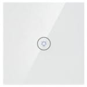

<!-- !!!! -->
<!-- ATTENTION: This file is auto-generated through docgen! -->
<!-- You can only edit the "Notes"-Section between the two comment lines "Notes BEGIN" and "Notes END". -->
<!-- Do not use h1 or h2 heading within "## Notes"-Section. -->
<!-- !!!! -->

# Vrey VR-X701U

|     |     |
|-----|-----|
| Model | VR-X701U  |
| Vendor  | Vrey |
| Description | 1 gang switch |
| Exposes | switch (state), linkquality |
| Picture |  |

<!-- Notes BEGIN: You can edit here. Add "## Notes" headline if not already present. -->
## Notes

### Pairing
Press and hold the button on the device for more then 10 seconds (until the led light starts blinking), release and wait.
<!-- Notes END: Do not edit below this line -->
