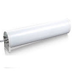

*To contribute to this page, edit the following
[file](https://github.com/Koenkk/zigbee2mqtt.io/blob/master/docs/devices/W40CZ.md)*

# ORVIBO W40CZ

| Model | W40CZ  |
| Vendor  | ORVIBO  |
| Description | Smart curtain motor  |
| Supports | open, close, stop, position |
| Picture |  |

## Notes

### Device type specific configuration
*[How to use device type specific configuration](../information/configuration.md)*

* `invert_cover`: By default the position/tilt values mean: open = 100, closed = 0. This can be inverted by setting this option to true (so open = 0, close = 100).


## Manual Home Assistant configuration
Although Home Assistant integration through [MQTT discovery](../integration/home_assistant) is preferred,
manual integration is possible with the following configuration:



```yaml
cover:
  - platform: "mqtt"
    availability_topic: "zigbee2mqtt/bridge/state"
    command_topic: "zigbee2mqtt/<FRIENDLY_NAME>/set"
    position_topic: "zigbee2mqtt/<FRIENDLY_NAME>"
    set_position_topic: "zigbee2mqtt/<FRIENDLY_NAME>/set"
    set_position_template: "{ \"position\": {{ position }} }"
    value_template: "{{ value_json.position }}"

sensor:
  - platform: "mqtt"
    state_topic: "zigbee2mqtt/<FRIENDLY_NAME>"
    availability_topic: "zigbee2mqtt/bridge/state"
    icon: "mdi:signal"
    unit_of_measurement: "lqi"
    value_template: "{{ value_json.linkquality }}"
```



