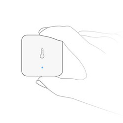

<!-- !!!! -->
<!-- ATTENTION: This file is auto-generated through docgen! -->
<!-- You can only edit the "Notes"-Section between the two comment lines "Notes BEGIN" and "Notes END". -->
<!-- Do not use h1 or h2 heading within "## Notes"-Section. -->
<!-- !!!! -->

# Aqara WSDCGQ11LM

|     |     |
|-----|-----|
| Model | WSDCGQ11LM  |
| Vendor  | [Aqara](/supported-devices/#v=Aqara)  |
| Description | Temperature and humidity sensor |
| Exposes | battery, temperature, humidity, pressure, voltage, linkquality |
| Picture |  |

<!-- Notes BEGIN: You can edit here. Add "## Notes" headline if not already present. -->
## Notes

### Battery Type
Uses a CR2032 battery

### Pairing
Press and hold the reset button on the device for +- 5 seconds (when the blue blinks, immediately release the button for pairing to start).
After this, the device will automatically join. If this doesn't work, try with a single short button press.

If the device fails to pair:
* Instead of using "Permit join (All)" use the drop-down arrow to select a Zigbee router device near where the sensor will be located to pair to.
* Try replacing the battery.

### Troubleshooting: device stops sending messages/disconnects from network
Since Xiaomi devices do not fully comply to the Zigbee standard, it sometimes happens that they disconnect from the network.
Most of the times this happens because of the following reasons:
- Device has a weak signal, you can see the signal quality in the published messages as `linkquality`. A linkquality < 20 is considered weak.
- Low battery voltage, this can even happen when the battery still appears full. Try a different battery.
- The device is connected through a router which cannot deal with Xiaomi devices. This is known to happen devices from: Centralite, General Electric, Iris, Ledvance, Legrand, OSRAM, Sylvania, SmartThings, Securifi. A possible solution is to connect the device directly to the central coordinator by pushing the reset button while being physically close to it.

More detailed information about this can be found [here](https://community.hubitat.com/t/xiaomi-aqara-devices-pairing-keeping-them-connected/623).
<!-- Notes END: Do not edit below this line -->

## Options
*[How to use device type specific configuration](../guide/configuration/devices-groups.md#specific-device-options)*

* `temperature_calibration`: Calibrates the temperature value (absolute offset), takes into effect on next report of device. The value must be a number.

* `temperature_precision`: Number of digits after decimal point for temperature, takes into effect on next report of device. This option can only decrease the precision, not increase it. The value must be a number with a minimum value of `0` and with a with a maximum value of `3`

* `humidity_calibration`: Calibrates the humidity value (absolute offset), takes into effect on next report of device. The value must be a number.

* `humidity_precision`: Number of digits after decimal point for humidity, takes into effect on next report of device. This option can only decrease the precision, not increase it. The value must be a number with a minimum value of `0` and with a with a maximum value of `3`

* `pressure_calibration`: Calibrates the pressure value (absolute offset), takes into effect on next report of device. The value must be a number.

* `pressure_precision`: Number of digits after decimal point for pressure, takes into effect on next report of device. This option can only decrease the precision, not increase it. The value must be a number with a minimum value of `0` and with a with a maximum value of `3`

## Exposes

### Battery (numeric)
Remaining battery in %, can take up to 24 hours before reported.
Value can be found in the published state on the `battery` property.
It's not possible to read (`/get`) or write (`/set`) this value.
The minimal value is `0` and the maximum value is `100`.
The unit of this value is `%`.

### Temperature (numeric)
Measured temperature value.
Value can be found in the published state on the `temperature` property.
It's not possible to read (`/get`) or write (`/set`) this value.
The unit of this value is `°C`.

### Humidity (numeric)
Measured relative humidity.
Value can be found in the published state on the `humidity` property.
It's not possible to read (`/get`) or write (`/set`) this value.
The unit of this value is `%`.

### Pressure (numeric)
The measured atmospheric pressure.
Value can be found in the published state on the `pressure` property.
It's not possible to read (`/get`) or write (`/set`) this value.
The unit of this value is `hPa`.

### Voltage (numeric)
Voltage of the battery in millivolts.
Value can be found in the published state on the `voltage` property.
It's not possible to read (`/get`) or write (`/set`) this value.
The unit of this value is `mV`.

### Linkquality (numeric)
Link quality (signal strength).
Value can be found in the published state on the `linkquality` property.
It's not possible to read (`/get`) or write (`/set`) this value.
The minimal value is `0` and the maximum value is `255`.
The unit of this value is `lqi`.

