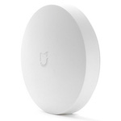

*To contribute to this page, edit the following
[file](https://github.com/Koenkk/zigbee2mqtt.io/blob/master/docs/devices/WXKG01LM.md)*

# Xiaomi WXKG01LM

| Model | WXKG01LM  |
| Vendor  | Xiaomi  |
| Description | MiJia wireless switch |
| Supports | single, double, triple, quadruple, many, long, long_release click |
| Picture |  |

## Notes


### Deprecated click event
By default this device exposes a deprecated `click` event. It's recommended to use the `action` event instead.

To disable the `click` event, set `legacy: false` for this device in `configuration.yaml`. Example:

```yaml
devices:
  '0x12345678':
    friendly_name: my_device
    legacy: false
```


### Pairing
Press and hold the reset button on the device for +- 5 seconds (until the blue light starts blinking).
After this the device will automatically join. If this doesn't work, try with a single short button press.


### Binding
This device does **not** support binding.


### Troubleshooting: device stops sending messages/disconnects from network
Since Xiaomi devices do not fully comply to the Zigbee standard, it sometimes happens that they disconnect from the network.
Most of the times this happens because of the following reasons:
- Device has a weak signal, you can see the signal quality in the published messages as `linkquality`. A linkquality < 20 is considered weak.
- Low battery voltage, this can even happen when the battery still appears full. Try a different battery.
- The device is connected through a router which cannot deal with Xiaomi devices. This is known to happen devices from: Centralite, General Electric, Iris, Ledvance, OSRAM, Sylvania, SmartThings, Securifi.

More detailed information about this can be found [here](https://community.hubitat.com/t/xiaomi-aqara-devices-pairing-keeping-them-connected/623).

### Device type specific configuration
*[How to use device type specific configuration](../information/configuration.md)*

* `hold_timeout`: The WXKG01LM only reports a button press and release.
By default, Zigbee2mqtt publishes a `hold` action when there is at
least 1000 ms between both events. It could be that due to
delays in the network the release message is received late. This causes a single
click to be identified as a `hold` action. If you are experiencing this you can try
experimenting with this option (e.g. `hold_timeout: 2000`).
* `hold_timeout_expire`: Sometimes it happens that the button does not send a release. To avoid problems Zigbee2mqtt expires the `hold` leading to no `release` being send. The default timeout is 4000 ms, you can increase it with this option.


* `legacy`: Set to `true` to disable the legacy integration (highly recommended!)


## Manual Home Assistant configuration
Although Home Assistant integration through [MQTT discovery](../integration/home_assistant) is preferred,
manual integration is possible with the following configuration:



```yaml
sensor:
  - platform: "mqtt"
    state_topic: "zigbee2mqtt/<FRIENDLY_NAME>"
    availability_topic: "zigbee2mqtt/bridge/state"
    icon: "mdi:toggle-switch"
    value_template: "{{ value_json.click }}"

sensor:
  - platform: "mqtt"
    state_topic: "zigbee2mqtt/<FRIENDLY_NAME>"
    availability_topic: "zigbee2mqtt/bridge/state"
    icon: "mdi:gesture-double-tap"
    value_template: "{{ value_json.action }}"

sensor:
  - platform: "mqtt"
    state_topic: "zigbee2mqtt/<FRIENDLY_NAME>"
    availability_topic: "zigbee2mqtt/bridge/state"
    unit_of_measurement: "%"
    device_class: "battery"
    value_template: "{{ value_json.battery }}"

sensor:
  - platform: "mqtt"
    state_topic: "zigbee2mqtt/<FRIENDLY_NAME>"
    availability_topic: "zigbee2mqtt/bridge/state"
    icon: "mdi:signal"
    unit_of_measurement: "lqi"
    value_template: "{{ value_json.linkquality }}"
```



