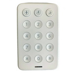

*To contribute to this page, edit the following
[file](https://github.com/Koenkk/zigbee2mqtt.io/blob/master/docs/devices/XHK1-TC.md)*

# Technicolor XHK1-TC

| Model | XHK1-TC  |
| Vendor  | Technicolor  |
| Description | Xfinity security keypad |
| Exposes | battery, voltage, occupancy, battery_low, tamper, presence, contact, temperature, action_code, action_transaction, action_zone, action, linkquality |
| Picture |  |

## Notes

### Device type specific configuration
*[How to use device type specific configuration](../information/configuration.md)*

* `temperature_precision`: Controls the precision of `temperature` values,
e.g. `0`, `1` or `2`; default `2`.
To control the precision based on the temperature value set it to e.g. `{30: 0, 10: 1}`,
when temperature >= 30 precision will be 0, when temperature >= 10 precision will be 1. Precision will take into affect with next report of device.
* `temperature_calibration`: Allows to manually calibrate temperature values,
e.g. `1` would add 1 degree to the temperature reported by the device; default `0`. Calibration will take into affect with next report of device.


### Arming/Disarming from the server
To set arming mode publish the following payload to `zigbee2mqtt/FRIENDLY_NAME/set` topic:

```js
{
    "arm_mode": {
        "mode": "arm_all_zones"
    }
}
```
Valid `mode` values as per ZCL specifications are `disarm`, `arm_day_zones`, `arm_night_zones`, `arm_all_zones`, `exit_delay`, `entry_delay`, `not_ready`, `in_alarm`, `arming_stay`, `arming_night`, `arming_away`.
### Arming/Disarming from the keypad
When an attempt to set arm mode is done on the keypad, Zigbee2MQTT will publish the following payload to topic `zigbee2mqtt/FRIENDLY_NAME`:

```js
{
    "action": "arm_all_zones", // This is the example
    "action_code": "123", // The code being entered
    "action_zone": 0, // The zone being armed (always 0)
    "action_transaction": 99 // The transaction number
}
```

The automation server must validate the request and send a notification to the keypad, confirming or denying the request.

Do so by sending the following payload to `zigbee2mqtt/FRIENDLY_NAME/set`:

```js
{
    "arm_mode": {
        "transaction": 99, // Transaction number (this must be the same as the keypad request `action_transaction`)
        "mode": "arm_all_zones" // Mode (this must be the same as the keypad request `action`)
    }
}
```
Valid `mode` values are `disarm`, `arm_day_zones`, `arm_night_zones`, `arm_all_zones`, `invalid_code`, `not_ready`, `already_disarmed`

The automation server must follow the notification with an actual change to the correct arm mode. For the example above, the server should respond with `exit_delay`, count the elapsed time (e.g 30 secs), then change mode again to `arm_all_zones` (see "Arming/Disarming from the server" section above)


## Exposes

### Battery (numeric)
Remaining battery in %.
Value can be found in the published state on the `battery` property.
It's not possible to read (`/get`) or write (`/set`) this value.
The minimal value is `0` and the maximum value is `100`.
The unit of this value is `%`.

### Voltage (numeric)
Voltage of the battery in millivolts.
Value can be found in the published state on the `voltage` property.
It's not possible to read (`/get`) or write (`/set`) this value.
The unit of this value is `mV`.

### Occupancy (binary)
Indicates whether the device detected occupancy.
Value can be found in the published state on the `occupancy` property.
It's not possible to read (`/get`) or write (`/set`) this value.
If value equals `true` occupancy is ON, if `false` OFF.

### Battery_low (binary)
Indicates if the battery of this device is almost empty.
Value can be found in the published state on the `battery_low` property.
It's not possible to read (`/get`) or write (`/set`) this value.
If value equals `true` battery_low is ON, if `false` OFF.

### Tamper (binary)
Indicates whether the device is tampered.
Value can be found in the published state on the `tamper` property.
It's not possible to read (`/get`) or write (`/set`) this value.
If value equals `true` tamper is ON, if `false` OFF.

### Presence (binary)
Indicates whether the device detected presence.
Value can be found in the published state on the `presence` property.
It's not possible to read (`/get`) or write (`/set`) this value.
If value equals `true` presence is ON, if `false` OFF.

### Contact (binary)
Indicates if the contact is closed (= true) or open (= false).
Value can be found in the published state on the `contact` property.
It's not possible to read (`/get`) or write (`/set`) this value.
If value equals `false` contact is ON, if `true` OFF.

### Temperature (numeric)
Measured temperature value.
Value can be found in the published state on the `temperature` property.
It's not possible to read (`/get`) or write (`/set`) this value.
The unit of this value is `°C`.

### Action_code (numeric)
Pin code introduced..
Value can be found in the published state on the `action_code` property.
It's not possible to read (`/get`) or write (`/set`) this value.

### Action_transaction (numeric)
Last action transaction number..
Value can be found in the published state on the `action_transaction` property.
It's not possible to read (`/get`) or write (`/set`) this value.

### Action_zone (text)
Alarm zone. Default value 0.
Value can be found in the published state on the `action_zone` property.
It's not possible to read (`/get`) or write (`/set`) this value.

### Action (enum)
Triggered action (e.g. a button click).
Value can be found in the published state on the `action` property.
It's not possible to read (`/get`) or write (`/set`) this value.
The possible values are: `disarm`, `arm_day_zones`, `identify`, `arm_night_zones`, `arm_all_zones`, `exit_delay`, `emergency`.

### Linkquality (numeric)
Link quality (signal strength).
Value can be found in the published state on the `linkquality` property.
It's not possible to read (`/get`) or write (`/set`) this value.
The minimal value is `0` and the maximum value is `255`.
The unit of this value is `lqi`.

## Manual Home Assistant configuration
Although Home Assistant integration through [MQTT discovery](../integration/home_assistant) is preferred,
manual integration is possible with the following configuration:



```yaml
sensor:
  - platform: "mqtt"
    state_topic: "zigbee2mqtt/<FRIENDLY_NAME>"
    availability_topic: "zigbee2mqtt/bridge/state"
    value_template: "{{ value_json.battery }}"
    unit_of_measurement: "%"
    device_class: "battery"
    state_class: "measurement"

sensor:
  - platform: "mqtt"
    state_topic: "zigbee2mqtt/<FRIENDLY_NAME>"
    availability_topic: "zigbee2mqtt/bridge/state"
    value_template: "{{ value_json.voltage }}"
    unit_of_measurement: "mV"
    device_class: "voltage"
    enabled_by_default: false
    state_class: "measurement"

binary_sensor:
  - platform: "mqtt"
    state_topic: "zigbee2mqtt/<FRIENDLY_NAME>"
    availability_topic: "zigbee2mqtt/bridge/state"
    value_template: "{{ value_json.occupancy }}"
    payload_on: true
    payload_off: false
    device_class: "motion"

binary_sensor:
  - platform: "mqtt"
    state_topic: "zigbee2mqtt/<FRIENDLY_NAME>"
    availability_topic: "zigbee2mqtt/bridge/state"
    value_template: "{{ value_json.battery_low }}"
    payload_on: true
    payload_off: false
    device_class: "battery"

binary_sensor:
  - platform: "mqtt"
    state_topic: "zigbee2mqtt/<FRIENDLY_NAME>"
    availability_topic: "zigbee2mqtt/bridge/state"
    value_template: "{{ value_json.tamper }}"
    payload_on: true
    payload_off: false

binary_sensor:
  - platform: "mqtt"
    state_topic: "zigbee2mqtt/<FRIENDLY_NAME>"
    availability_topic: "zigbee2mqtt/bridge/state"
    value_template: "{{ value_json.presence }}"
    payload_on: true
    payload_off: false
    device_class: "presence"

binary_sensor:
  - platform: "mqtt"
    state_topic: "zigbee2mqtt/<FRIENDLY_NAME>"
    availability_topic: "zigbee2mqtt/bridge/state"
    value_template: "{{ value_json.contact }}"
    payload_on: false
    payload_off: true
    device_class: "door"

sensor:
  - platform: "mqtt"
    state_topic: "zigbee2mqtt/<FRIENDLY_NAME>"
    availability_topic: "zigbee2mqtt/bridge/state"
    value_template: "{{ value_json.temperature }}"
    unit_of_measurement: "°C"
    device_class: "temperature"
    state_class: "measurement"

sensor:
  - platform: "mqtt"
    state_topic: "zigbee2mqtt/<FRIENDLY_NAME>"
    availability_topic: "zigbee2mqtt/bridge/state"
    value_template: "{{ value_json.action_code }}"

sensor:
  - platform: "mqtt"
    state_topic: "zigbee2mqtt/<FRIENDLY_NAME>"
    availability_topic: "zigbee2mqtt/bridge/state"
    value_template: "{{ value_json.action_transaction }}"

sensor:
  - platform: "mqtt"
    state_topic: "zigbee2mqtt/<FRIENDLY_NAME>"
    availability_topic: "zigbee2mqtt/bridge/state"
    value_template: "{{ value_json.action_zone }}"

sensor:
  - platform: "mqtt"
    state_topic: "zigbee2mqtt/<FRIENDLY_NAME>"
    availability_topic: "zigbee2mqtt/bridge/state"
    value_template: "{{ value_json.action }}"
    enabled_by_default: true
    icon: "mdi:gesture-double-tap"

sensor:
  - platform: "mqtt"
    state_topic: "zigbee2mqtt/<FRIENDLY_NAME>"
    availability_topic: "zigbee2mqtt/bridge/state"
    value_template: "{{ value_json.linkquality }}"
    unit_of_measurement: "lqi"
    enabled_by_default: false
    icon: "mdi:signal"
    state_class: "measurement"
```



