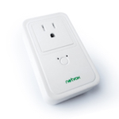

*To contribute to this page, edit the following
[file](https://github.com/Koenkk/zigbee2mqtt.io/blob/master/docs/devices/Z809A.md)*

# Netvox Z809A

| Model | Z809A  |
| Vendor  | Netvox  |
| Description | Power socket with power consumption monitoring |
| Supports | on/off, power measurement |
| Picture |  |

## Notes


### Pairing
Factory reset by:
- Press and hold the Binding Key for 15 seconds. The network indicator will flash green 3 times
(at the 3rd, the 10th, and the 15th second).
- After releasing the Binding Key, press the Switch Key within 2 seconds. The network indicator
will rapidly flash green.
- After fast flashes, Z809A will reboot, and the restore is completed. The socket will automatically connect now.


## Manual Home Assistant configuration
Although Home Assistant integration through [MQTT discovery](../integration/home_assistant) is preferred,
manual integration is possbile with the following configuration:



```yaml
switch:
  - platform: "mqtt"
    state_topic: "zigbee2mqtt/<FRIENDLY_NAME>"
    availability_topic: "zigbee2mqtt/bridge/state"
    payload_off: "OFF"
    payload_on: "ON"
    value_template: "{{ value_json.state }}"
    command_topic: "zigbee2mqtt/<FRIENDLY_NAME>/set"

sensor:
  - platform: "mqtt"
    state_topic: "zigbee2mqtt/<FRIENDLY_NAME>"
    availability_topic: "zigbee2mqtt/bridge/state"
    unit_of_measurement: "W"
    icon: "mdi:factory"
    value_template: "{{ value_json.power }}"

sensor:
  - platform: "mqtt"
    state_topic: "zigbee2mqtt/<FRIENDLY_NAME>"
    availability_topic: "zigbee2mqtt/bridge/state"
    unit_of_measurement: "-"
    value_template: "{{ value_json.linkquality }}"
```



