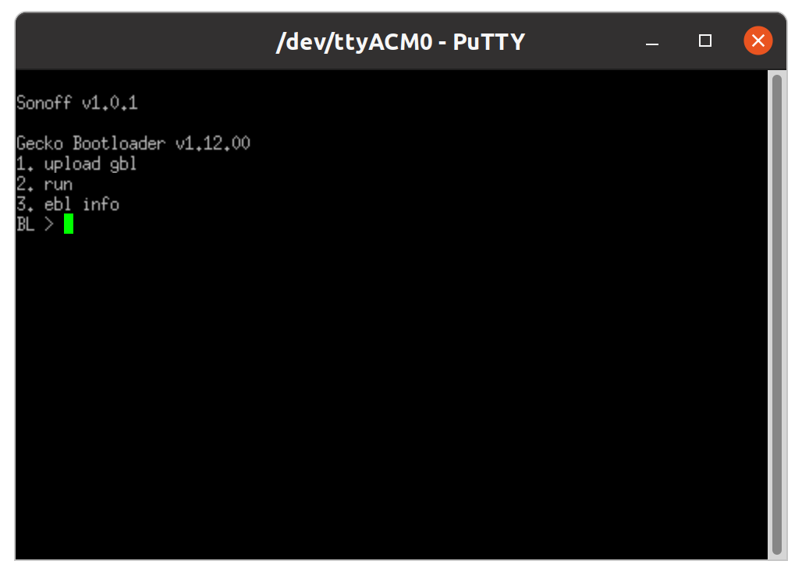
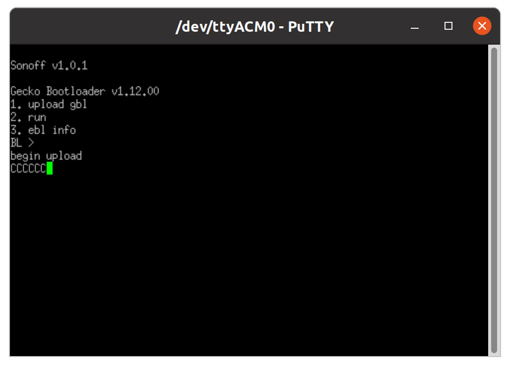

<!-- !!!! -->
<!-- ATTENTION: This file is auto-generated through docgen! -->
<!-- You can only edit the "Notes"-Section between the two comment lines "Notes BEGIN" and "Notes END". -->
<!-- Do not use h1 or h2 heading within "## Notes"-Section. -->
<!-- !!!! -->

# SONOFF ZBDongle-E

|     |     |
|-----|-----|
| Model | ZBDongle-E  |
| Vendor  | [SONOFF](/supported-devices/#v=SONOFF)  |
| Description | Sonoff Zigbee 3.0 USB Dongle Plus (EFR32MG21) with router firmware |
| Exposes | light_indicator_level, linkquality |
| Picture |  |

<!-- Notes BEGIN: You can edit here. Add "## Notes" headline if not already present. -->
## Notes

### How to create a SONOFF ZBDongle-E Router
You can create a powerful Zigbee router from an ordinary Sonoff Zigbee 3.0 USB Dongle Plus (Model "ZBDongle-E" with EFR32MG21 chip) by flashing a router firmware onto the device. You can find the official guide for flashing the device here: [SONOFF Zigbee 3.0 USB dongle plus firmware flashing](https://sonoff.tech/wp-content/uploads/2022/11/SONOFF-Zigbee-3.0-USB-dongle-plus-firmware-flashing-.pdf). The guide also contains the link to the official [SONOFF Router Firmware for the ZBDongle-E](https://github.com/itead/Sonoff_Zigbee_Dongle_Firmware/tree/master/Dongle-E/Router).  
  
As an alternative to disassembling the device, you can also use the browser-based [Silabs Firmware Flasher](https://darkxst.github.io/silabs-firmware-builder/). Before flashing, download the router firmware and plug the dongle into a USB port on your computer. A browser supporting the WebSerial API is required; if in doubt, use **Google Chrome** or **Microsoft Edge**. After the flashing is done, the dongle will immediately reboot into pairing mode. Pair as usual with Z2M.
### Hints
The guide from SONOFF is not very detailed. Here are some additional hints:
* First, you have to disassemble the device and pull the logic board out of its housing. You need a **J00 Phillips screwdriver** for this.
  
  
* Second, you need a **software supporting the [XMODEM file transfer protocol](https://en.wikipedia.org/wiki/XMODEM)** for sending the firmware image to the device. On Debian Linux like Ubuntu you can use lrzsz, 
  * install XMODEM transfer protocol and terminal emulator Putty with 
  
      debian based OS: `sudo apt install lrzsz putty`
      arch based OS: `sudo paxman -S lrzsz putty`
  * user needs to be in dialout group in order to access serial ports
      
      debian based OS: `sudo adduser $USER dialout`
      arch based OS: `sudo usermod -a -G uucp $USER`
  * log in and out so that group membership comes into effect (You can check by running `id`)
* Third, you must operate on the naked logic board while it is plugged in. This is a lot easier if you use a **USB extension cable**.
* Forth, to enter the Bootloader Mode, you have to
  * Plug the device in
  * Connect to the device with the serial software (for serial connection parameters, see guide)
      
      `putty -serial -sercfg 115200,8,n,1 /dev/ttyACM0`  
        
      If you get the error `PuTTY: unable to load font "server:fixed"`, run `export GDK_BACKEND=x11` previous to the putty command.

  * Press and hold the "BOOT" button (upper button in the lower right corner next to the USB plug in the photo below)
  * and then press the "RST." button (lower button in the lower right corner next to the USB plug in the photo below) to restart the device 
  
* Fifth, to upload the file, in the bootloader terminal press '1' to initiate the upload  
  
  * Open another terminal on the host system. Download the router firmware *.gbl file from [here](https://github.com/itead/Sonoff_Zigbee_Dongle_Firmware/tree/master/Dongle-E/Router), e.g.

      `wget https://github.com/itead/Sonoff_Zigbee_Dongle_Firmware/blob/master/Dongle-E/Router/Z3RouterUSBDonlge_EZNet6.10.3_V1.0.0.gbl`
  * Send the file through XMODEM    

      debian based OS: `sx Z3RouterUSBDonlge_EZNet6.10.3_V1.0.0.gbl < /dev/ttyACM0 > /dev/ttyACM0`
      arch based OS: `lrzsz-sx -X Z3RouterUSBDonlge_EZNet6.10.3_V1.0.0.gbl < /dev/ttyACM0 > /dev/ttyACM0` (Without the -X it will not use the xmodem protocol)
  * Wait for 'Serial upload complete', then press '2' in the Bootloader Terminal to restart the dongle.
* Finally, the dongle LED blinks green, inidicating it is in paring mode. Pair as usual with Z2M.
* Note: The dongle may not pair successfully if it is plugged into a USB 3.x socket, if it fails to pair try moving it to a USB 2 socket or a standalone USB charger.
<!-- Notes END: Do not edit below this line -->

## Exposes

### Light indicator level (numeric)
Brightness of the indicator light.
Value can be found in the published state on the `light_indicator_level` property.
It's not possible to read (`/get`) or write (`/set`) this value.

### Linkquality (numeric)
Link quality (signal strength).
Value can be found in the published state on the `linkquality` property.
It's not possible to read (`/get`) or write (`/set`) this value.
The minimal value is `0` and the maximum value is `255`.
The unit of this value is `lqi`.

