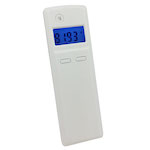

*To contribute to this page, edit the following
[file](https://github.com/Koenkk/zigbee2mqtt.io/blob/master/docs/devices/ZBHT-1.md)*

# Smartenit ZBHT-1

| Model | ZBHT-1  |
| Vendor  | Smartenit  |
| Description | Temperature & humidity sensor  |
| Supports | temperature and humidity |
| Picture |  |

## Notes


### Similar Devices
This device is older and seems to be similar to the netvox Z711 (and others).

### Pairing

#### Resetting the Device/Restore to Factory Defaults
1. Remove the battery to power off the device.
2. Press and hold the only button.
3. Re-install the batteries to power on the device
4. Release the button.
 * The LED will blink quickly, and the reset/restore is complete

#### Joining the Network
1. Remove battery from device
2. Enable permit-join on Zigbee2MQTT
3. Re-install battery in the device
 * The LED will flash 5 times to indicate success (no flashing means not successful)
4. After successfully joining, press and hold the only button for 3 seconds to broadcast the binding request.
5. The LED will flash once.
6. The LED flashes 5 times after the binding is completed; otherwise, it flashes 10 times.

#### Waking the Device
If the device is asleep (which is most of the time) and you need it to be awake for some reason, tap the only button on the device. The LED will flash 5 times and the device will be awake for a brief period.

### Status of Functions
1. Temperature monitoring - Works
2. Humidity monitoring - Works
3. Battery monitoring - untested.
 * In theory the device LED will flash ONCE if the voltage falls below 2.4V
 * In theory the device will send a low-power report to the ZigBee network if the voltage falls below 2.4V - no other battery reporting.

### Device type specific configuration
*[How to use device type specific configuration](../information/configuration.md)*

* `temperature_precision`: Controls the precision of `temperature` values,
e.g. `0`, `1` or `2`; default `2`.
To control the precision based on the temperature value set it to e.g. `{30: 0, 10: 1}`,
when temperature >= 30 precision will be 0, when temperature >= 10 precision will be 1.
* `temperature_calibration`: Allows to manually calibrate temperature values,
e.g. `1` would add 1 degree to the temperature reported by the device; default `0`.


* `humidity_precision`: Controls the precision of `humidity` values, e.g. `0`, `1` or `2`; default `2`.
To control the precision based on the humidity value set it to e.g. `{80: 0, 10: 1}`,
when humidity >= 80 precision will be 0, when humidity >= 10 precision will be 1.


## Manual Home Assistant configuration
Although Home Assistant integration through [MQTT discovery](../integration/home_assistant) is preferred,
manual integration is possible with the following configuration:



```yaml
sensor:
  - platform: "mqtt"
    state_topic: "zigbee2mqtt/<FRIENDLY_NAME>"
    availability_topic: "zigbee2mqtt/bridge/state"
    unit_of_measurement: "°C"
    device_class: "temperature"
    value_template: "{{ value_json.temperature }}"

sensor:
  - platform: "mqtt"
    state_topic: "zigbee2mqtt/<FRIENDLY_NAME>"
    availability_topic: "zigbee2mqtt/bridge/state"
    unit_of_measurement: "%"
    device_class: "humidity"
    value_template: "{{ value_json.humidity }}"

sensor:
  - platform: "mqtt"
    state_topic: "zigbee2mqtt/<FRIENDLY_NAME>"
    availability_topic: "zigbee2mqtt/bridge/state"
    unit_of_measurement: "%"
    device_class: "battery"
    value_template: "{{ value_json.battery }}"

sensor:
  - platform: "mqtt"
    state_topic: "zigbee2mqtt/<FRIENDLY_NAME>"
    availability_topic: "zigbee2mqtt/bridge/state"
    icon: "mdi:signal"
    unit_of_measurement: "lqi"
    value_template: "{{ value_json.linkquality }}"
```



