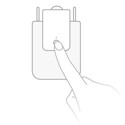

<!-- !!!! -->
<!-- ATTENTION: This file is auto-generated through docgen! -->
<!-- You can only edit the "Notes"-Section between the two comment lines "Notes BEGIN" and "Notes END". -->
<!-- Do not use h1 or h2 heading within "## Notes"-Section. -->
<!-- !!!! -->

# Aqara ZNCLBL01LM

|     |     |
|-----|-----|
| Model | ZNCLBL01LM  |
| Vendor  | [Aqara](/supported-devices/#v=Aqara)  |
| Description | Curtain driver E1 |
| Exposes | cover (state, position), hand_open, limits_calibration, battery, voltage, device_temperature, illuminance_lux, motor_state, running, hooks_lock, hooks_state, target_position, power_source, charging, action, linkquality |
| Picture |  |
| White-label | Aqara CM-M01, Aqara CM-M01R |

<!-- Notes BEGIN: You can edit here. Add "## Notes" headline if not already present. -->
## Notes

### Adapter firmware
In order for this device to work, at least the following firmware is required on your adapter:
- CC2530/CC2531: [`20211115`](https://github.com/Koenkk/Z-Stack-firmware/tree/Z-Stack_Home_1.2_20211115/20211116/coordinator/Z-Stack_Home_1.2/bin)
- CC1352/CC2652: [`20211114`](https://github.com/Koenkk/Z-Stack-firmware/tree/7c5a6da0c41855d42b5e6506e5e3b496be097ba3/coordinator/Z-Stack_3.x.0/bin)
- CC2538: [`20211222`](https://github.com/jethome-ru/zigbee-firmware/tree/master/ti/coordinator/cc2538_cc2592)
- Conbee II: [`0x26720700`]( http://deconz.dresden-elektronik.de/deconz-firmware/deCONZ_ConBeeII_0x26720700.bin.GCF)

*Note that if you have already paired the device you will need to repair it after upgrading your adapter firmware.*

### Pairing
Press and hold the reset button on the device for +- 5 seconds (until the blue light starts blinking).
After this the device will automatically join. If this doesn't work, try with a single short button press.

<!-- Notes END: Do not edit below this line -->

## OTA updates
This device supports OTA updates, for more information see [OTA updates](../guide/usage/ota_updates.md).

## Options
*[How to use device type specific configuration](../guide/configuration/devices-groups.md#specific-device-options)*

* `device_temperature_calibration`: Calibrates the device_temperature value (absolute offset), takes into effect on next report of device. The value must be a number.

* `illuminance_lux_calibration`: Calibrates the illuminance_lux value (percentual offset), takes into effect on next report of device. The value must be a number.

* `invert_cover`: Inverts the cover position, false: open=100,close=0, true: open=0,close=100 (default false). The value must be `true` or `false`

## Exposes

### Cover 
The current state of this cover is in the published state under the `state` property (value is `OPEN` or `CLOSE`).
To control this cover publish a message to topic `zigbee2mqtt/FRIENDLY_NAME/set` with payload `{"state": "OPEN"}`, `{"state": "CLOSE"}`, `{"state": "STOP"}`.
To read the current state of this cover publish a message to topic `zigbee2mqtt/FRIENDLY_NAME/get` with payload `{"state": ""}`.
To change the position publish a message to topic `zigbee2mqtt/FRIENDLY_NAME/set` with payload `{"position": VALUE}` where `VALUE` is a number between `0` and `100`.

### Hand open (binary)
Pulling curtains by hand starts the motor.
Value can be found in the published state on the `hand_open` property.
To read (`/get`) the value publish a message to topic `zigbee2mqtt/FRIENDLY_NAME/get` with payload `{"hand_open": ""}`.
To write (`/set`) a value publish a message to topic `zigbee2mqtt/FRIENDLY_NAME/set` with payload `{"hand_open": NEW_VALUE}`.
If value equals `true` hand open is ON, if `false` OFF.

### Limits calibration (enum)
Calibrate the position limits.
Value will **not** be published in the state.
It's not possible to read (`/get`) this value.
To write (`/set`) a value publish a message to topic `zigbee2mqtt/FRIENDLY_NAME/set` with payload `{"limits_calibration": NEW_VALUE}`.
The possible values are: `start`, `end`, `reset`.

### Battery (numeric)
Remaining battery in %, can take up to 24 hours before reported.
Value can be found in the published state on the `battery` property.
To read (`/get`) the value publish a message to topic `zigbee2mqtt/FRIENDLY_NAME/get` with payload `{"battery": ""}`.
It's not possible to write (`/set`) this value.
The minimal value is `0` and the maximum value is `100`.
The unit of this value is `%`.

### Voltage (numeric)
Voltage of the battery in millivolts.
Value can be found in the published state on the `voltage` property.
To read (`/get`) the value publish a message to topic `zigbee2mqtt/FRIENDLY_NAME/get` with payload `{"voltage": ""}`.
It's not possible to write (`/set`) this value.
The unit of this value is `mV`.

### Device temperature (numeric)
Temperature of the device.
Value can be found in the published state on the `device_temperature` property.
It's not possible to read (`/get`) or write (`/set`) this value.
The unit of this value is `°C`.

### Illuminance (lux) (numeric)
Measured illuminance in lux.
Value can be found in the published state on the `illuminance_lux` property.
It's not possible to read (`/get`) or write (`/set`) this value.
The unit of this value is `lx`.

### Motor state (enum)
Motor state.
Value can be found in the published state on the `motor_state` property.
It's not possible to read (`/get`) or write (`/set`) this value.
The possible values are: `stopped`, `opening`, `closing`, `pause`.

### Running (binary)
Whether the motor is moving or not.
Value can be found in the published state on the `running` property.
It's not possible to read (`/get`) or write (`/set`) this value.
If value equals `true` running is ON, if `false` OFF.

### Hooks lock (enum)
Lock the curtain driver hooks.
Value can be found in the published state on the `hooks_lock` property.
It's not possible to read (`/get`) this value.
To write (`/set`) a value publish a message to topic `zigbee2mqtt/FRIENDLY_NAME/set` with payload `{"hooks_lock": NEW_VALUE}`.
The possible values are: `LOCK`, `UNLOCK`.

### Hooks state (enum)
Hooks state.
Value can be found in the published state on the `hooks_state` property.
To read (`/get`) the value publish a message to topic `zigbee2mqtt/FRIENDLY_NAME/get` with payload `{"hooks_state": ""}`.
It's not possible to write (`/set`) this value.
The possible values are: `unlocked`, `locked`, `locking`, `unlocking`.

### Target position (numeric)
Target position.
Value can be found in the published state on the `target_position` property.
It's not possible to read (`/get`) or write (`/set`) this value.
The unit of this value is `%`.

### Power source (enum)
The current power source.
Value can be found in the published state on the `power_source` property.
To read (`/get`) the value publish a message to topic `zigbee2mqtt/FRIENDLY_NAME/get` with payload `{"power_source": ""}`.
It's not possible to write (`/set`) this value.
The possible values are: `battery`, `dc_source`.

### Charging (binary)
The current charging state.
Value can be found in the published state on the `charging` property.
To read (`/get`) the value publish a message to topic `zigbee2mqtt/FRIENDLY_NAME/get` with payload `{"charging": ""}`.
It's not possible to write (`/set`) this value.
If value equals `true` charging is ON, if `false` OFF.

### Action (enum)
Triggered action (e.g. a button click).
Value can be found in the published state on the `action` property.
It's not possible to read (`/get`) or write (`/set`) this value.
The possible values are: `manual_open`, `manual_close`.

### Linkquality (numeric)
Link quality (signal strength).
Value can be found in the published state on the `linkquality` property.
It's not possible to read (`/get`) or write (`/set`) this value.
The minimal value is `0` and the maximum value is `255`.
The unit of this value is `lqi`.

