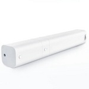

*To contribute to this page, edit the following
[file](https://github.com/Koenkk/zigbee2mqtt.io/blob/master/docs/devices/ZNCLDJ12LM.md)*

# Xiaomi ZNCLDJ12LM

| Model | ZNCLDJ12LM  |
| Vendor  | Xiaomi  |
| Description | Aqara B1 curtain motor  |
| Supports | open, close, stop, position |
| Picture |  |

## Notes


### Configuration of device attributes
By publishing to `zigbee2mqtt/[FRIENDLY_NAME]/set` various device attributes can be configured:
```json
{
    "options":{
        "reverse_direction": xxx,
        "auto_close": xxx
    }
}
```

- **reverse_direction**: (`true`/`false`, default: `false`). Device can be configured to act in an opposite direction.
- **auto_close**: (`true`/`false`, default: `true`). Enables/disabled auto close

You can send a subset of options, all options that won't be specified will be revered to default.

After changing `reverse_direction` you will need to fully open and fully close the curtain so the motor will re-detect edges. `reverse_direction` will get new state only after this recalibration.

## Xiaomi ZNCLDJ12LM with battery

| Picture |  |

If motor is used without battery it loses configuration when power down. After that you need to perform end stops calibration again. You can use the following automation for that:
```yaml
- alias: Calibrate curtain
  trigger:
  - platform: homeassistant
    event: start
  action:
  - service: mqtt.publish
    data:
      topic: zigbee2mqtt/<FRIENDLY_NAME>/set
      payload: "{'discovery': true}"
  - service: cover.close_cover
    entity_id: cover.<COVER_ID>
  - delay:
      seconds: 13 #wait for closure complete
  - service: cover.open_cover
    entity_id: cover.<COVER_ID>
```
Motor leaves calibration mode automatically after it reaches the both open and close curtain position limits. Calibration is mandatory for proper position reporting and ability to set intermediate positions.

## Manual Home Assistant configuration
Although Home Assistant integration through [MQTT discovery](../integration/home_assistant) is preferred,
manual integration is possible with the following configuration:



```yaml
cover:
  - platform: "mqtt"
    availability_topic: "zigbee2mqtt/bridge/state"
    command_topic: "zigbee2mqtt/<FRIENDLY_NAME>/set"
    position_topic: "zigbee2mqtt/<FRIENDLY_NAME>"
    set_position_topic: "zigbee2mqtt/<FRIENDLY_NAME>/set"
    set_position_template: "{ \"position\": {{ position }} }"
    value_template: "{{ value_json.position }}"

sensor:
  - platform: "mqtt"
    state_topic: "zigbee2mqtt/<FRIENDLY_NAME>"
    availability_topic: "zigbee2mqtt/bridge/state"
    unit_of_measurement: "%"
    device_class: "battery"
    value_template: "{{ value_json.battery }}"

sensor:
  - platform: "mqtt"
    state_topic: "zigbee2mqtt/<FRIENDLY_NAME>"
    availability_topic: "zigbee2mqtt/bridge/state"
    icon: "mdi:signal"
    unit_of_measurement: "lqi"
    value_template: "{{ value_json.linkquality }}"
```



