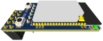

# Supported Adapters

All officially supported adapters are listed on this page. Note that before an adapter can be used with Zigbee2MQTT it has to be flashed with a coordinator firmware (some adapters come preflashed).

::: tip TIP
Want to migrate to a different adapter? Read [this](../faq/README.md#how-do-i-migrate-from-one-adapter-to-another)
:::

## Recommended
The adapters below are recommended because they use powerful chips, can handle large networks and are well-supported.

### Based on Texas Instruments CC2652/CC1352 chip:
_(in order of first appearance)_

* USB connected (easiest)
  * <details>
    <summary>Electrolama zig-a-zig-ah! (zzh!)</summary>
      
    USB connected adapter with external antenna based on CC2652R chip  
    * [Coordinator firmware](https://github.com/Koenkk/Z-Stack-firmware/raw/master/coordinator/Z-Stack_3.x.0/bin/CC2652R_coordinator_20220219.zip)  
    * [Router firmware](https://github.com/Koenkk/Z-Stack-firmware/raw/master/router/Z-Stack_3.x.0/bin/CC2652R_router_20220125.zip)  
    * [Flashing instructions](https://electrolama.com/radio-docs/#step-3-flash-the-firmware-on-your-stick) or see "Flashing CC1352/CC2652/CC2538 based adapters" below
    * [Buy](https://shop.electrolama.com/collections/usb-rf-sticks/products/zzh-multiprotocol-rf-stick)
  
    
    </details>  

  * <details>
    <summary>Slaesh's CC2652RB stick</summary>

    **WARNING:** Problems with customer support have been [reported](https://github.com/Koenkk/zigbee2mqtt/discussions/6702).
  
    USB connected adapter with external antenna based on CC2652RB chip  
    * [Coordinator firmware](https://github.com/Koenkk/Z-Stack-firmware/raw/master/coordinator/Z-Stack_3.x.0/bin/CC2652RB_coordinator_20220219.zip)  
    * [Router firmware](https://github.com/Koenkk/Z-Stack-firmware/raw/master/router/Z-Stack_3.x.0/bin/CC2652RB_router_20220125.zip)  
    * [Flashing instructions](https://slae.sh/projects/cc2652/#flashing) or see "Flashing CC1352/CC2652/CC2538 based adapters" below
    * [Buy](https://slae.sh/projects/cc2652/)
  
    
    </details>

  * <details>
    <summary>Tube's CC2652P2 USB Coordinator</summary>
  
    Open source hardware CC2652P based USB connected adapter with external antenna and USB extension cable  
    * [Coordinator firmware](https://github.com/Koenkk/Z-Stack-firmware/raw/master/coordinator/Z-Stack_3.x.0/bin/CC1352P2_CC2652P_launchpad_coordinator_20220219.zip)  
    * [Router firmware](https://github.com/Koenkk/Z-Stack-firmware/raw/master/router/Z-Stack_3.x.0/bin/CC1352P2_CC2652P_launchpad_router_20220125.zip)  
    * [Flashing instructions](https://github.com/tube0013/tube_gateways) or see "Flashing CC1352/CC2652/CC2538 based adapters" below
    * [Buy](https://www.tubeszb.com/)
  
    
    </details>
  
  * <details>
    <summary>Egony Stick V4</summary>
  
    Powerful CC2652P Zigbee USB dongle and Raspberry Pi GPIO module. Available in Ebyte (left picture) and RFSTAR (right picture) version.  
    * Coordinator firmware: [Ebyte](https://github.com/Koenkk/Z-Stack-firmware/raw/master/coordinator/Z-Stack_3.x.0/bin/CC1352P2_CC2652P_other_coordinator_20220219.zip) [RFSTAR](https://github.com/Koenkk/Z-Stack-firmware/raw/master/coordinator/Z-Stack_3.x.0/bin/CC1352P2_CC2652P_launchpad_coordinator_20220219.zip)  
    * Router firmware: [Ebyte](https://github.com/Koenkk/Z-Stack-firmware/raw/master/router/Z-Stack_3.x.0/bin/CC1352P2_CC2652P_other_router_20220125.zip) [RFSTAR](https://github.com/Koenkk/Z-Stack-firmware/raw/master/router/Z-Stack_3.x.0/bin/CC1352P2_CC2652P_launchpad_router_20220125.zip)  
    * [Flashing instructions](https://github.com/egony/cc2652p_E72-2G4M20S1E/wiki/Flashing-EN) or see "Flashing CC1352/CC2652/CC2538 based adapters" below
    * Description: [Ebyte](https://github.com/egony/cc2652p_E72-2G4M20S1E/wiki/Home-EN) [RFSTAR](https://github.com/egony/cc2652p_cc1352p_RF-STAR/wiki/Home-EN)  
    * [Contact](http://t.me/Egony)
  
     
    </details>

  * <details>
    <summary>ZigStar Stick v4</summary>
  
    Powerfull Open source dongle with external antenna based on CC2652P  
    * [Coordinator firmware](https://github.com/Koenkk/Z-Stack-firmware/raw/master/coordinator/Z-Stack_3.x.0/bin/CC1352P2_CC2652P_launchpad_coordinator_20220219.zip)  
    * [Router firmware](https://github.com/Koenkk/Z-Stack-firmware/raw/master/router/Z-Stack_3.x.0/bin/CC1352P2_CC2652P_launchpad_router_20220125.zip)  
    * [Description](https://zig-star.com/projects/zigbee-stick-v4/)  
    * [Flashing instructions](https://zig-star.com/radio-docs/flash-cc-bsl/) or see "Flashing CC1352/CC2652/CC2538 based adapters" below
    * [Buy](https://zig-star.com)
  
    
    </details>

  * <details>
    <summary>CircuitSetup's CC2652P2 USB Coordinator</summary>
  
    CC2652P based USB connected adapter pre-programmed with Z-Stack  
    * [Coordinator firmware](https://github.com/Koenkk/Z-Stack-firmware/raw/master/coordinator/Z-Stack_3.x.0/bin/CC1352P2_CC2652P_launchpad_coordinator_20220219.zip)  
    * [Router firmware](https://github.com/Koenkk/Z-Stack-firmware/raw/master/router/Z-Stack_3.x.0/bin/CC1352P2_CC2652P_launchpad_router_20220125.zip)  
    * [Flashing instructions](https://circuitsetup.us/product/usb-zigbee-stick-z-stack-coordinator/) or see "Flashing CC1352/CC2652/CC2538 based adapters" below
    * [Buy](https://circuitsetup.us/product/usb-zigbee-stick-z-stack-coordinator/)
  
    
    </details>

  * <details>
    <summary>SMARTLIGHT CC2652P Zigbee USB Adapter SLZB-02</summary>
  
    CC2652P factory-made Zigbee USB coordinator with external 6dB antenna and worldwide delivery  
    * [Coordinator firmware](https://github.com/Koenkk/Z-Stack-firmware/raw/master/coordinator/Z-Stack_3.x.0/bin/CC1352P2_CC2652P_other_coordinator_20220219.zip)  
    * [Router firmware](https://github.com/Koenkk/Z-Stack-firmware/raw/master/router/Z-Stack_3.x.0/bin/CC1352P2_CC2652P_other_router_20220125.zip)  
    * [Description](https://smartlight.me/smart-home-devices/zigbee-devices/zigbee-coordinator-v4-cc2652p)  
    * [Flashing instructions](https://smartlight.me/flashing_slzb-02) or see "Flashing CC1352/CC2652/CC2538 based adapters" below
    * Buy: [eBay](https://www.ebay.com/itm/164928826521) [Official store](https://smartlight.me/smart-home-devices/zigbee-devices/zigbee-coordinator-v4-cc2652p) [Telegram](https://t.me/smartlightme)
  
    
    </details>

  * <details>
    <summary>SONOFF Zigbee 3.0 USB Dongle Plus</summary>
  
    CC2652P based USB connected adapter pre-programmed and with enclosure  
    * [Coordinator firmware](https://github.com/Koenkk/Z-Stack-firmware/raw/master/coordinator/Z-Stack_3.x.0/bin/CC1352P2_CC2652P_launchpad_coordinator_20220219.zip)  
    * [Router firmware](https://github.com/Koenkk/Z-Stack-firmware/raw/master/router/Z-Stack_3.x.0/bin/CC1352P2_CC2652P_launchpad_router_20220125.zip)  
    * [Flashing instructions](https://sonoff.tech/wp-content/uploads/2021/09/Zigbee-3.0-USB-dongle-plus-firmware-flashing-1-1.docx) ([PDF version](/docs/guide/adapters/flashing/zigbee-3.0-usb-dongle-plus-firmware_flashing-1-1.pdf)) or see "Flashing CC1352/CC2652/CC2538 based adapters" below  
    * [Buy](https://itead.cc/product/sonoff-zigbee-3-0-usb-dongle-plus/)
  
    
    </details>

  * <details>
    <summary>Vision CC2652 dongle</summary>
  
    Adapter or small development board based on CC2652R (VS201) or CC2652P (VS202)  
    Coordinator firmware: [VS201](https://github.com/Koenkk/Z-Stack-firmware/raw/master/coordinator/Z-Stack_3.x.0/bin/CC2652R_coordinator_20220219.zip) [VS202](https://github.com/Koenkk/Z-Stack-firmware/raw/master/coordinator/Z-Stack_3.x.0/bin/CC1352P2_CC2652P_launchpad_coordinator_20220219.zip)  
    Router firmware: [VS201](https://github.com/Koenkk/Z-Stack-firmware/raw/master/router/Z-Stack_3.x.0/bin/CC2652R_router_20220125.zip) [VS202](https://github.com/Koenkk/Z-Stack-firmware/raw/master/router/Z-Stack_3.x.0/bin/CC1352P2_CC2652P_launchpad_router_20220125.zip)  
    * [Flashing instructions](https://www.aliexpress.com/item/1005002823262979.html?spm=a2g0o.productlist.0.0.1a1640b82yeViq&algo_pvid=e01b1872-ca85-4814-971f-ce9b058855b8&algo_exp_id=e01b1872-ca85-4814-971f-ce9b058855b8-0&pdp_ext_f=%7B%22sku_id%22%3A%2212000022351543786%22%7D) or see "Flashing CC1352/CC2652/CC2538 based adapters" below
    * Buy: [VS201](https://www.aliexpress.com/item/1005002809329614.html) [VS202](https://www.aliexpress.com/item/1005003393047763.html)
  
    
    </details>


* Hybrid (network + USB)
  * <details>
    <summary>Gio-dot Z-Bee Duo with CC2652P</summary>
  
    4 in 1 zigbee adapter: USB Stick, WiFi, LAN, PI Zero Hat, with external antenna and 3D printed case. 
    * [Description](https://gio-dot.github.io/Z-Bee-Duo/)  
    * [Coordinator firmware](https://github.com/Koenkk/Z-Stack-firmware/blob/master/coordinator/Z-Stack_3.x.0/bin/CC1352P2_CC2652P_other_coordinator_20220219.zip)  
    * [Router firmware](https://github.com/Koenkk/Z-Stack-firmware/blob/master/router/Z-Stack_3.x.0/bin/CC1352P2_CC2652P_other_router_20220125.zip)  
    * [Flashing instructions](https://gio-dot.github.io/Z-Bee-Duo/Firmware-upgrade) or see "Flashing CC1352/CC2652/CC2538 based adapters" below
    * [Buy](https://www.tindie.com/products/gio_dot/z-bee-duo-modular-cc2652p-zigbee-30-adapter/)
  
    
    </details>

  * <details>
    <summary>ZigStar LAN Coordinator</summary>
  
    Powerfull Open source LAN Coordinator with external antenna on CC2652P  
    * [Coordinator firmware](https://github.com/Koenkk/Z-Stack-firmware/raw/master/coordinator/Z-Stack_3.x.0/bin/CC1352P2_CC2652P_launchpad_coordinator_20220219.zip)  
    * [Router firmware](https://github.com/Koenkk/Z-Stack-firmware/raw/master/router/Z-Stack_3.x.0/bin/CC1352P2_CC2652P_launchpad_router_20220125.zip)  
    * [Description](https://zig-star.com/projects/zigbee-gw-lan/)  
    * [Flashing instructions](https://zig-star.com/radio-docs/flash-cc-bsl/) or see "Flashing CC1352/CC2652/CC2538 based adapters" below
    * [Buy](https://zig-star.com) [Tindie](https://www.tindie.com/products/zigstar/zigstar-lan-gateway/)
  
    
    </details>
	
  * <details>
    <summary>ZigStar PoE Coordinator</summary>
  
    Open source PoE af Coordinator with external antenna on CC2652P  
    * [Coordinator firmware](https://github.com/Koenkk/Z-Stack-firmware/raw/master/coordinator/Z-Stack_3.x.0/bin/CC1352P2_CC2652P_launchpad_coordinator_20220219.zip)  
    * [Router firmware](https://github.com/Koenkk/Z-Stack-firmware/raw/master/router/Z-Stack_3.x.0/bin/CC1352P2_CC2652P_launchpad_router_20220125.zip)  
    * [Description](https://zig-star.com/projects/zigstar-lilyzig/)  
    * [Flashing instructions](https://zig-star.com/radio-docs/zigstar-multi-tool/) or see "Flashing CC1352/CC2652/CC2538 based adapters" below
    * [Buy](https://zig-star.com) [Tindie](https://www.tindie.com/products/zigstar/zigstar-lilyzig-poe/) 
  
    
    </details>

* Network
  * <details>
    <summary>Tube's Zigbee Gateways (CC2652P2 variant)</summary>
  
    Open source hardware CC2652P and ESP32 based Zigbee to Ethernet Coordinator (left picture), POE variant is also available (right picture)  
    * [Coordinator firmware](https://github.com/Koenkk/Z-Stack-firmware/raw/master/coordinator/Z-Stack_3.x.0/bin/CC1352P2_CC2652P_launchpad_coordinator_20220219.zip)  
    * [Router firmware](https://github.com/Koenkk/Z-Stack-firmware/raw/master/router/Z-Stack_3.x.0/bin/CC1352P2_CC2652P_launchpad_router_20220125.zip)  
    * [Flashing instructions](https://github.com/tube0013/tube_gateways) or see "Flashing CC1352/CC2652/CC2538 based adapters" below
    * [Buy](https://www.tubeszb.com/)
  
     
    </details>

  * <details>
    <summary>cyijun OpenZ3Gateway</summary>
  
    An open source Zstack3 gateway powered by ESP8266 and CC2652P modules. One costs less than 60 CNY in China.  
    * [Coordinator firmware](https://github.com/Koenkk/Z-Stack-firmware/raw/master/coordinator/Z-Stack_3.x.0/bin/CC1352P2_CC2652P_launchpad_coordinator_20220219.zip)  
    * [Router firmware](https://github.com/Koenkk/Z-Stack-firmware/raw/master/router/Z-Stack_3.x.0/bin/CC1352P2_CC2652P_launchpad_router_20220125.zip)
    * Flashing instructions; see "Flashing CC1352/CC2652/CC2538 based adapters" below
    * [Description](https://github.com/cyijun/OpenZ3Gateway)  
    * [Tindie](https://www.tindie.com/products/cyijun/openz3gateway/)  
  
    
    </details>
  * <details>
    <summary>XGG 52PZ2MGateway</summary>
  
    An open source Zstack3 gateway powered by ESP8266 and CC2652P modules. One costs less than 60 CNY in China.  
    * [Coordinator firmware](https://github.com/Koenkk/Z-Stack-firmware/raw/master/coordinator/Z-Stack_3.x.0/bin/CC1352P2_CC2652P_launchpad_coordinator_20220219.zip)  
    * [Router firmware](https://github.com/Koenkk/Z-Stack-firmware/raw/master/router/Z-Stack_3.x.0/bin/CC1352P2_CC2652P_launchpad_router_20220125.zip)  
    * Flashing instructions; see "Flashing CC1352/CC2652/CC2538 based adapters" below
    * [Description](https://z2m.wiki/)  
    * [Buy](https://z2m.wiki/)  
  
    
    </details>
  * <details>
    <summary>SMARTLIGHT Zigbee LAN Adapter CC2652P Model SLZB-05</summary>
  
    Pre-flashed ready-to-use Zigbee LAN CC2652P Adapter, factory made, metal case, 6dB antenna, worldwide delivery, Zigbee firmware can be manually updated via USB in 5 easy steps, customer/tech support, fast order processing.  
    * [Coordinator firmware](https://github.com/Koenkk/Z-Stack-firmware/raw/master/coordinator/Z-Stack_3.x.0/bin/CC1352P2_CC2652P_other_coordinator_20220219.zip)  
    * [Router firmware](https://github.com/Koenkk/Z-Stack-firmware/raw/master/router/Z-Stack_3.x.0/bin/CC1352P2_CC2652P_other_router_20220219.zip)  
    * [Description](https://smartlight.me/smart-home-devices/zigbee-devices/smlight-zigbee-lan-adapter-slzb-05en)  
    * Flashing instructions; see "Flashing CC1352/CC2652/CC2538 based adapters" below
    * Buy: [eBay](https://www.ebay.com/itm/165178757770) [Official store](https://smartlight.me/smart-home-devices/zigbee-devices/smlight-zigbee-lan-adapter-slzb-05en) [Telegram](https://t.me/smartlightme)

    
    </details>
  * <details>
    <summary>cod.m ZigBee CC2652P2 TCP Coordinator</summary>

    CC2652P2 ZigBee Ethernet Coordinator, ethernet part based on [USR-K6](https://www.pusr.com/products/low-cost-ttl-to-ethernet-modules-usr-k6.html) module. POE possible with external splitter. Comes complete with 3d printed case and antenna.
    * [Coordinator firmware](https://github.com/Koenkk/Z-Stack-firmware/raw/master/coordinator/Z-Stack_3.x.0/bin/CC1352P2_CC2652P_launchpad_coordinator_20220219.zip)
    * [Router firmware](https://github.com/Koenkk/Z-Stack-firmware/raw/master/router/Z-Stack_3.x.0/bin/CC1352P2_CC2652P_launchpad_router_20220125.zip)
    * [Flashing instructions](https://github.com/codm/cc2652p2-tcp-zigbee#update)
    * [Buy](https://shop.codm.de/automation/zigbee/40/zigbee-cc2652p2-tcp-ethernet-coordinator)

     
    </details>
* Raspberry Pi hat
  * <details>
    <summary>cod.m Zigbee CC2652P RPi Module</summary>
  
    Raspberry Pi GPIO module with CC2652P and integrated power amplifier (+20dBm)  
    * [Coordinator firmware](https://github.com/Koenkk/Z-Stack-firmware/raw/master/coordinator/Z-Stack_3.x.0/bin/CC1352P2_CC2652P_launchpad_coordinator_20220219.zip)  
    * [Router firmware](https://github.com/Koenkk/Z-Stack-firmware/raw/master/router/Z-Stack_3.x.0/bin/CC1352P2_CC2652P_launchpad_router_20220125.zip)  
    * [Flashing instructions](https://github.com/codm/cc2652-raspberry-pi-module#firmware) or see "Flashing CC1352/CC2652/CC2538 based adapters" below
    * [Buy](https://shop.codm.de/automation/zigbee/33/zigbee-cc2652p2-raspberry-pi-module)
  
    
    </details>
  * <details>
    <summary>ZigStar Shield</summary>
  
    Powerfull Open source Pi Shield based on CC2652P  
    * [Coordinator firmware](https://github.com/Koenkk/Z-Stack-firmware/raw/master/coordinator/Z-Stack_3.x.0/bin/CC1352P2_CC2652P_launchpad_coordinator_20220219.zip)  
    * [Router firmware](https://github.com/Koenkk/Z-Stack-firmware/raw/master/router/Z-Stack_3.x.0/bin/CC1352P2_CC2652P_launchpad_router_20220125.zip)  
    * [Description](https://zig-star.com/projects/zigbee-shield/)  
    * [Flashing instructions](https://zig-star.com/radio-docs/flash-cc-bsl/) or see "Flashing CC1352/CC2652/CC2538 based adapters" below  
    * [Buy](https://zig-star.com)
  
    
    </details>

* Development board
  * <details>
    <summary>Texas Instruments LAUNCHXL-CC1352P-2</summary>
  
    USB connected development kit, based on CC1352P chip  
    These devices have two serial devices built in. Make sure you put the right serial device in the [configuration](../configuration/) or use auto detect (completely remove the `serial` section from `configuration.yaml`) if you only have one Texas Instruments CC device connected to your system.  
    An external antenna can be connected which could increase range: [requires resoldering a tiny capacitor (moving C14 to C24)](http://e2e.ti.com/support/wireless-connectivity/zigbee-and-thread/f/158/t/880219?LAUNCHXL-CC26X2R1-Antenna-CC26X2R1)  
  
    * [Coordinator firmware](https://github.com/Koenkk/Z-Stack-firmware/raw/master/coordinator/Z-Stack_3.x.0/bin/CC1352P2_CC2652P_launchpad_coordinator_20220219.zip)  
    * [Router firmware](https://github.com/Koenkk/Z-Stack-firmware/raw/master/router/Z-Stack_3.x.0/bin/CC1352P2_CC2652P_launchpad_router_20220125.zip)  
    * [Flashing instructions](./flashing/flashing_via_uniflash.md) or see "Flashing CC1352/CC2652/CC2538 based adapters" below
    * [Buy](http://www.ti.com/tool/LAUNCHXL-CC1352P)
  
    
    </details>

  * <details>
    <summary>Texas Instruments LAUNCHXL-CC26X2R1</summary>
  
    USB connected development kit, based on CC2652R chip  
    These devices have two serial devices built in. Make sure you put the right serial device in the [configuration](../configuration/) or use auto detect (completely remove the `serial` section from `configuration.yaml`) if you only have one Texas Instruments CC device connected to your system.  
    An external antenna can be connected which could increase range: [requires resoldering a tiny capacitor](https://github.com/Koenkk/zigbee2mqtt/issues/2162#issuecomment-570286663)  
  
    * [Coordinator firmware](https://github.com/Koenkk/Z-Stack-firmware/raw/master/coordinator/Z-Stack_3.x.0/bin/CC2652R_coordinator_20220219.zip)  
    * [Router firmware](https://github.com/Koenkk/Z-Stack-firmware/raw/master/router/Z-Stack_3.x.0/bin/CC2652R_router_20220125.zip)  
    * [Flashing instructions](./flashing/flashing_via_uniflash.md) or see "Flashing CC1352/CC2652/CC2538 based adapters" below
    * [Buy](http://www.ti.com/tool/LAUNCHXL-CC26X2R1)
  
    
    </details>

### Other
  * <details>
    <summary>ConBee / ConBee II / RaspBee / RaspBee II</summary>
  
    USB connected adapters (ConBee and ConBee II) and Raspberry Pi GPIO modules (RaspBee and RaspBee II).
    If Zigbee2MQTT fails to start, try adding the following to your `configuration.yaml`
    ```yaml
    serial:
      adapter: deconz
    ```
  
    * [Coordinator firmware](https://deconz.dresden-elektronik.de/deconz-firmware/)
    * [Flashing](https://github.com/dresden-elektronik/deconz-rest-plugin/wiki/Update-deCONZ-manually)
    * [Buy](https://phoscon.de/conbee2#buy) (ConBee II)
    * [Buy](https://phoscon.de/raspbee2#buy) (RaspBee II)
  
    
    </details>


## Not recommended
The adapters below are well-supported but use outdated chips.

* USB connected
  * <details>
    <summary>Texas Instruments CC2531</summary>
  
    USB connected Zigbee adapter with PCB antenna  
    **Warning 1:** requires additional hardware to flash (CC debugger + download cable)  
    **Warning 2:** might not be powerful enough to handle networks of 20+ devices  
    **Warning 3:** this adapter has bad range  
    * [Coordinator firmware](https://github.com/Koenkk/Z-Stack-firmware/tree/master/coordinator/Z-Stack_Home_1.2/bin)  
    * [Router firmware](https://github.com/Koenkk/Z-Stack-firmware/tree/master/router/Z-Stack_Home_1.2/bin)  
    * [Flashing instructions](./flashing/flashing_the_cc2531.md)  
    * [Buy](https://www.aliexpress.com/wholesale?catId=0&initiative_id=SB_20191108075039&SearchText=cc2531)
  
    
    </details>

  * <details>
    <summary>Vision CC2538+CC2592 Dongle(VS203)</summary>
  
    Adapter or small development board based on CC2538 and CC2592 chip  
    * [Coordinator firmware](https://github.com/Koenkk/Z-Stack-firmware/tree/master/coordinator/Z-Stack_3.0.x/bin)  
    * [Flashing instructions](https://www.aliexpress.com/item/1005002809329614.html?spm=a2g0o.store_pc_allProduct.8148356.2.4d7f1012TTc3uX)  
    * [Buy](https://www.aliexpress.com/item/1005002809329614.html?spm=a2g0o.store_pc_allProduct.8148356.2.4d7f1012TTc3uX)
  
    
    </details>


* Serial connected

  * <details>
    <summary>Texas Instruments CC2530</summary>
  
    Serial connected adapter with external antenna optionally with CC2591 or CC2592 RF frontend  
    **Warning 1:** requires additional hardware to flash (CC debugger + download cable)  
    **Warning 2:** might not be powerful enough to handle networks of 20+ devices  
    * [Coordinator firmware](https://github.com/Koenkk/Z-Stack-firmware/tree/master/coordinator/Z-Stack_Home_1.2/bin)  
    * [Router firmware](https://github.com/Koenkk/Z-Stack-firmware/tree/master/router/Z-Stack_Home_1.2/bin)  
    * [Flashing instructions](../../advanced/zigbee/05_create_a_cc2530_router.md#2-flashing-the-cc2530)  
    * [Connecting](./flashing/connecting_cc2530.md)  
    * Buy: [AliExpress](http://www.aliexpress.com/wholesale?catId=0&initiative_id=SB_20181213104041&SearchText=cc2530) [GBAN](http://www.gban.cn/en/product_show.asp?id=43) [Tindie](https://www.tindie.com/products/GiovanniCas/cc2530-cc2592-zigbee-dongle/)
  
    
    </details>
  * <details>
    <summary>Texas Instruments CC2538</summary>
  
    Serial connected adapter with CC2592 RF Amplifier  
    * [Coordinator firmware](https://github.com/Koenkk/Z-Stack-firmware/tree/master/coordinator/Z-Stack_3.0.x/bin)  
    * [Flashing](./flashing/flashing_the_cc2538.md)  
    * Buy: [AliExpress](https://www.aliexpress.com/wholesale?catId=0&initiative_id=SB_20191108075039&SearchText=cc2538)
  
    
    </details>

* Raspberry Pi

  * <details>
    <summary>Texas Instruments CC2538 HAT</summary>
  
    Raspberry pinout compatible HAT with CC2538 and optional external antenna  
    * [Coordinator firmware](https://github.com/Koenkk/Z-Stack-firmware/tree/master/coordinator/Z-Stack_3.0.x/bin)  
    * [Flashing](./flashing/flashing_the_cc2538.md)  
    * [Buy](https://www.tindie.com/products/GiovanniCas/zigbee-hat-with-cc2538-for-raspberry/)
  
    
    </details>
  
* Network

  * <details>
    <summary>XGG gateway</summary>
  
    An open source zigbee gateway powered by ESP8266 and CC2538+CC2592PA (XGG 38PZ2MGateway) or CC2530 (XGG 30Z2MGateway)  
    Coordinator firmware: [XGG 38PZ2MGateway](https://github.com/Koenkk/Z-Stack-firmware/tree/master/coordinator/Z-Stack_3.0.x/bin) [XGG 30Z2MGateway](https://github.com/Koenkk/Z-Stack-firmware/tree/master/coordinator/Z-Stack_Home_1.2/bin)  
    * [Contact](https://z2m.wiki/)
  
    
    </details>


## Experimental
The adapters below are experimental, don't use these if you want a stable setup.

* <details>
  <summary>ZiGate</summary>
  
  Initial development started on experimental (alpha stage) support for various ZigGate adapters (based on NXP Zigbee chips like JN5168 and JN5169). This include all ZiGate compatible hardware adapters with ZigGate 3.1d firmware or later.   
  If Zigbee2MQTT fails to start, try adding the following to your `configuration.yaml`
    ```yaml
    serial:
    adapter: zigate
    ```
  
  * [Coordinator firmware](https://zigate.fr/tag/firmware/)  
  * [Discussion](https://github.com/Koenkk/zigbee-herdsman/issues/242)  
  * [Buy](https://zigate.fr/boutique/?orderby=date_desc)
  
  
  </details>

* <details>
  <summary>Silicon Labs EZSP v8</summary>
  
  Initial development started on experimental (alpha stage) support for various adapters based on Silicon Labs EM35X and EFR32MG SoC families with EmberZNet NCP 6.7.8 firmware or later via EZSP version 8 (EmberZNet Serial Protocol) interface. This include all hardware based on SoCs/Modules from Silabs EFR32MG21/MGM210 and EFR32MG12/MGM12 series    
  If Zigbee2MQTT fails to start, try adding the following to your `configuration.yaml`
  ```yaml
  serial:
    adapter: ezsp
  ```
  
  * [Coordinator firmware](https://github.com/Koenkk/zigbee-herdsman/issues/319)  
  * [Discussion](https://github.com/Koenkk/zigbee-herdsman/issues/319)  
  
  
  </details>


## Notes
Before buying an adapter, please read the notes below!

- Want to migrate to a different adapter? This may require repairing all your devices in some cases, see [FAQ](../faq/README.md#what-does-and-does-not-require-repairing-of-all-devices)
- Network adapters connected via WiFi might have reduced stability as the serial protocol does not have enough fault-tolerance to handle packet loss or latency delays that can normally occur over WiFi connections. If cannot use a locally connected USB or UART/GPIO adapter then the recommendation is to use remote adapter that connected via Ethernet (wired) to avoid issues.
- What are the differences between the various CC2652/CC1352 chips?
  - Chips ending with `P` have a power amplifier which support up-to 20dBm vs 5dBm on adapters ending with `R`/`RB`.
  - Chips starting with `CC1352` support the sub-1 GHz frequency (which is not relevant for Zigbee since it uses 2.4 GHz), `CC2652` only supports 2.4 GHz. So for Zigbee2MQTT purposes there is no difference between `CC1352` and `CC2652`.
  - Chips ending with `RB` don't require a crystal on the PCB, this only makes a difference for the manufacturing process.

### Flashing CC1352/CC2652/CC2538 based adapters
Adapters based on CC1352 or CC2652 chips can be flashed by putting them in the bootloader. See your adapter manual on how to do this. After you have done this one of the following tools can be used to flash it.
- [ZigStar GW Multi tool](https://github.com/xyzroe/ZigStarGW-MT) (multi platform GUI tool)
- [CC2538-BSL](https://github.com/JelmerT/cc2538-bsl) (multi platform Python based command line tool) ([instructions](./flashing/flashing_via_cc2538-bsl.md))
- [llama-bsl](https://github.com/electrolama/llama-bsl) (multi platform Python based command line tool, a fork of cc2538-bsl with added features)
- Texas Instruments [FLASH PROGRAMMER 2](https://www.ti.com/tool/FLASH-PROGRAMMER) (Windows only) (can't find your device? read below!)

#### Flashing an existing adapter
The above flashing tools can be used to upgrade the firmware on an existing adapter without needing to repair devices. See the [FAQ](https://www.zigbee2mqtt.io/guide/faq/#what-does-and-does-not-require-repairing-of-all-devices) for information on what does and does not require repairing of devices.

#### Is your OS unable to find your device?
If you're asking yourself "Why won't my dongle or adapter show up?" when you are using (for example) Flash Programmer 2, chances are that your OS can't communicate with your device over VCP (Virtual COM Port), causing your dongle not showing up as a flashable device. To fix this problem, be sure to install a USB-to-UART bridge VCP driver like the one at [Silicon Labs](https://www.silabs.com/developers/usb-to-uart-bridge-vcp-drivers) or [FTDI Chip](https://ftdichip.com/drivers/vcp-drivers/).

### Router
Besides serving as a coordinator some adapters can also be used as a Zigbee router (check if there is a router firmware by clicking on your adapter). To factory reset/pair:
- Texas Instruments CC2531: press the S2 button for 5 seconds.
- Texas Instruments CC2530: power on/power off the device three times (power on, wait 2 seconds, power off, repeat this cycle three times).
- Adapters based on CC2652/CC1352: single press (one of the) buttons on the device
